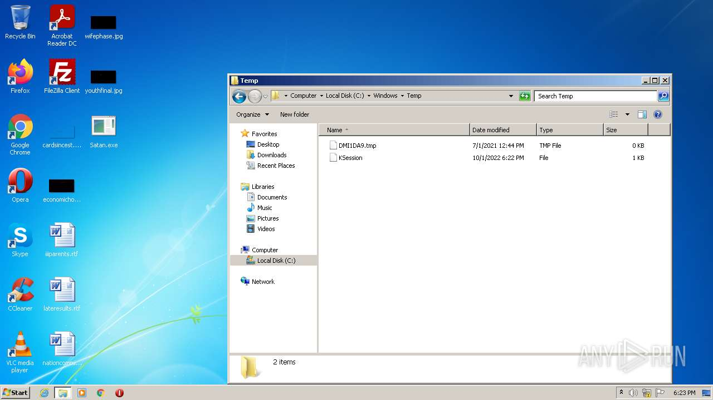
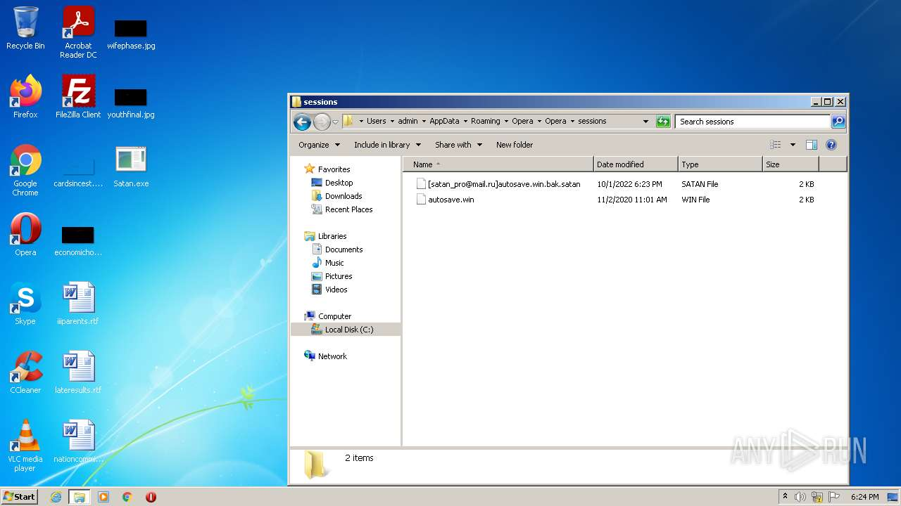
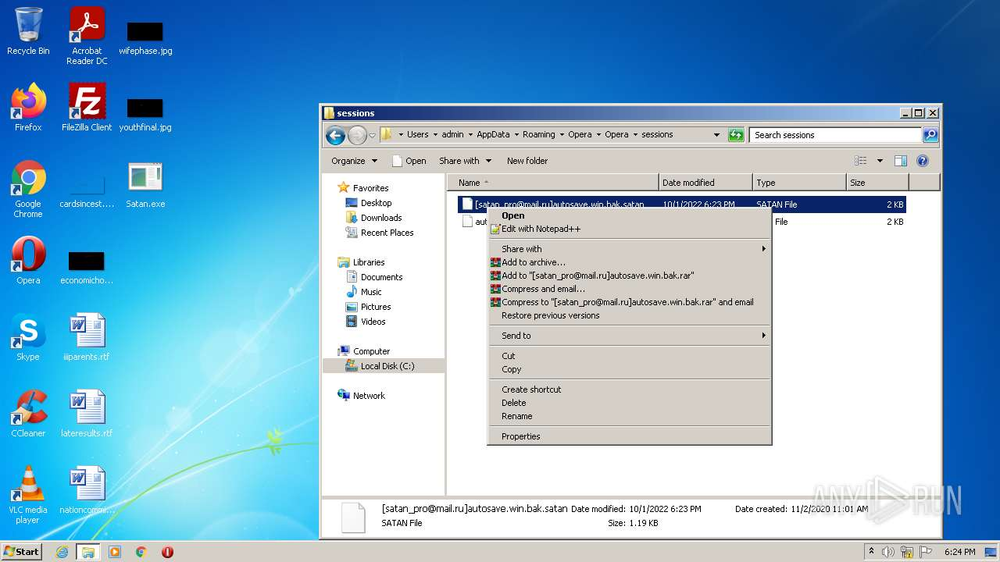
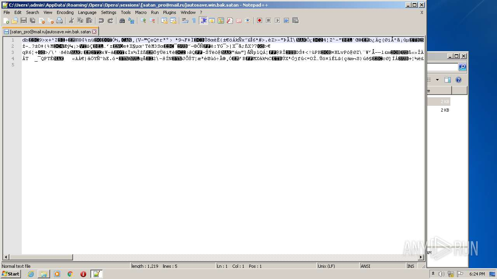
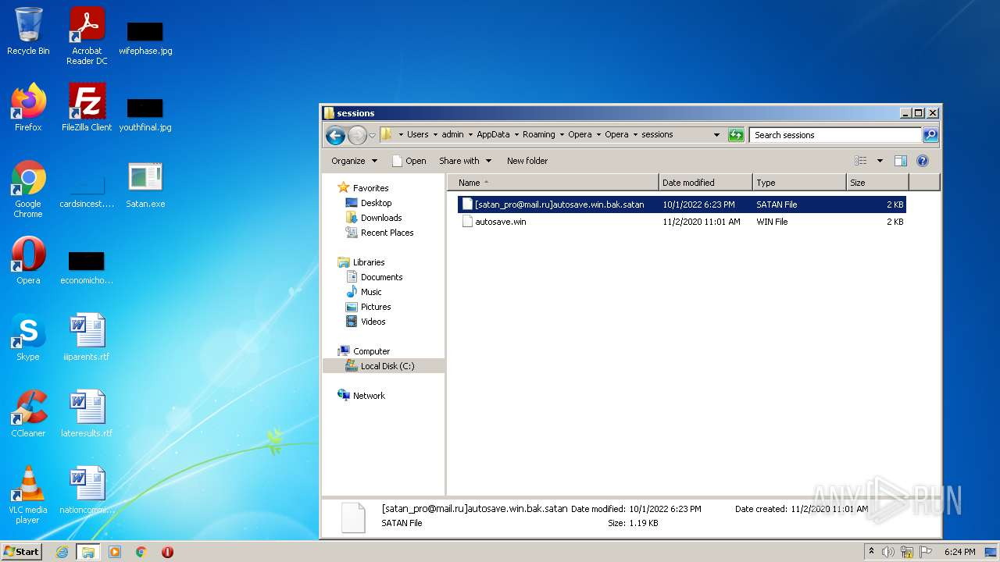

# Trojan-Ransom.Win32.CryFile.aacr-480e8c67f2354530c006380d4804f4bacb1016f0401f391303e3337be94fbb11

```
- _id: "480e8c67f2354530c006380d4804f4bacb1016f0401f391303e3337be94fbb11"
  creation_date: 1525412186  # 2018-05-04 07:36:26 +0200 CEST
  crowdsourced_yara_results: 
  - author: "ditekSHen"
    description: "Detects executables built or packed with MPress PE compressor"
    rule_name: "INDICATOR_EXE_Packed_MPress"
    ruleset_id: "00c291ca7f"
    ruleset_name: "indicator_packed"
    source: "https://github.com/ditekshen/detection"
  - author: "@bartblaze"
    description: "Identifies Satan ransomware (and its variants) by mutex."
    match_in_subfile: true
    rule_name: "Satan_Mutexes"
    ruleset_id: "002eacb457"
    ruleset_name: "Satan_Mutexes"
    source: "https://github.com/bartblaze/Yara-rules"
  - author: "ditekSHen"
    description: "Detects executables built or packed with MPress PE compressor"
    match_in_subfile: true
    rule_name: "INDICATOR_EXE_Packed_MPress"
    ruleset_id: "00c291ca7f"
    ruleset_name: "indicator_packed"
    source: "https://github.com/ditekshen/detection"
  first_submission_date: 1525463824  # 2018-05-04 21:57:04 +0200 CEST
  last_analysis_date: 1650437679  # 2022-04-20 08:54:39 +0200 CEST
  last_analysis_results: 
    Kaspersky: 
      result: "Trojan-Ransom.Win32.CryFile.aacr"
  magic: "MS-DOS executable, MZ for MS-DOS"
  size: 146432
  trid: 
  - file_type: "Win32 Executable (generic)"
    probability: 52.9
  - file_type: "Generic Win/DOS Executable"
    probability: 23.5
  - file_type: "DOS Executable Generic"
    probability: 23.5
```








