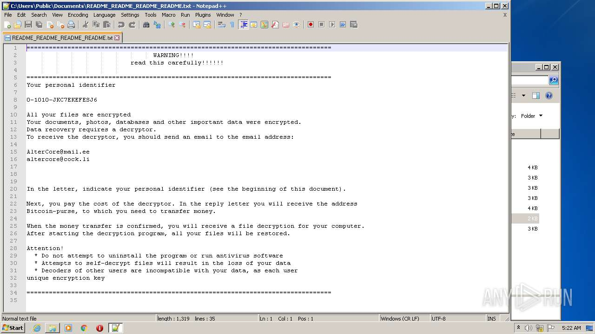
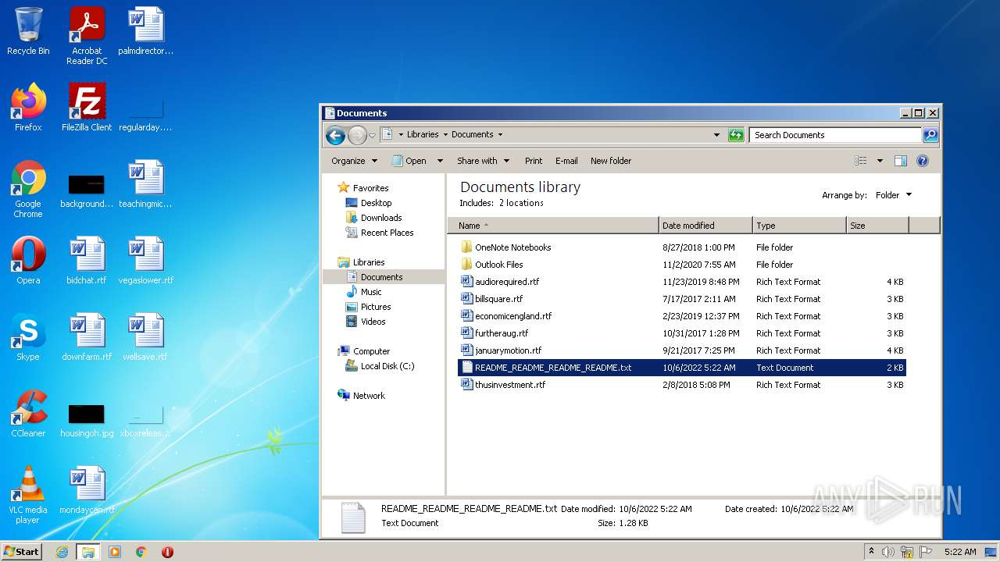
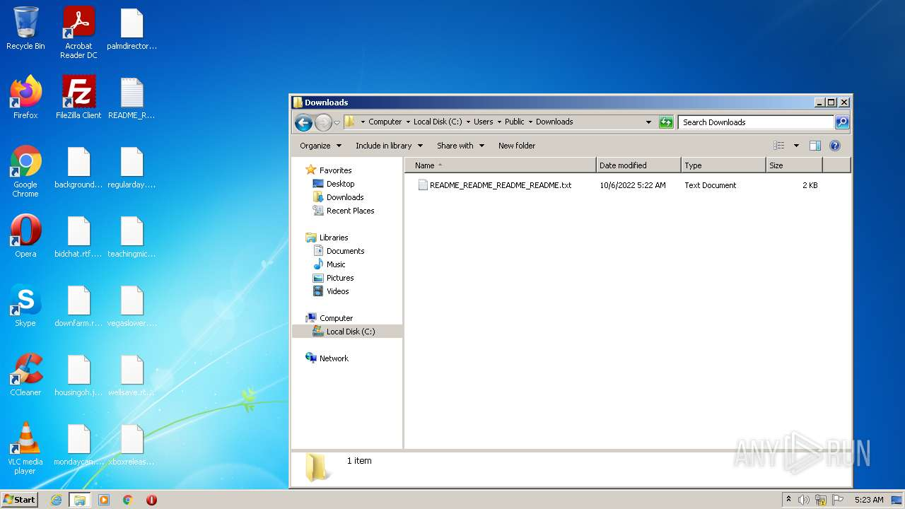
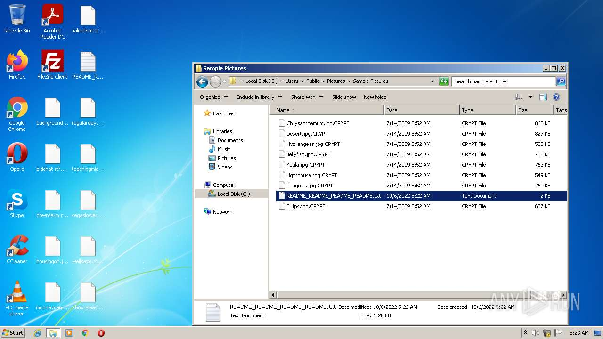
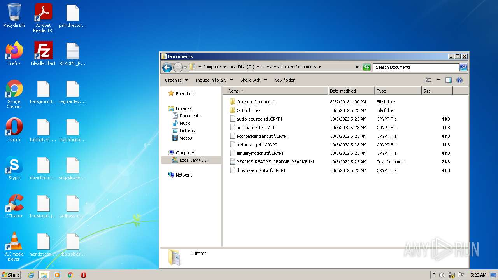

# Trojan-Ransom.Win32.Crypren.agob-5eb33afe516fe5a73f0773340f0a3d6c9d88342bb07b968ec2f759194bf430ee

- https://any.run/report/5eb33afe516fe5a73f0773340f0a3d6c9d88342bb07b968ec2f759194bf430ee/38830585-458e-4335-aecf-8f76de998372

```
- _id: "5eb33afe516fe5a73f0773340f0a3d6c9d88342bb07b968ec2f759194bf430ee"
  first_submission_date: 1580644761  # 2020-02-02 12:59:21 +0100 CET
  last_analysis_date: 1644548779  # 2022-02-11 04:06:19 +0100 CET
  last_analysis_results: 
    Kaspersky: 
      result: "Trojan-Ransom.Win32.Crypren.agob"
  magic: "PE32 executable for MS Windows (GUI) Intel 80386 32-bit"
  size: 3870720
  trid: 
  - file_type: "Win64 Executable (generic)"
    probability: 40.2
  - file_type: "Win16 NE executable (generic)"
    probability: 19.2
  - file_type: "Win32 Executable (generic)"
    probability: 17.2
  - file_type: "OS/2 Executable (generic)"
    probability: 7.7
  - file_type: "Generic Win/DOS Executable"
    probability: 7.6
```







