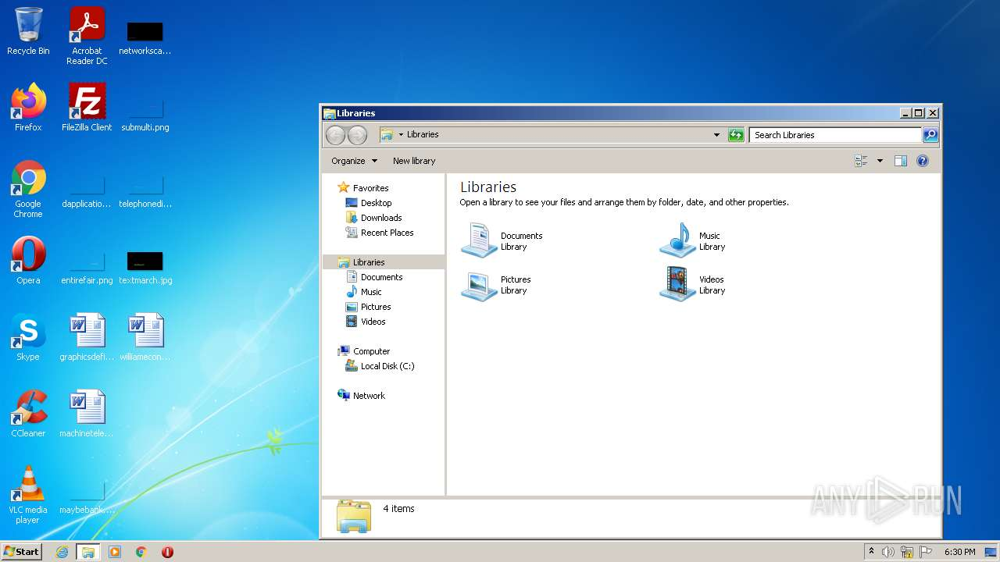
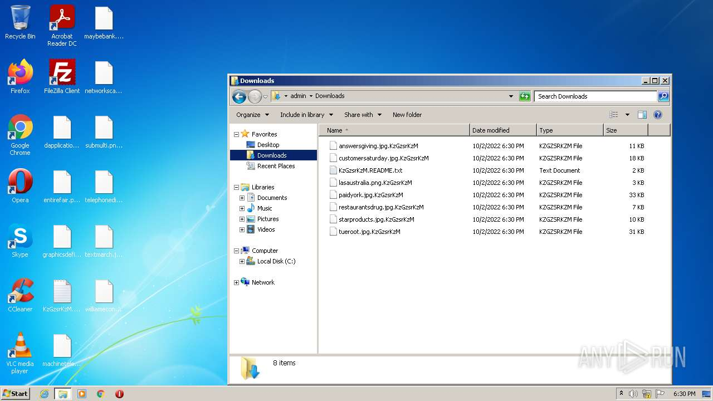
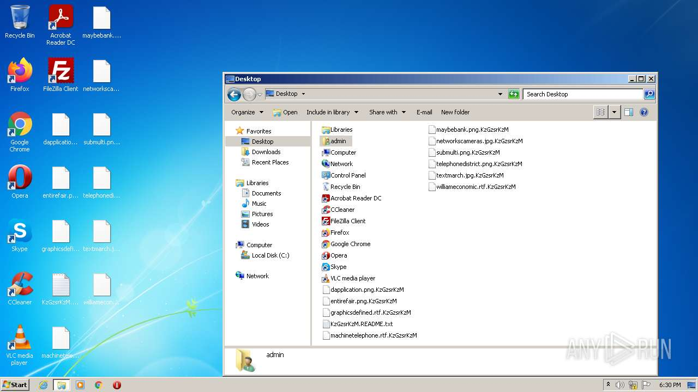
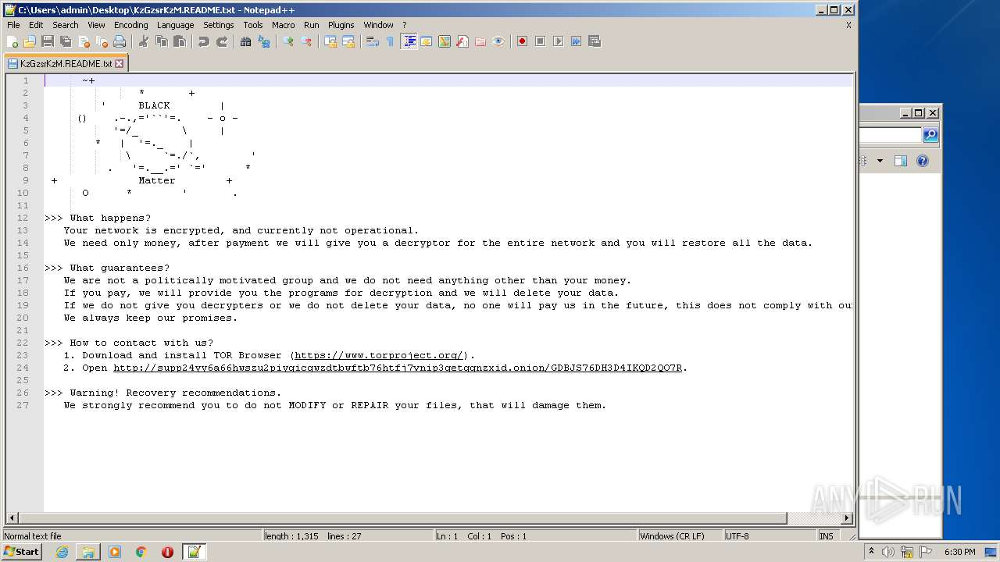
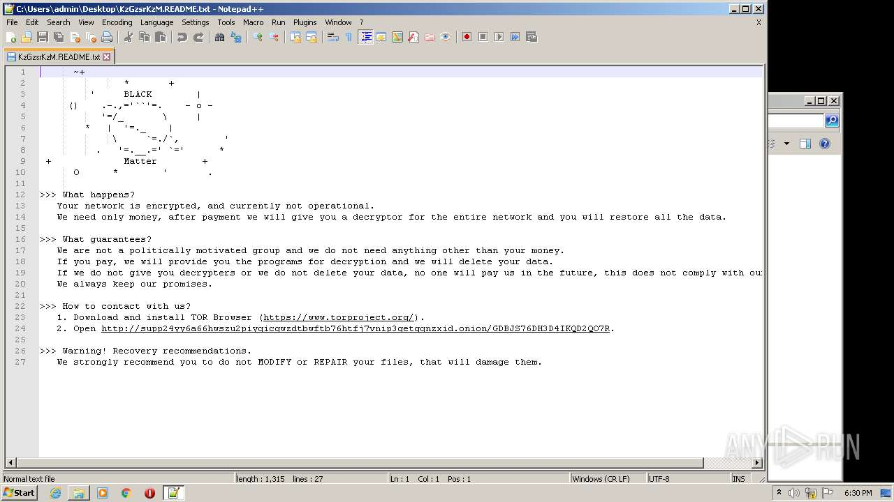
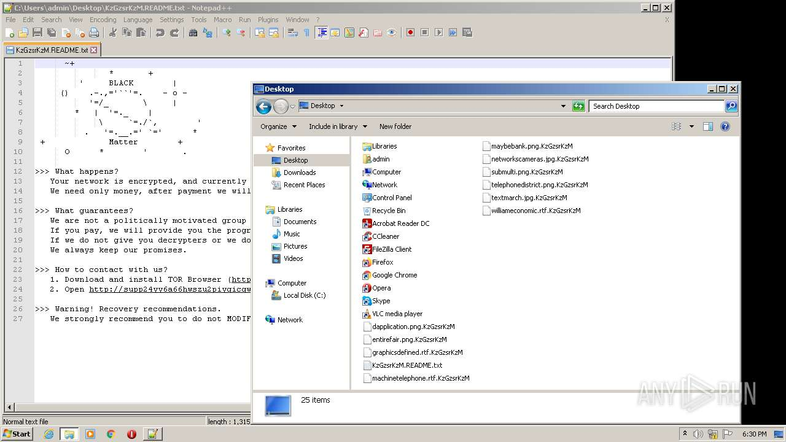
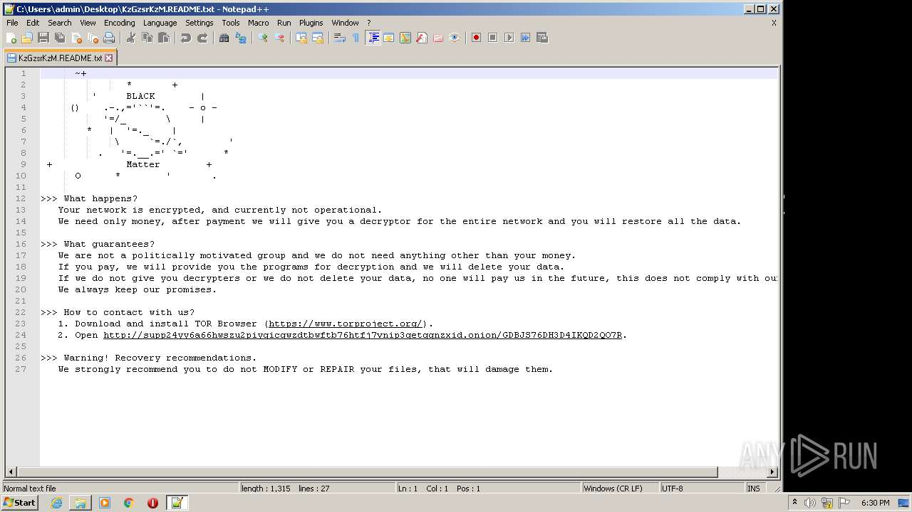
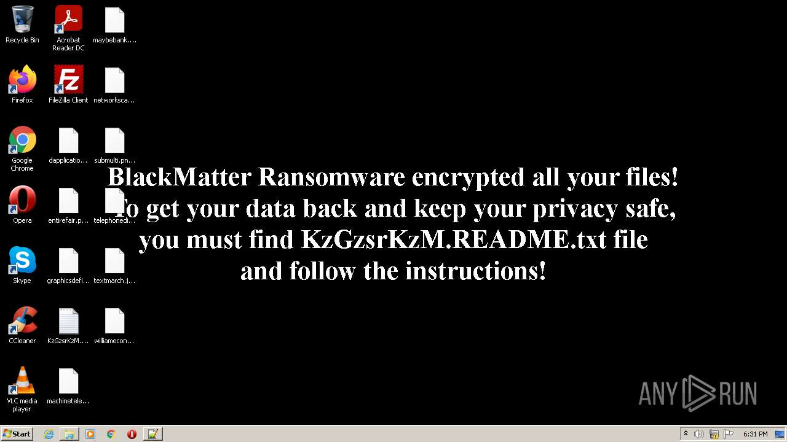
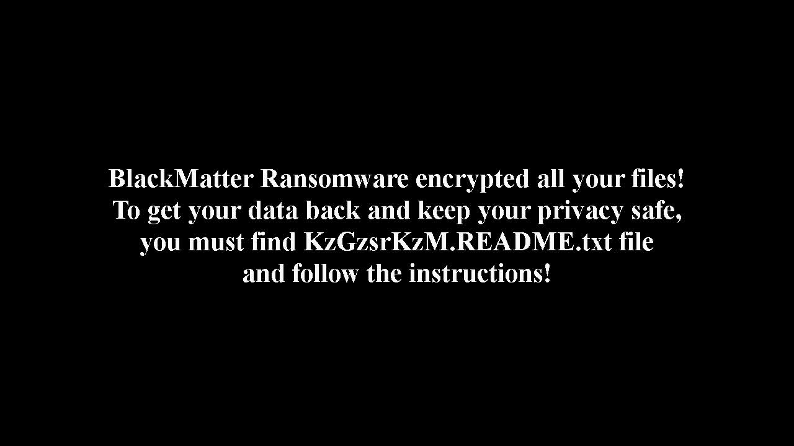

# Trojan-Ransom.Win32.Encoder.nke-c6e2ef30a86baa670590bd21acf5b91822117e0cbe6060060bc5fe0182dace99

- https://any.run/report/c6e2ef30a86baa670590bd21acf5b91822117e0cbe6060060bc5fe0182dace99/40618757-5870-4e4b-8f07-7168dffdbe46

```
- _id: "c6e2ef30a86baa670590bd21acf5b91822117e0cbe6060060bc5fe0182dace99"
  creation_date: 1627073478  # 2021-07-23 22:51:18 +0200 CEST
  crowdsourced_yara_results: 
  - author: "@bartblaze"
    description: "Identifies Darkside ransomware."
    rule_name: "Darkside"
    ruleset_id: "0022c78e42"
    ruleset_name: "Darkside"
    source: "https://github.com/bartblaze/Yara-rules"
  - author: "Felix Bilstein - yara-signator at cocacoding dot com"
    description: "Detects win.blackmatter."
    rule_name: "win_blackmatter_auto"
    ruleset_id: "008dd729cd"
    ruleset_name: "win.blackmatter_auto"
    source: "https://malpedia.caad.fkie.fraunhofer.de/"
  first_submission_date: 1627904433  # 2021-08-02 13:40:33 +0200 CEST
  last_analysis_date: 1658570982  # 2022-07-23 12:09:42 +0200 CEST
  last_analysis_results: 
    Kaspersky: 
      result: "Trojan-Ransom.Win32.Encoder.nke"
  magic: "PE32 executable for MS Windows (GUI) Intel 80386 32-bit"
  size: 68096
  trid: 
  - file_type: "Win32 Dynamic Link Library (generic)"
    probability: 27.1
  - file_type: "Win16 NE executable (generic)"
    probability: 20.7
  - file_type: "Win32 Executable (generic)"
    probability: 18.5
  - file_type: "Win16/32 Executable Delphi generic"
    probability: 8.5
  - file_type: "OS/2 Executable (generic)"
    probability: 8.3
```











