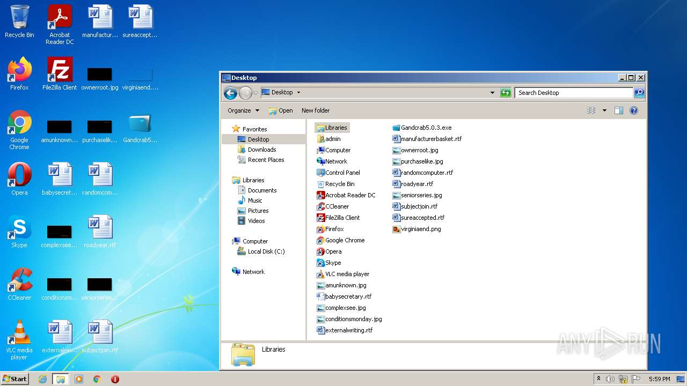
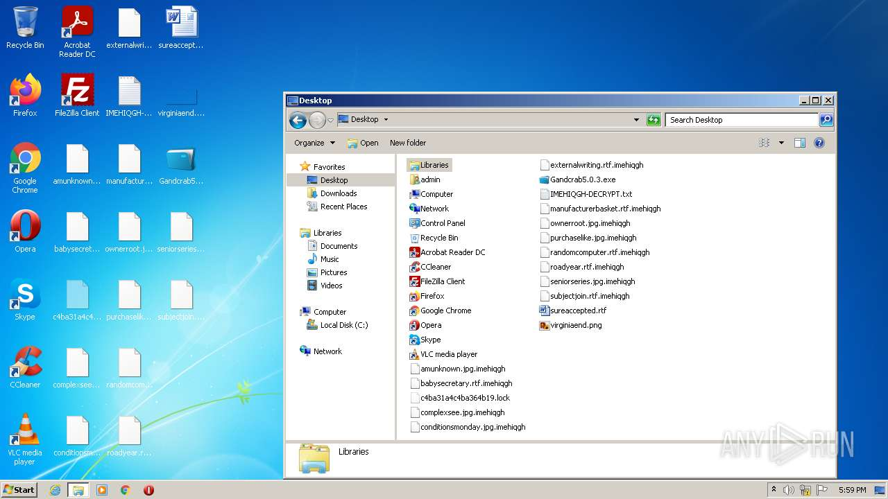
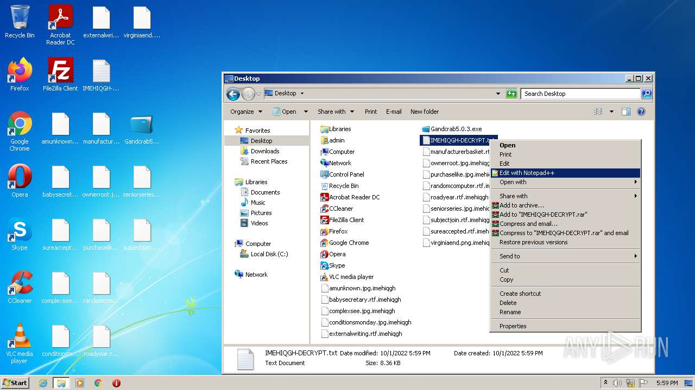
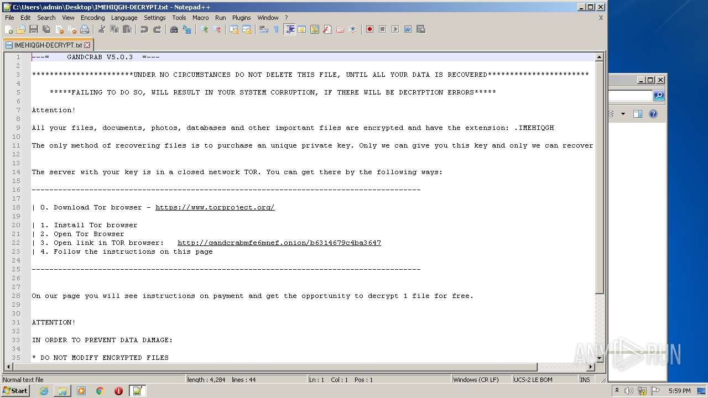
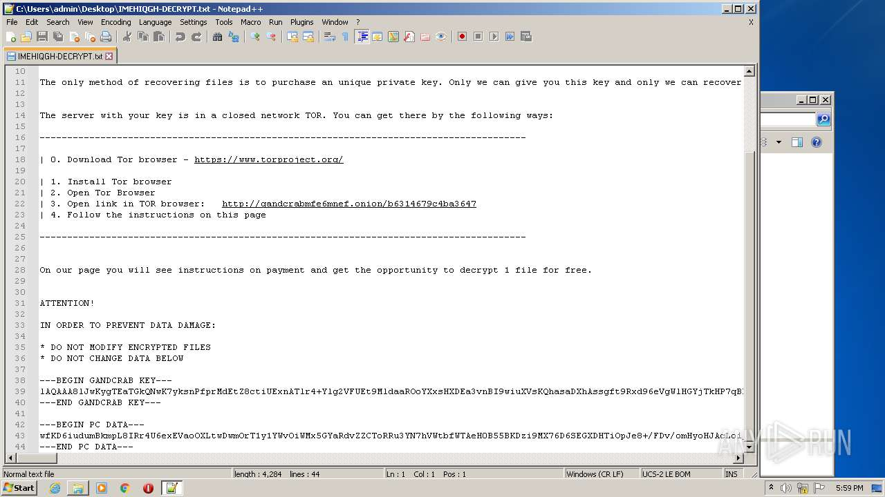
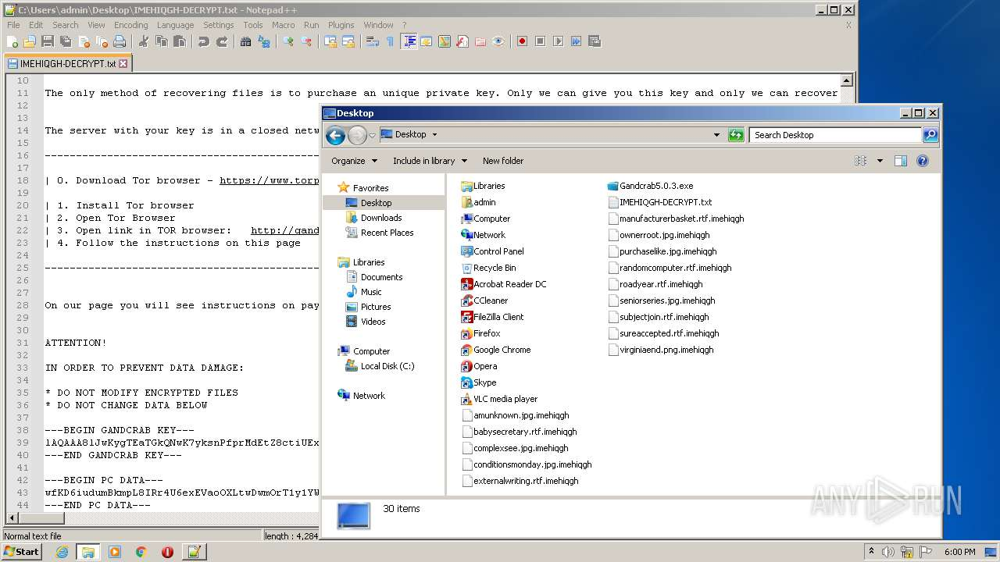
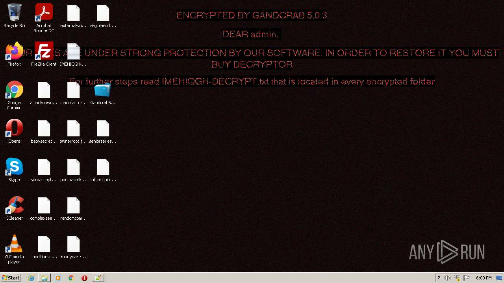
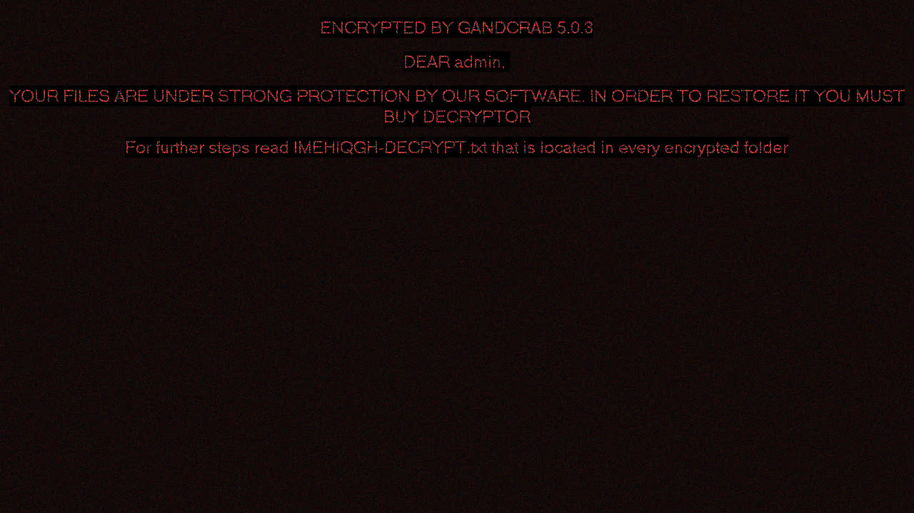

# Trojan-Ransom.Win32.GandCrypt.fwa-49b769536224f160b6087dc866edf6445531c6136ab76b9d5079ce622b043200

```
- _id: "49b769536224f160b6087dc866edf6445531c6136ab76b9d5079ce622b043200"
  creation_date: 1481024040  # 2016-12-06 12:34:00 +0100 CET
  first_submission_date: 1539153028  # 2018-10-10 08:30:28 +0200 CEST
  last_analysis_date: 1651096604  # 2022-04-27 23:56:44 +0200 CEST
  last_analysis_results: 
    Kaspersky: 
      result: "Trojan-Ransom.Win32.GandCrypt.fwa"
  magic: "PE32 executable for MS Windows (GUI) Intel 80386 32-bit"
  packers: 
    PEiD: "Microsoft Visual C++"
  size: 434176
  trid: 
  - file_type: "Microsoft Visual C++ compiled executable (generic)"
    probability: 42.7
  - file_type: "Win32 Dynamic Link Library (generic)"
    probability: 17.0
  - file_type: "Win16 NE executable (generic)"
    probability: 13.0
  - file_type: "Win32 Executable (generic)"
    probability: 11.6
  - file_type: "OS/2 Executable (generic)"
    probability: 5.2
```











