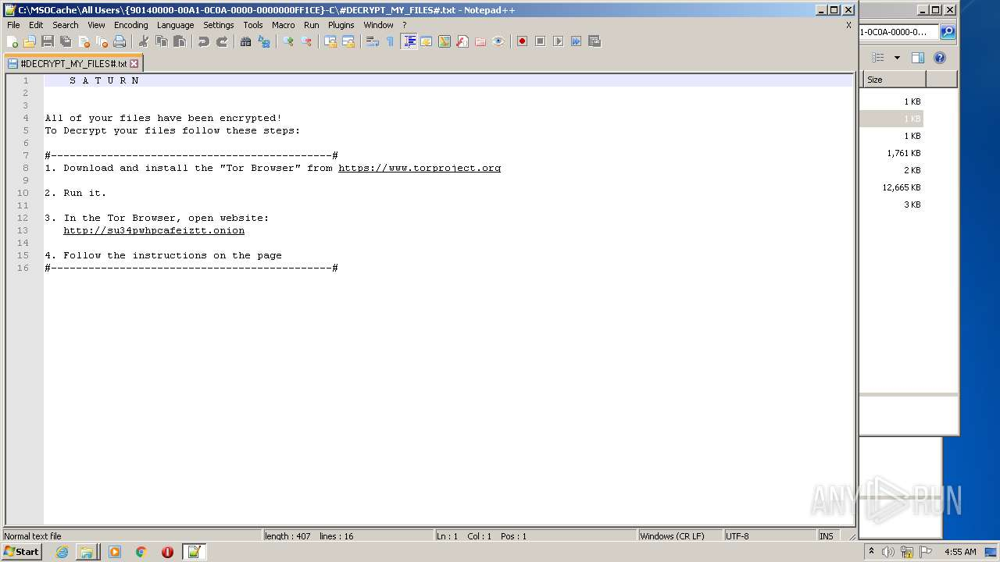

# Trojan-Ransom.Win32.Gen.hjs-9e87f069de22ceac029a4ac56e6305d2df54227e6b0f0b3ecad52a01fbade021

- https://any.run/report/9e87f069de22ceac029a4ac56e6305d2df54227e6b0f0b3ecad52a01fbade021/e860fc0a-07ac-472c-a1b9-8f17976ef997

```
- _id: "9e87f069de22ceac029a4ac56e6305d2df54227e6b0f0b3ecad52a01fbade021"
  creation_date: 1518635954  # 2018-02-14 20:19:14 +0100 CET
  crowdsourced_yara_results: 
  - author: "AlienVault Labs"
    description: "Sandbox detection tricks"
    rule_name: "sandboxdetect_misc"
    ruleset_id: "009cfa8ad5"
    ruleset_name: "sandboxdetect"
    source: "https://github.com/AlienVault-Labs/AlienVaultLabs"
  - author: "Florian Roth"
    description: "Detects Arid Viper malware sample"
    rule_name: "MAL_AirdViper_Sample_Apr18_1"
    ruleset_id: "00070be7f4"
    ruleset_name: "apt_winnti_burning_umbrella"
    source: "https://github.com/Neo23x0/signature-base"
  - author: "Florian Roth"
    description: "Detects ransomware indicator"
    rule_name: "SUSP_RANSOMWARE_Indicator_Jul20"
    ruleset_id: "000a7d3924"
    ruleset_name: "crime_ransom_generic"
    source: "https://github.com/Neo23x0/signature-base"
  - author: "ditekSHen"
    description: "detects command variations typically used by ransomware"
    rule_name: "INDICATOR_SUSPICIOUS_GENRansomware"
    ruleset_id: "00c3b8eb5d"
    ruleset_name: "indicator_suspicious"
    source: "https://github.com/ditekshen/detection"
  - author: "ReversingLabs"
    description: "Yara rule that detects Saturn ransomware."
    rule_name: "Win32_Ransomware_Saturn"
    ruleset_id: "00519f2f1a"
    ruleset_name: "Win32.Ransomware.Saturn"
    source: "https://github.com/reversinglabs/reversinglabs-yara-rules"
  first_submission_date: 1518641362  # 2018-02-14 21:49:22 +0100 CET
  last_analysis_date: 1664772460  # 2022-10-03 06:47:40 +0200 CEST
  last_analysis_results: 
    Kaspersky: 
      result: "Trojan-Ransom.Win32.Gen.hjs"
  magic: "PE32 executable for MS Windows (GUI) Intel 80386 32-bit"
  size: 346624
  trid: 
  - file_type: "Win64 Executable (generic)"
    probability: 32.1
  - file_type: "Win32 Dynamic Link Library (generic)"
    probability: 20.1
  - file_type: "Win16 NE executable (generic)"
    probability: 15.4
  - file_type: "Win32 Executable (generic)"
    probability: 13.7
  - file_type: "OS/2 Executable (generic)"
    probability: 6.2
```





