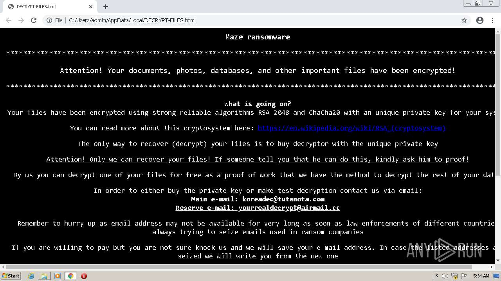
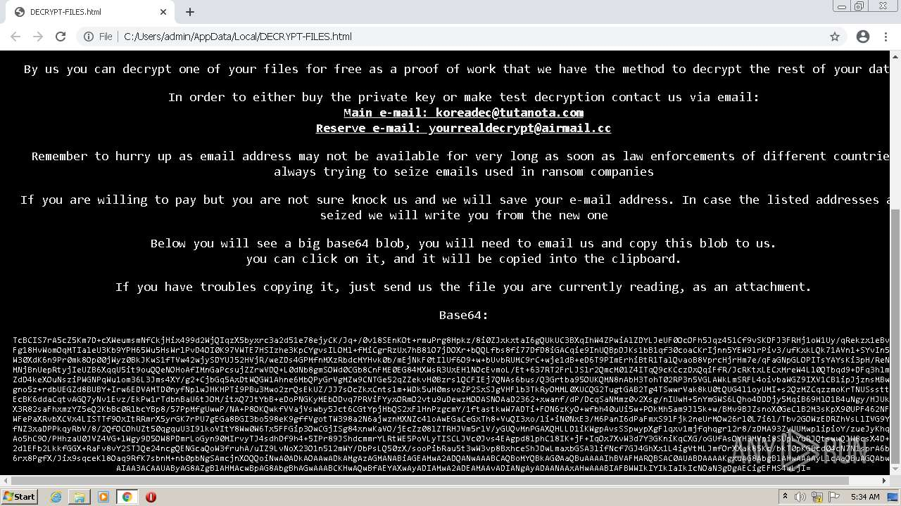
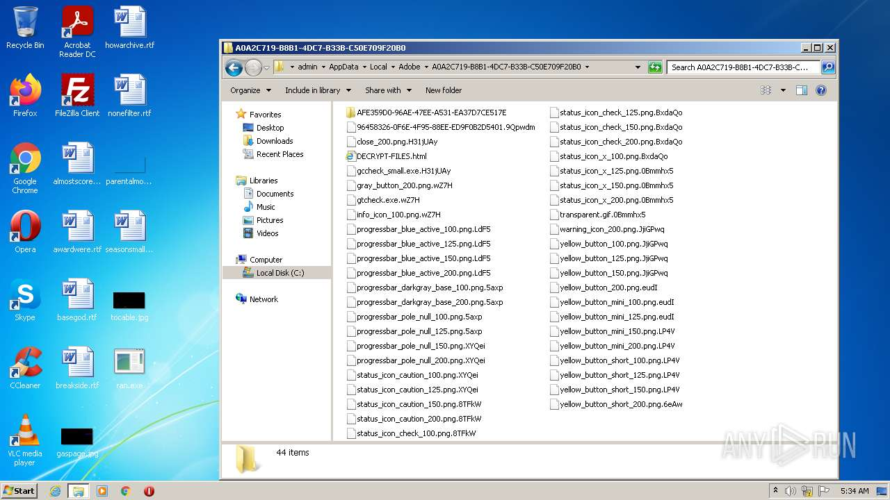

# Trojan-Ransom.Win32.Gen.qqa-e8a091a84dd2ea7ee429135ff48e9f48f7787637ccb79f6c3eb42f34588bc684

- https://any.run/report/e8a091a84dd2ea7ee429135ff48e9f48f7787637ccb79f6c3eb42f34588bc684/6cbd13af-e91d-4fe1-aeed-d7dc733176d9

```
- _id: "e8a091a84dd2ea7ee429135ff48e9f48f7787637ccb79f6c3eb42f34588bc684"
  creation_date: 1558987402  # 2019-05-27 22:03:22 +0200 CEST
  first_submission_date: 1559039650  # 2019-05-28 12:34:10 +0200 CEST
  last_analysis_date: 1666783404  # 2022-10-26 13:23:24 +0200 CEST
  last_analysis_results: 
    Kaspersky: 
      result: "Trojan-Ransom.Win32.Gen.qqa"
  magic: "PE32 executable for MS Windows (GUI) Intel 80386 32-bit"
  size: 484352
  trid: 
  - file_type: "Win32 Executable MS Visual C++ (generic)"
    probability: 48.8
  - file_type: "Win64 Executable (generic)"
    probability: 16.4
  - file_type: "Win32 Dynamic Link Library (generic)"
    probability: 10.2
  - file_type: "Win16 NE executable (generic)"
    probability: 7.8
  - file_type: "Win32 Executable (generic)"
    probability: 7.0
```





