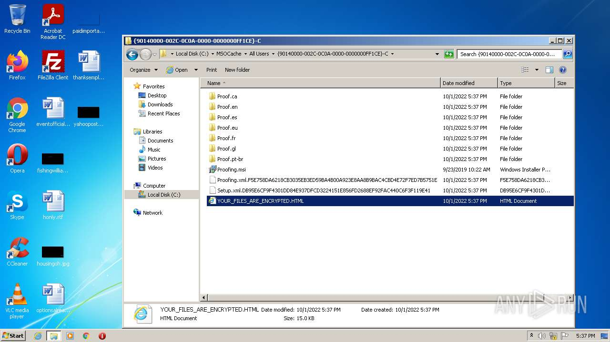
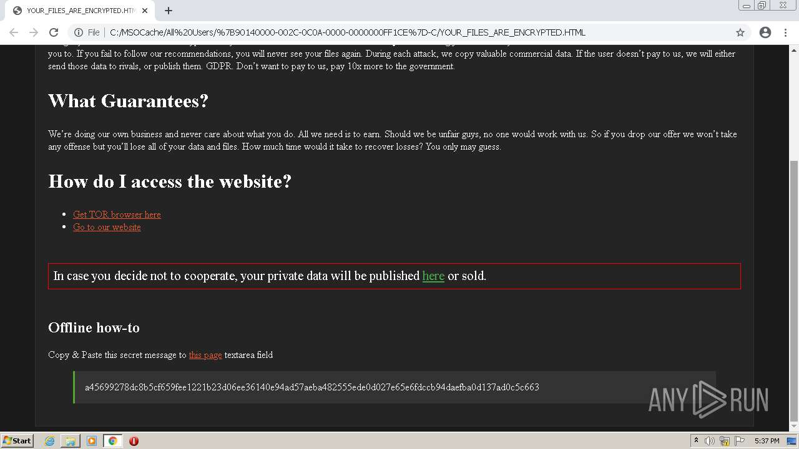
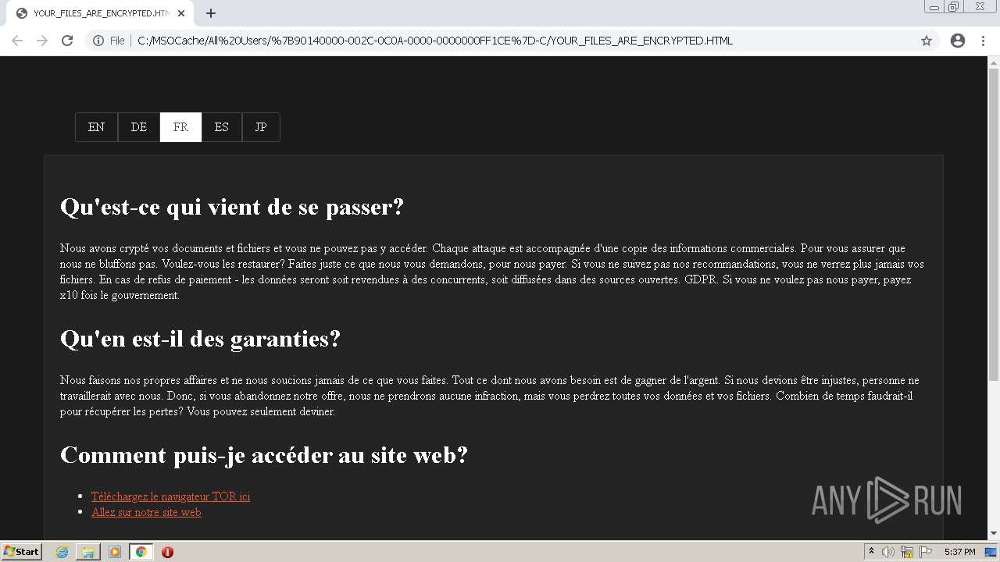
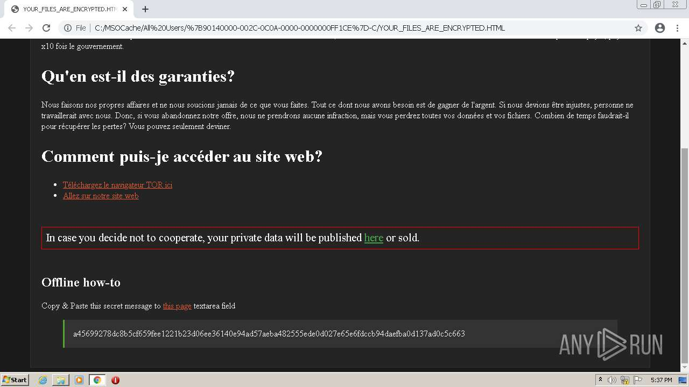
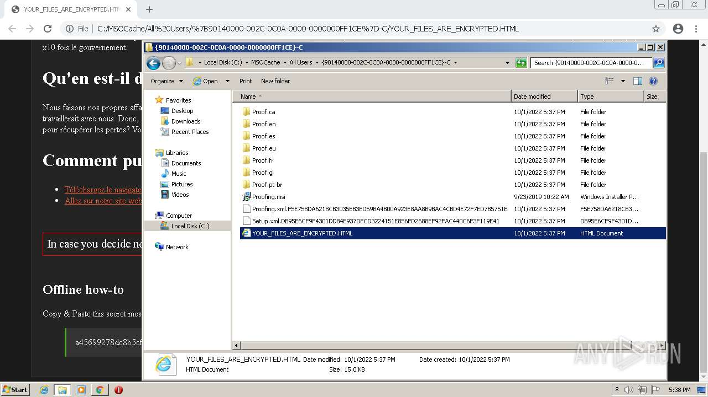
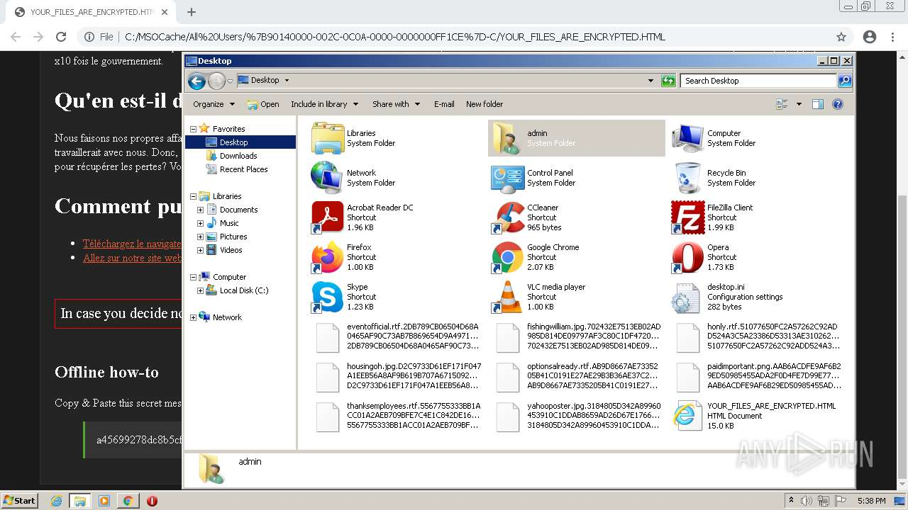
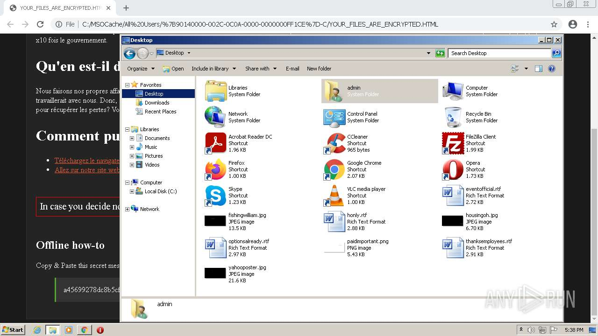

# Trojan-Ransom.Win32.Gen.zph-95ca9e284a085ce93f68c3d12e6c5f557a5049539e3379284a65de784e1bdeff

```
- _id: "95ca9e284a085ce93f68c3d12e6c5f557a5049539e3379284a65de784e1bdeff"
  crowdsourced_yara_results: 
  - author: "Florian Roth"
    description: "Detects an XORed URL in an executable"
    rule_name: "SUSP_XORed_URL_in_EXE"
    ruleset_id: "000f44c4bb"
    ruleset_name: "gen_susp_xor"
    source: "https://github.com/Neo23x0/signature-base"
  first_submission_date: 1611263138  # 2021-01-21 22:05:38 +0100 CET
  last_analysis_date: 1615811529  # 2021-03-15 13:32:09 +0100 CET
  last_analysis_results: 
    Kaspersky: 
      result: "Trojan-Ransom.Win32.Gen.zph"
  magic: "PE32 executable for MS Windows (GUI) Intel 80386 32-bit"
  size: 453120
  trid: 
  - file_type: "Win32 Executable MS Visual C++ (generic)"
    probability: 56.3
  - file_type: "Win16 NE executable (generic)"
    probability: 12.7
  - file_type: "Win32 Dynamic Link Library (generic)"
    probability: 11.8
  - file_type: "Win32 Executable (generic)"
    probability: 8.1
  - file_type: "OS/2 Executable (generic)"
    probability: 3.6
```











