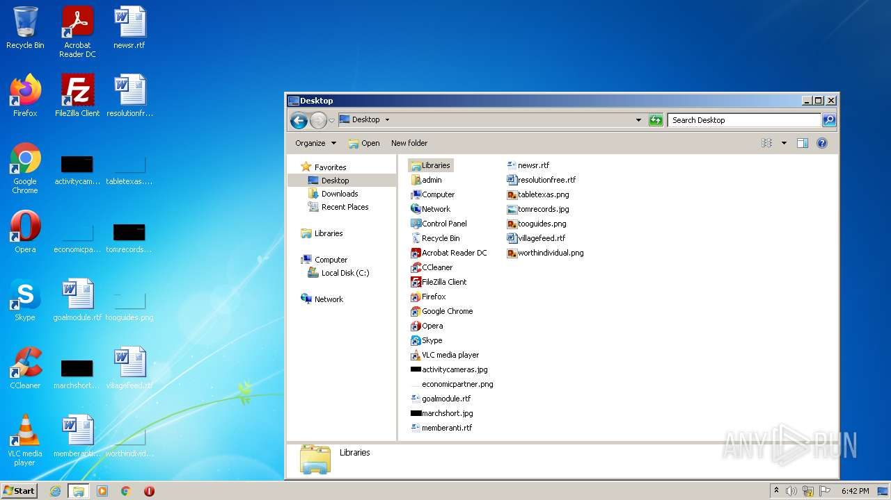
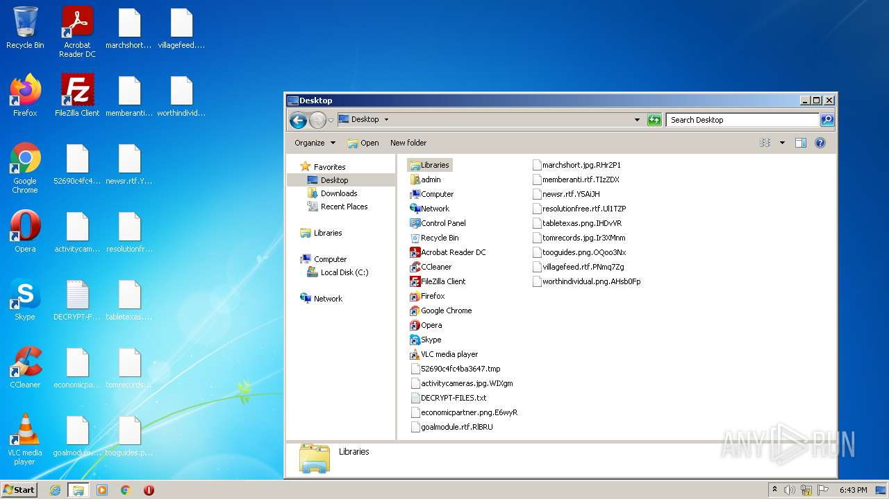
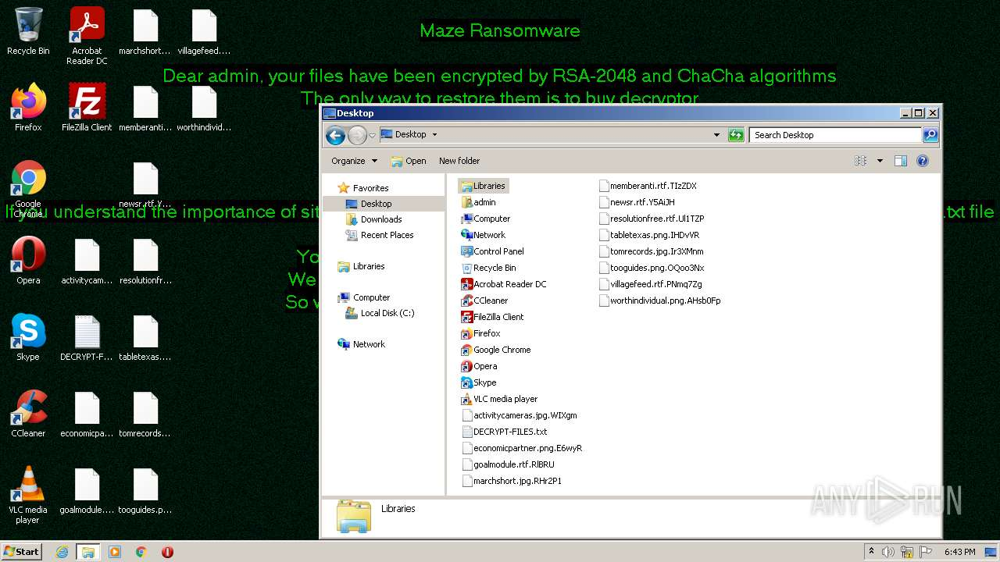
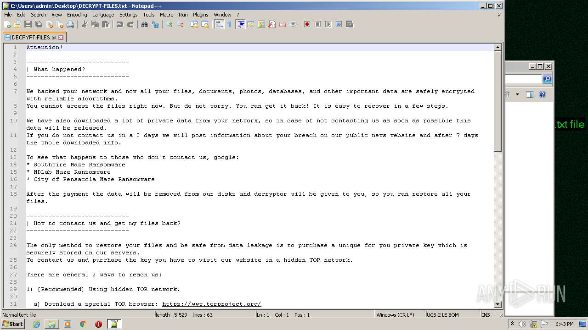
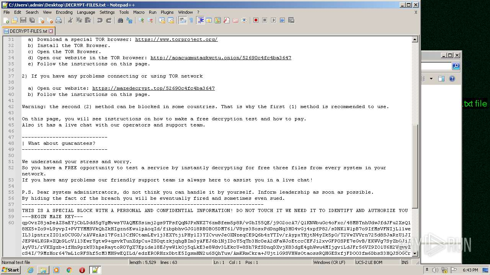
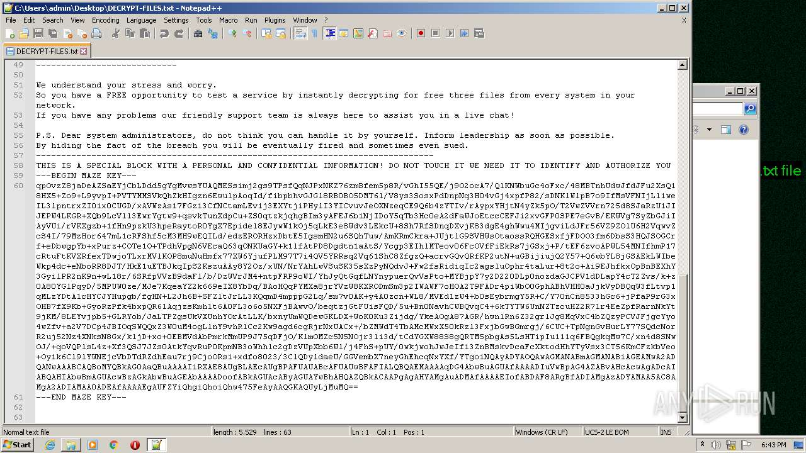
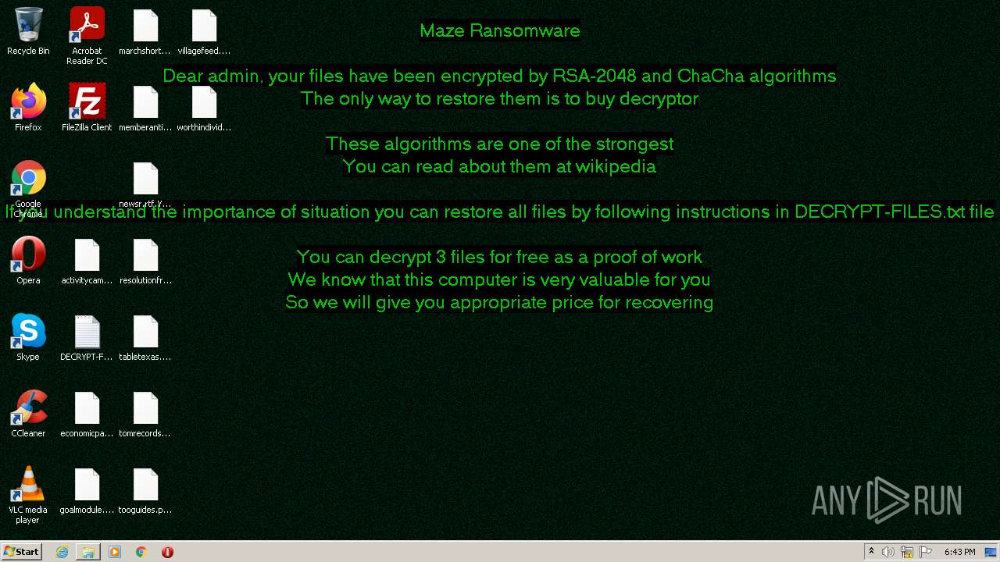
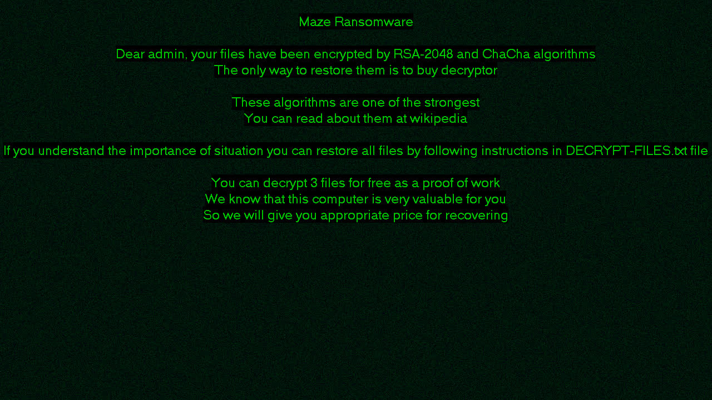

# Trojan-Ransom.Win32.Maze.dm-b345697c16f84d3775924dc17847fa3ff61579ee793a95248e9c4964da586dd1

- https://any.run/report/b345697c16f84d3775924dc17847fa3ff61579ee793a95248e9c4964da586dd1/7d98b9e2-d402-4f2e-ab4f-3d6e5cb55a93

```
- _id: "b345697c16f84d3775924dc17847fa3ff61579ee793a95248e9c4964da586dd1"
  creation_date: 1580321316  # 2020-01-29 19:08:36 +0100 CET
  crowdsourced_yara_results: 
  - description: "Identifies MAZE ransomware"
    rule_name: "Windows_Ransomware_Maze_61254061"
    ruleset_id: "015f35d55b"
    ruleset_name: "Windows_Ransomware_Maze"
    source: "https://github.com/elastic/protections-artifacts"
  - author: "Felix Bilstein - yara-signator at cocacoding dot com"
    description: "Detects win.maze."
    rule_name: "win_maze_auto"
    ruleset_id: "0084b5a9a9"
    ruleset_name: "win.maze_auto"
    source: "https://malpedia.caad.fkie.fraunhofer.de/"
  first_submission_date: 1580360622  # 2020-01-30 06:03:42 +0100 CET
  last_analysis_date: 1662352995  # 2022-09-05 06:43:15 +0200 CEST
  last_analysis_results: 
    Kaspersky: 
      result: "Trojan-Ransom.Win32.Maze.dm"
  magic: "PE32 executable for MS Windows (GUI) Intel 80386 32-bit"
  size: 1142784
  trid: 
  - file_type: "Win32 Executable MS Visual C++ (generic)"
    probability: 48.8
  - file_type: "Win64 Executable (generic)"
    probability: 16.4
  - file_type: "Win32 Dynamic Link Library (generic)"
    probability: 10.2
  - file_type: "Win16 NE executable (generic)"
    probability: 7.8
  - file_type: "Win32 Executable (generic)"
    probability: 7.0
```









