# Trojan-Ransom.Win32.Maze.r-067f1b8f1e0b2bfe286f5169e17834e8cf7f4266b8d97f28ea78995dc81b0e7b

```
- _id: "067f1b8f1e0b2bfe286f5169e17834e8cf7f4266b8d97f28ea78995dc81b0e7b"
  creation_date: 1572330859  # 2019-10-29 07:34:19 +0100 CET
  first_submission_date: 1572338057  # 2019-10-29 09:34:17 +0100 CET
  last_analysis_date: 1655272089  # 2022-06-15 07:48:09 +0200 CEST
  last_analysis_results: 
    Kaspersky: 
      result: "Trojan-Ransom.Win32.Maze.r"
  magic: "PE32 executable for MS Windows (GUI) Intel 80386 32-bit"
  size: 754176
  trid: 
  - file_type: "Win32 Dynamic Link Library (generic)"
    probability: 27.1
  - file_type: "Win16 NE executable (generic)"
    probability: 20.7
  - file_type: "Win32 Executable (generic)"
    probability: 18.5
  - file_type: "Win16/32 Executable Delphi generic"
    probability: 8.5
  - file_type: "OS/2 Executable (generic)"
    probability: 8.3
```

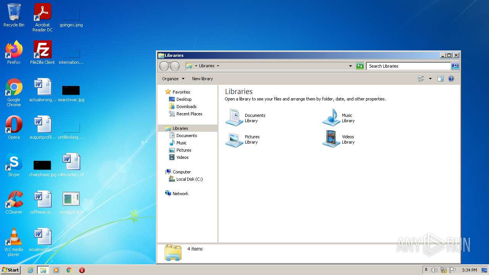
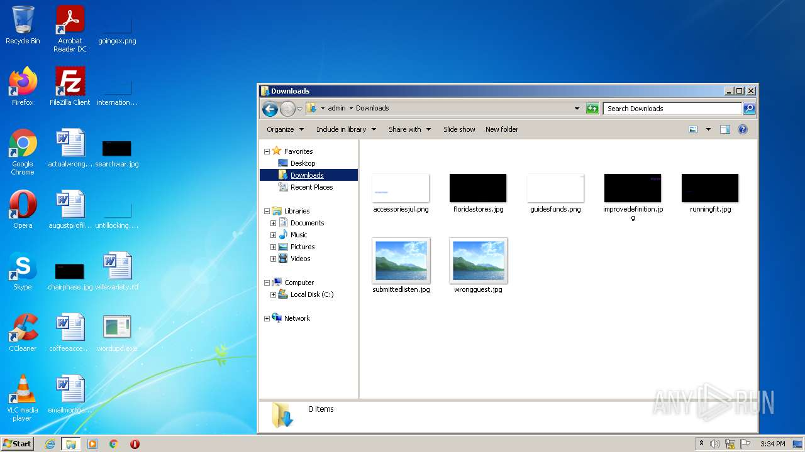


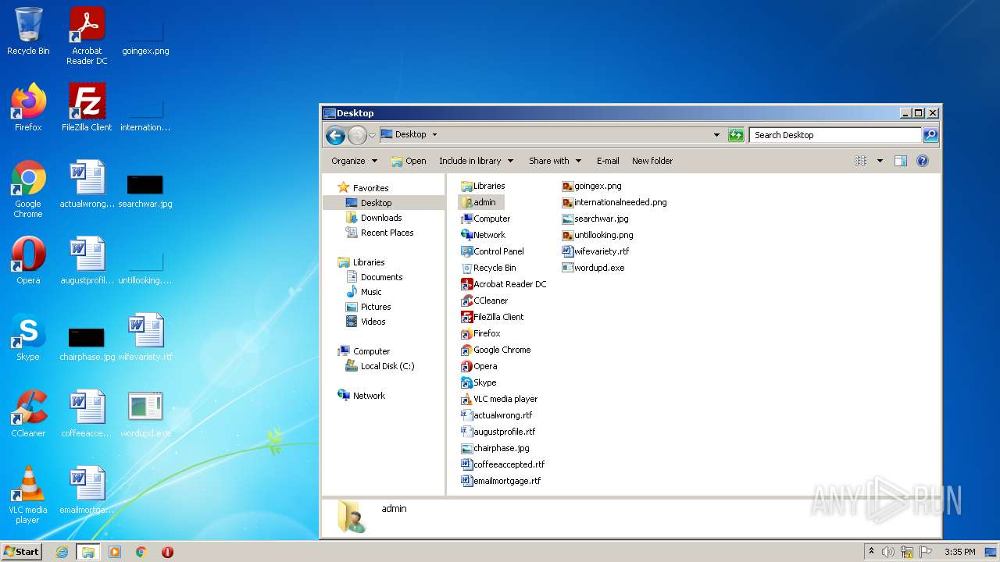
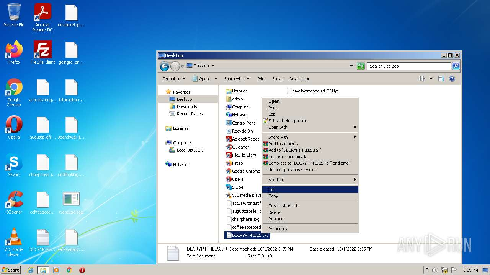
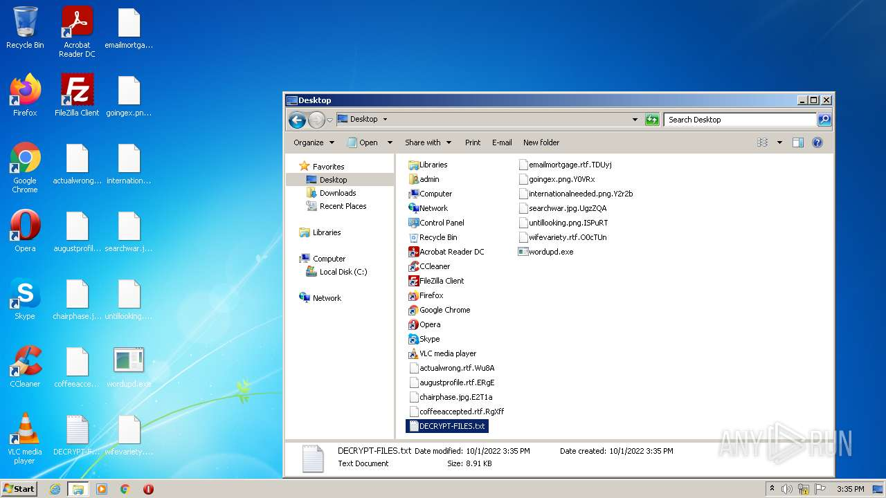

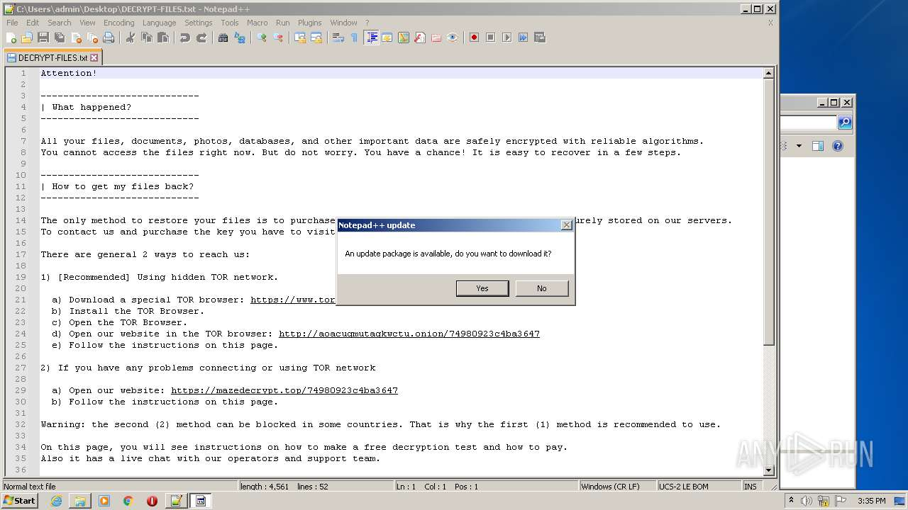
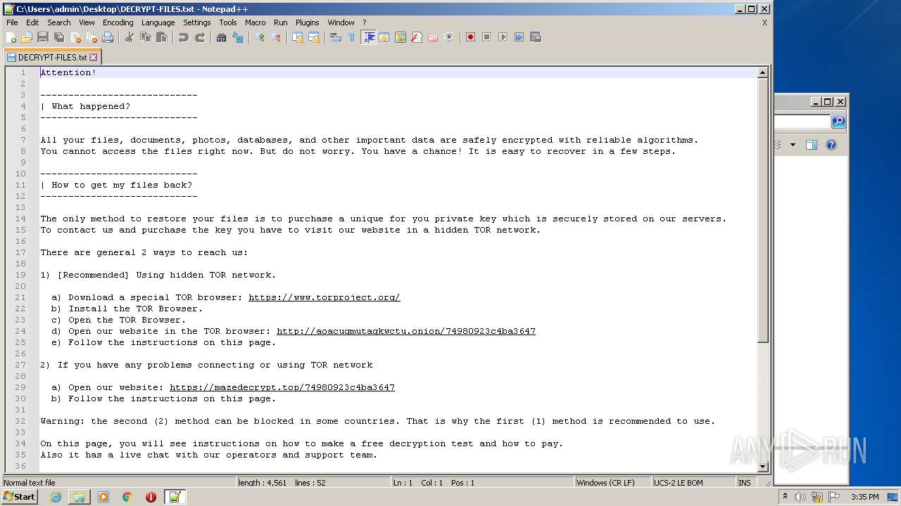
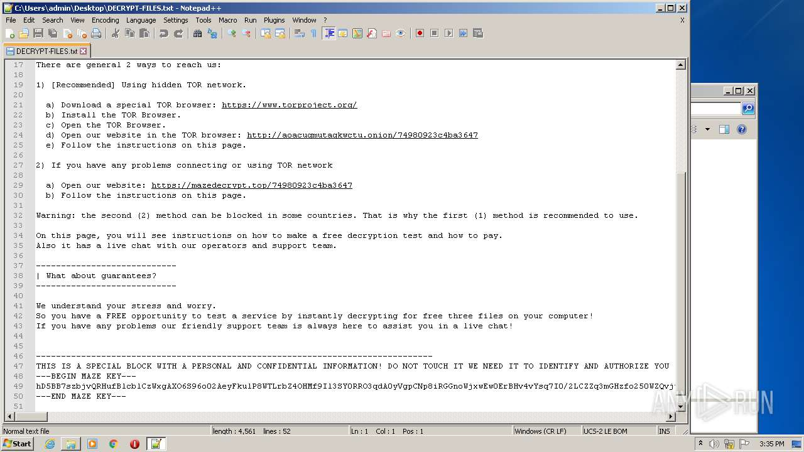
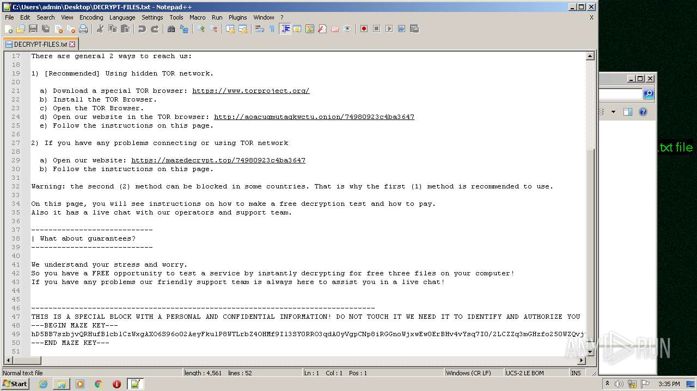
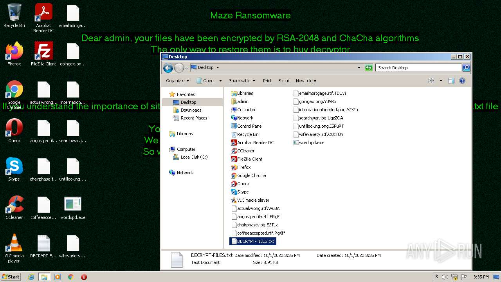
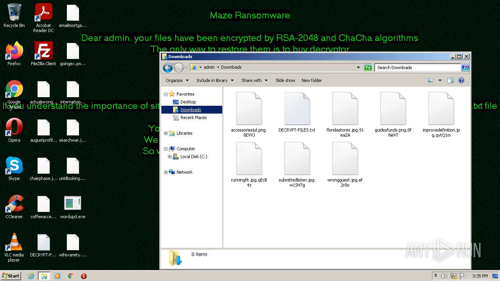
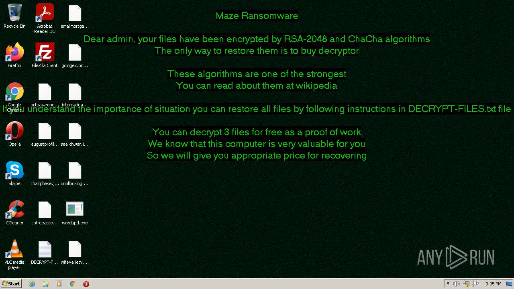
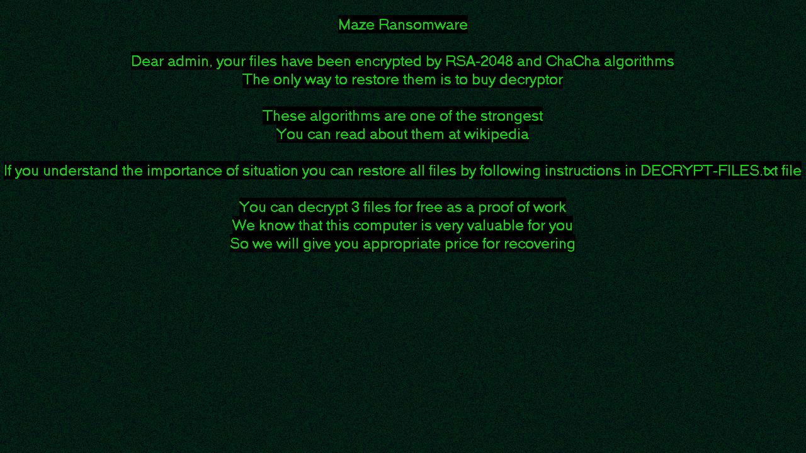
