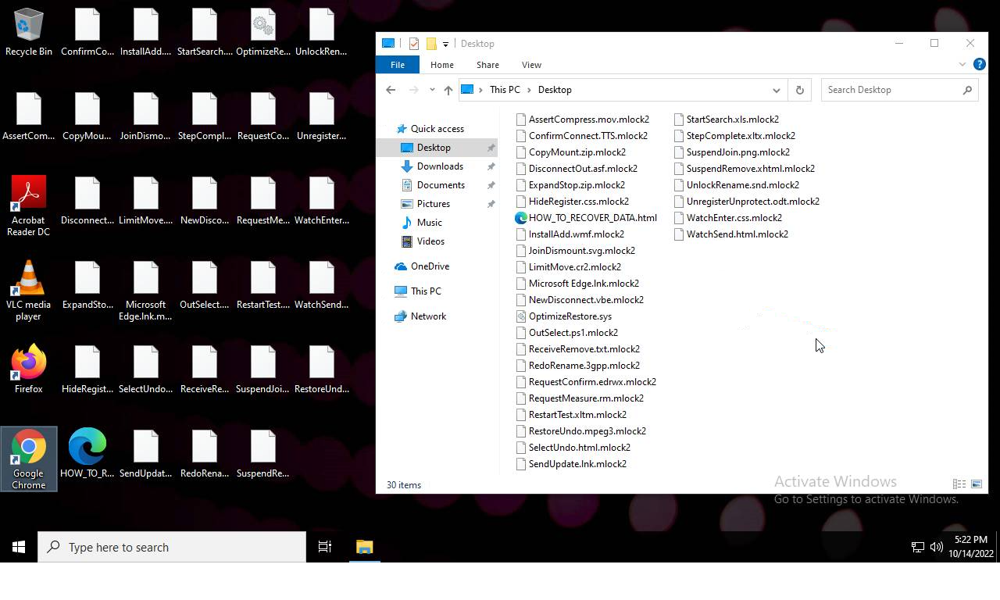
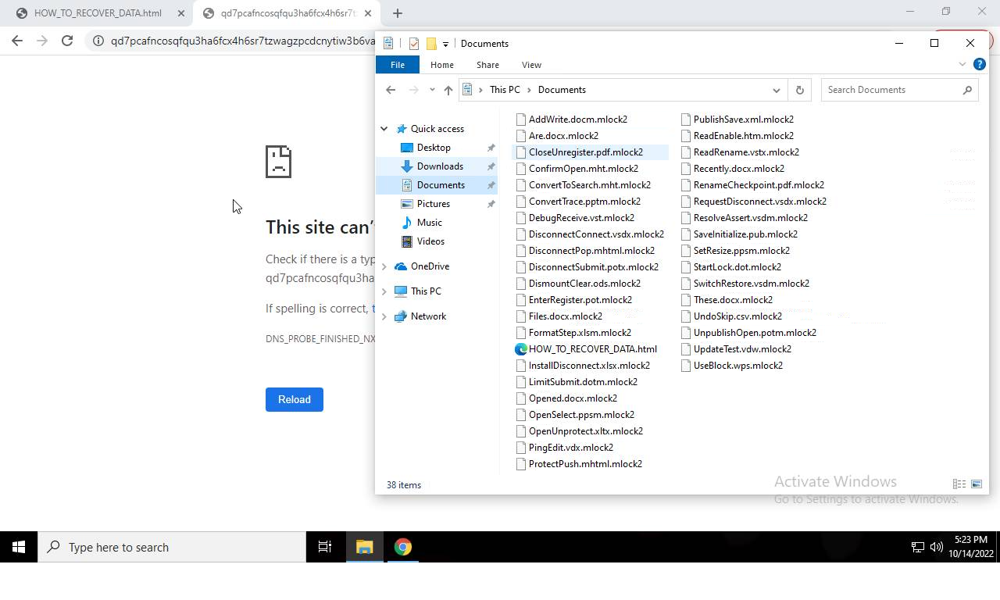

# Trojan-Ransom.Win32.Medusa.n-7a073ba748c752fa795254cb4019c282ef03a0283602a43f5481a49d17323152

- https://tria.ge/221014-vw74nadhc2/behavioral1

```
- _id: "7a073ba748c752fa795254cb4019c282ef03a0283602a43f5481a49d17323152"
  creation_date: 1572502120  # 2019-10-31 07:08:40 +0100 CET
  crowdsourced_yara_results: 
  - author: "ditekSHen"
    description: "detects command variations typically used by ransomware"
    rule_name: "INDICATOR_SUSPICIOUS_GENRansomware"
    ruleset_id: "00c3b8eb5d"
    ruleset_name: "indicator_suspicious"
    source: "https://github.com/ditekshen/detection"
  - author: "ditekSHen"
    description: "Detects Windows exceutables bypassing UAC using CMSTP COM interfaces. MITRE (T1218.003)"
    rule_name: "INDICATOR_SUSPICIOUS_EXE_UACBypass_CMSTPCOM"
    ruleset_id: "00c3b8eb5d"
    ruleset_name: "indicator_suspicious"
    source: "https://github.com/ditekshen/detection"
  - author: "ditekshen"
    description: "Detects MedusaLocker ransomware"
    rule_name: "MALWARE_Win_MedusaLocker"
    ruleset_id: "00cc803bdc"
    ruleset_name: "malware"
    source: "https://github.com/ditekshen/detection"
  - author: "Felix Bilstein - yara-signator at cocacoding dot com"
    description: "Describes win.medusalocker."
    rule_name: "win_medusalocker_auto"
    ruleset_id: "0087f7ad3c"
    ruleset_name: "win.medusalocker_auto"
    source: "https://malpedia.caad.fkie.fraunhofer.de/"
  first_submission_date: 1665756950  # 2022-10-14 16:15:50 +0200 CEST
  last_analysis_date: 1665756950  # 2022-10-14 16:15:50 +0200 CEST
  last_analysis_results: 
    Kaspersky: 
      result: "Trojan-Ransom.Win32.Medusa.n"
  magic: "PE32 executable for MS Windows (GUI) Intel 80386 32-bit"
  size: 685568
  trid: 
  - file_type: "Win64 Executable (generic)"
    probability: 32.2
  - file_type: "Win32 Dynamic Link Library (generic)"
    probability: 20.1
  - file_type: "Win16 NE executable (generic)"
    probability: 15.4
  - file_type: "Win32 Executable (generic)"
    probability: 13.7
  - file_type: "OS/2 Executable (generic)"
    probability: 6.2
```





