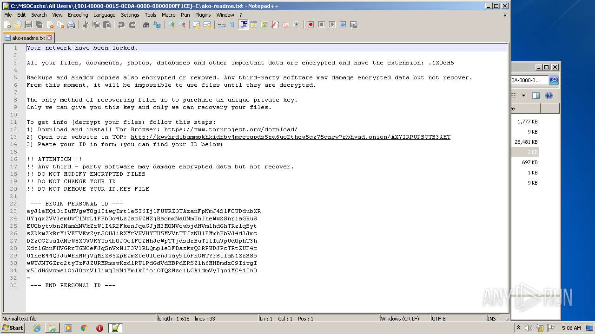

# Trojan-Ransom.Win32.Medusa.t-3b71a640ff55a14c7407ceff83c31ec4e69654cd29e79f53ae674378e3f97d7c

- https://any.run/report/3b71a640ff55a14c7407ceff83c31ec4e69654cd29e79f53ae674378e3f97d7c/bc82691b-474e-41ef-a96e-48fd9b6b777f

```
- _id: "3b71a640ff55a14c7407ceff83c31ec4e69654cd29e79f53ae674378e3f97d7c"
  creation_date: 1578568152  # 2020-01-09 12:09:12 +0100 CET
  crowdsourced_yara_results: 
  - author: "Felix Bilstein - yara-signator at cocacoding dot com"
    description: "autogenerated rule brought to you by yara-signator"
    rule_name: "win_medusalocker_auto"
    ruleset_id: "0087f7ad3c"
    ruleset_name: "win.medusalocker_auto"
    source: "https://malpedia.caad.fkie.fraunhofer.de/"
  - author: "ReversingLabs"
    description: "Yara rule that detects Ako ransomware."
    rule_name: "Win32_Ransomware_Ako"
    ruleset_id: "005741ea63"
    ruleset_name: "Win32.Ransomware.Ako"
    source: "https://github.com/reversinglabs/reversinglabs-yara-rules"
  first_submission_date: 1580996983  # 2020-02-06 14:49:43 +0100 CET
  last_analysis_date: 1624776572  # 2021-06-27 08:49:32 +0200 CEST
  last_analysis_results: 
    Kaspersky: 
      result: "Trojan-Ransom.Win32.Medusa.t"
  magic: "PE32 executable for MS Windows (GUI) Intel 80386 32-bit"
  size: 606208
  trid: 
  - file_type: "Win32 Executable MS Visual C++ (generic)"
    probability: 48.8
  - file_type: "Win64 Executable (generic)"
    probability: 16.4
  - file_type: "Win32 Dynamic Link Library (generic)"
    probability: 10.2
  - file_type: "Win16 NE executable (generic)"
    probability: 7.8
  - file_type: "Win32 Executable (generic)"
    probability: 7.0
```





