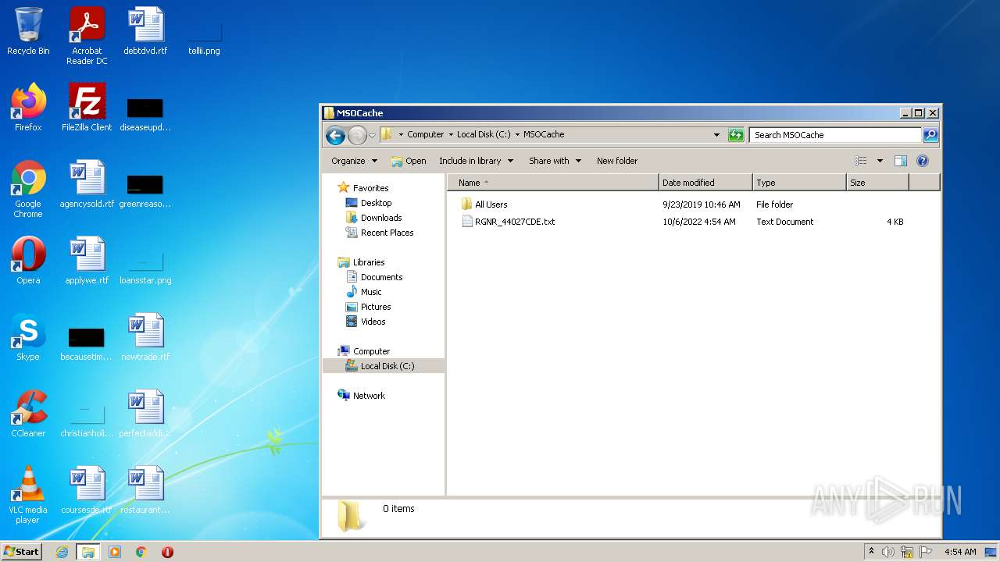
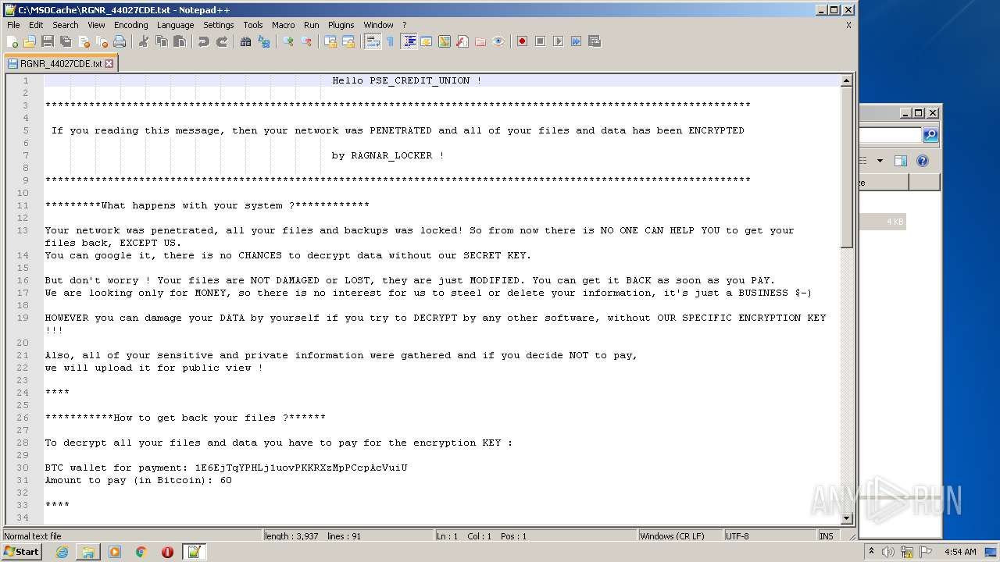
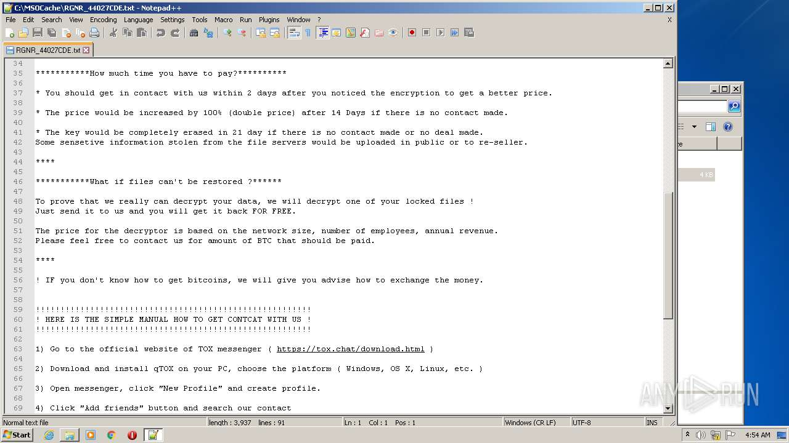
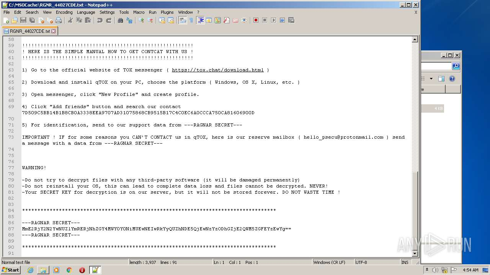
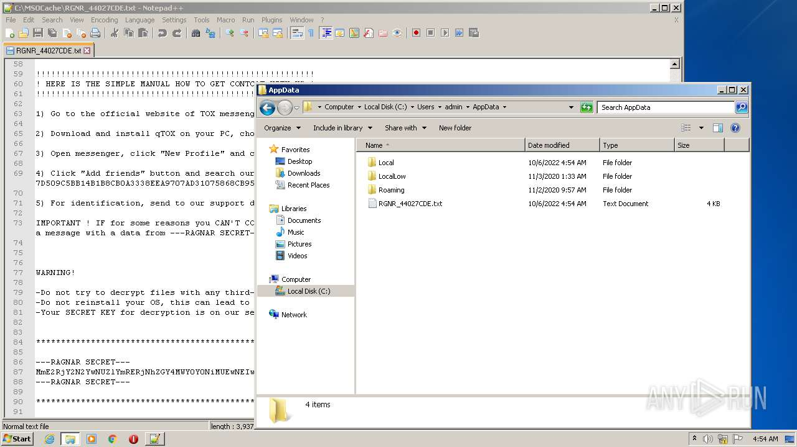
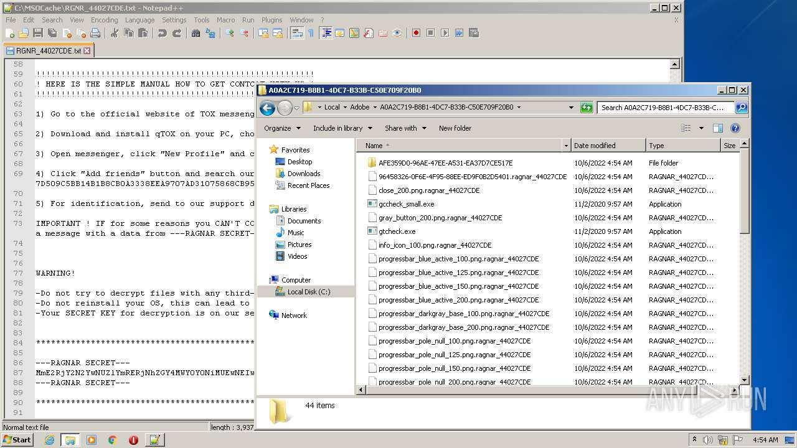
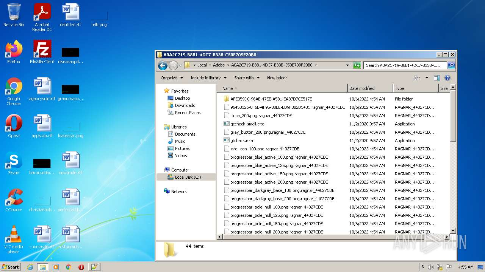
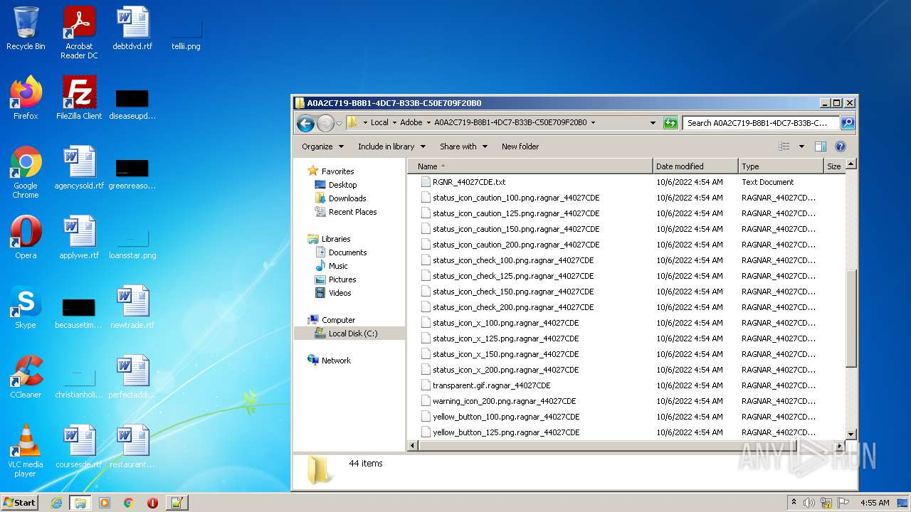
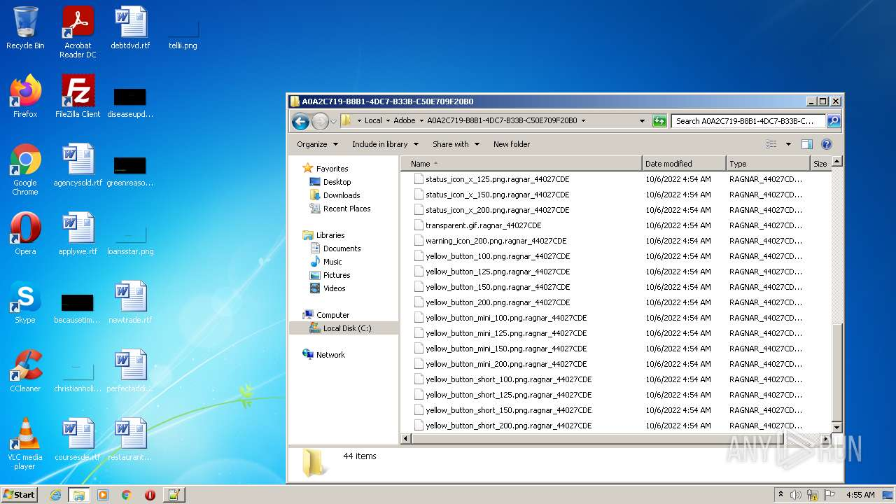
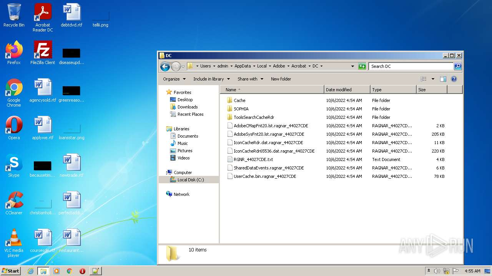

# Trojan-Ransom.Win32.RagnarLocker.a-9bdd7f965d1c67396afb0a84c78b4d12118ff377db7efdca4a1340933120f376

- https://any.run/report/9bdd7f965d1c67396afb0a84c78b4d12118ff377db7efdca4a1340933120f376/cda8afa2-f611-4a33-945a-4c4cbf00f524

```
- _id: "9bdd7f965d1c67396afb0a84c78b4d12118ff377db7efdca4a1340933120f376"
  creation_date: 1580506580  # 2020-01-31 22:36:20 +0100 CET
  crowdsourced_yara_results: 
  - author: "Florian Roth"
    description: "Detects Ragna Locker Ransomware"
    rule_name: "MAL_RANSOM_Ragna_Locker_Apr20_1"
    ruleset_id: "00001ff3fd"
    ruleset_name: "crime_ransom_ragna_locker"
    source: "https://github.com/Neo23x0/signature-base"
  - author: "McAfee ATR Team"
    description: "Rule to detect RagnarLocker samples"
    rule_name: "ragnarlocker_ransomware"
    ruleset_id: "001b3de217"
    ruleset_name: "RANSOM_ragnarlocker"
    source: "https://github.com/advanced-threat-research/Yara-Rules"
  - author: "Felix Bilstein - yara-signator at cocacoding dot com"
    description: "Detects win.ragnarlocker."
    rule_name: "win_ragnarlocker_auto"
    ruleset_id: "00874dc57e"
    ruleset_name: "win.ragnarlocker_auto"
    source: "https://malpedia.caad.fkie.fraunhofer.de/"
  - author: "ReversingLabs"
    description: "Yara rule that detects RagnarLocker ransomware."
    rule_name: "Win32_Ransomware_RagnarLocker"
    ruleset_id: "00536666f2"
    ruleset_name: "Win32.Ransomware.RagnarLocker"
    source: "https://github.com/reversinglabs/reversinglabs-yara-rules"
  first_submission_date: 1580837092  # 2020-02-04 18:24:52 +0100 CET
  last_analysis_date: 1662151240  # 2022-09-02 22:40:40 +0200 CEST
  last_analysis_results: 
    Kaspersky: 
      result: "Trojan-Ransom.Win32.RagnarLocker.a"
  magic: "PE32 executable for MS Windows (GUI) Intel 80386 32-bit"
  size: 40448
  trid: 
  - file_type: "Win32 Dynamic Link Library (generic)"
    probability: 29.6
  - file_type: "Win16 NE executable (generic)"
    probability: 22.7
  - file_type: "Win32 Executable (generic)"
    probability: 20.3
  - file_type: "OS/2 Executable (generic)"
    probability: 9.1
  - file_type: "Generic Win/DOS Executable"
    probability: 9.0
```












