# Trojan-Ransom.Win32.RagnarLocker.h-041fd213326dd5c10a16caf88ff076bb98c68c052284430fba5f601023d39a14

```
- _id: "041fd213326dd5c10a16caf88ff076bb98c68c052284430fba5f601023d39a14"
  creation_date: 1580506580  # 2020-01-31 22:36:20 +0100 CET
  crowdsourced_yara_results: 
  - author: "InQuest Labs"
    description: "This signature identifies Adobe Extensible Metadata Platform (XMP) identifiers embedded within files. Defined as a standard for mapping graphical asset relationships, XMP allows for tracking of both parent-child relationships and individual revisions. There are three categories of identifiers: original document, document, and instance. Generally, XMP data is stored in XML format, updated on save/copy, and embedded within the graphical asset. These identifiers can be used to track both malicious and benign graphics within common Microsoft and Adobe document lures."
    rule_name: "Adobe_XMP_Identifier"
    ruleset_id: "0121ae37cc"
    ruleset_name: "Adobe_XMP_Identifier"
    source: "https://github.com/InQuest/yara-rules-vt"
  - author: "Florian Roth"
    description: "Detects Ragna Locker Ransomware"
    rule_name: "MAL_RANSOM_Ragna_Locker_Apr20_1"
    ruleset_id: "00001ff3fd"
    ruleset_name: "crime_ransom_ragna_locker"
    source: "https://github.com/Neo23x0/signature-base"
  - author: "ReversingLabs"
    description: "Yara rule that detects RagnarLocker ransomware."
    rule_name: "Win32_Ransomware_RagnarLocker"
    ruleset_id: "00536666f2"
    ruleset_name: "Win32.Ransomware.RagnarLocker"
    source: "https://github.com/reversinglabs/reversinglabs-yara-rules"
  first_submission_date: 1590598913  # 2020-05-27 19:01:53 +0200 CEST
  last_analysis_date: 1662047372  # 2022-09-01 17:49:32 +0200 CEST
  last_analysis_results: 
    Kaspersky: 
      result: "Trojan-Ransom.Win32.RagnarLocker.h"
  magic: "PE32 executable for MS Windows (GUI) Intel 80386 32-bit"
  size: 817764
  trid: 
  - file_type: "Win32 Dynamic Link Library (generic)"
    probability: 29.6
  - file_type: "Win16 NE executable (generic)"
    probability: 22.7
  - file_type: "Win32 Executable (generic)"
    probability: 20.3
  - file_type: "OS/2 Executable (generic)"
    probability: 9.1
  - file_type: "Generic Win/DOS Executable"
    probability: 9.0
```


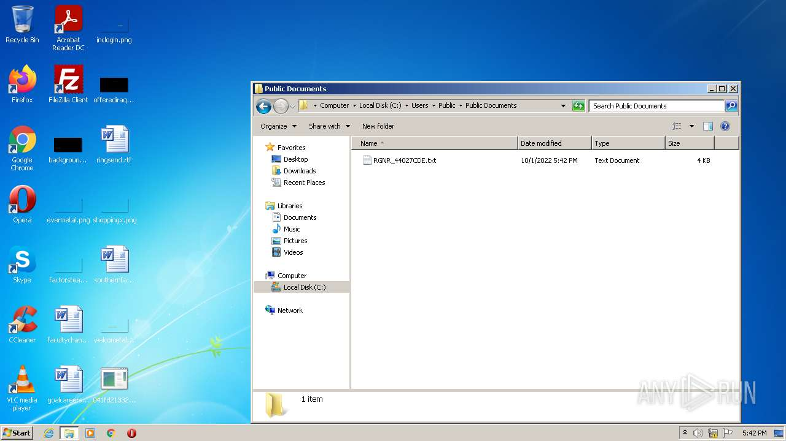
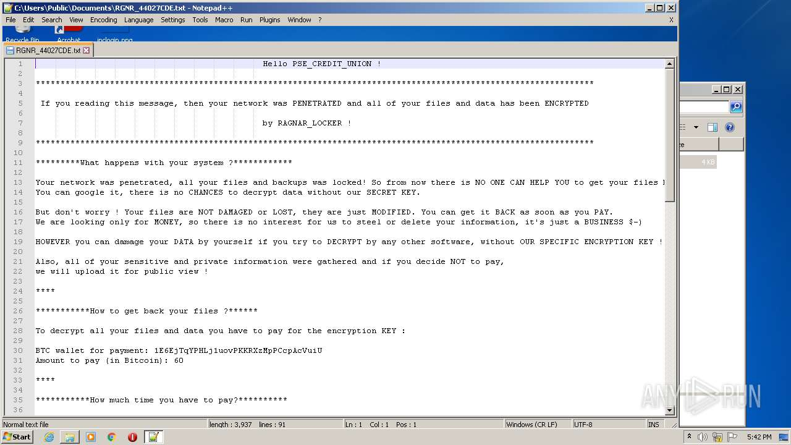
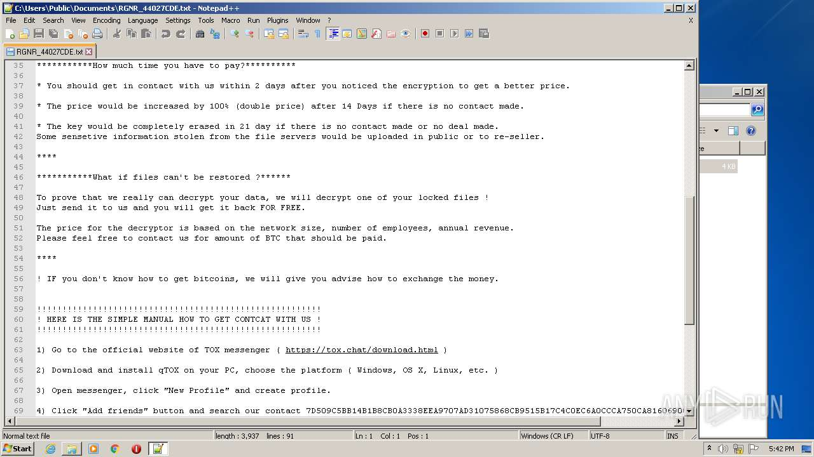
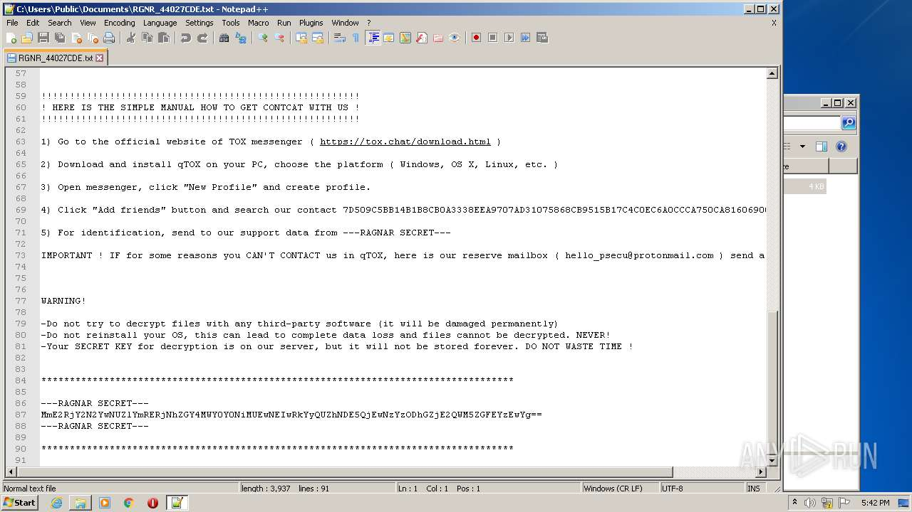
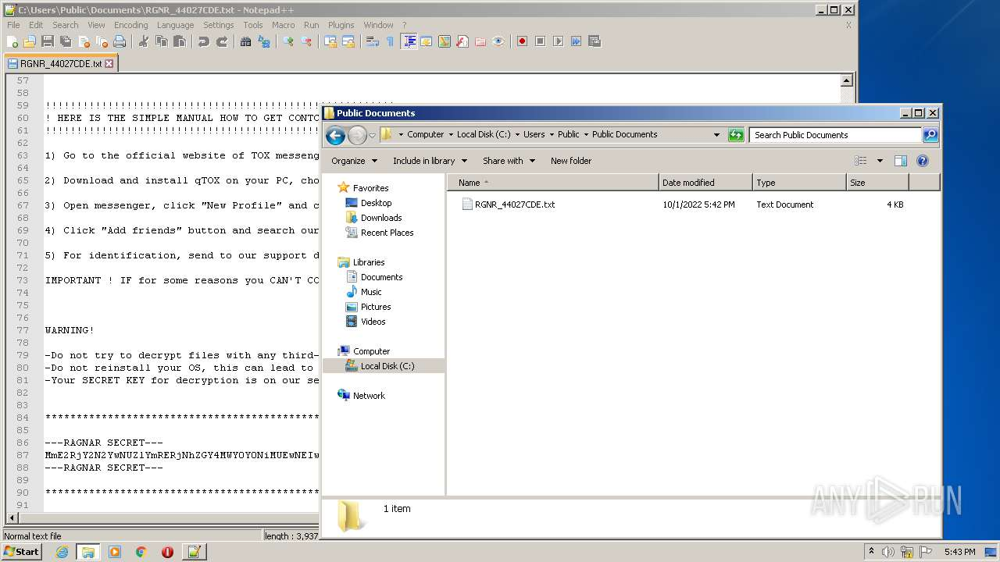
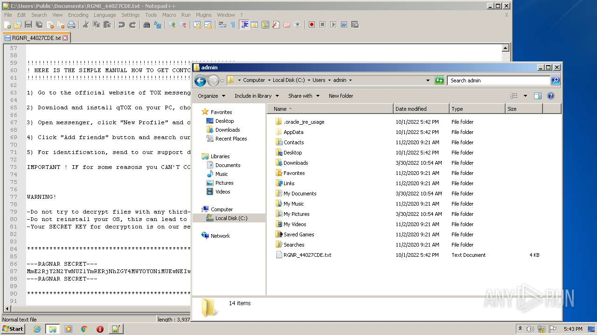

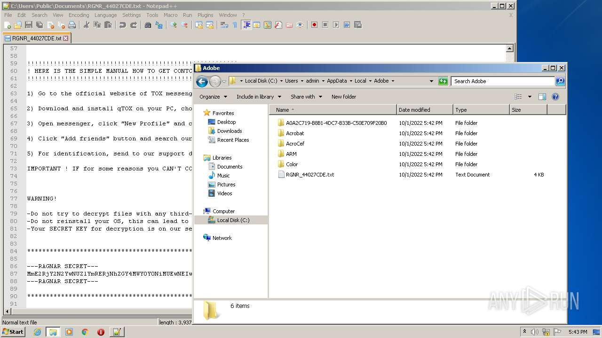
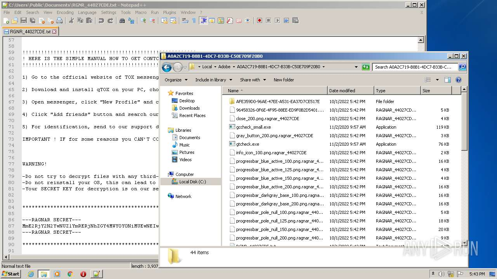
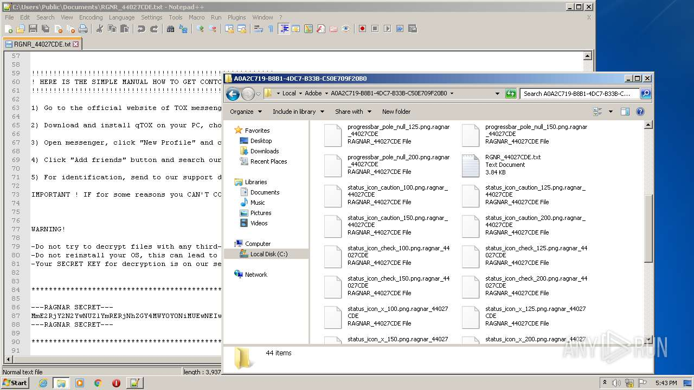
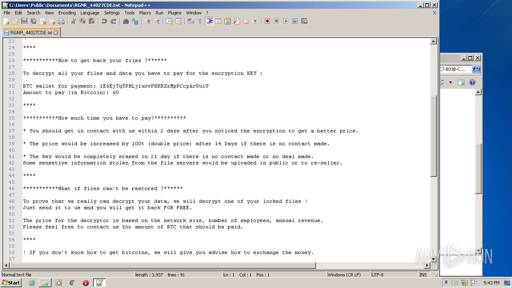
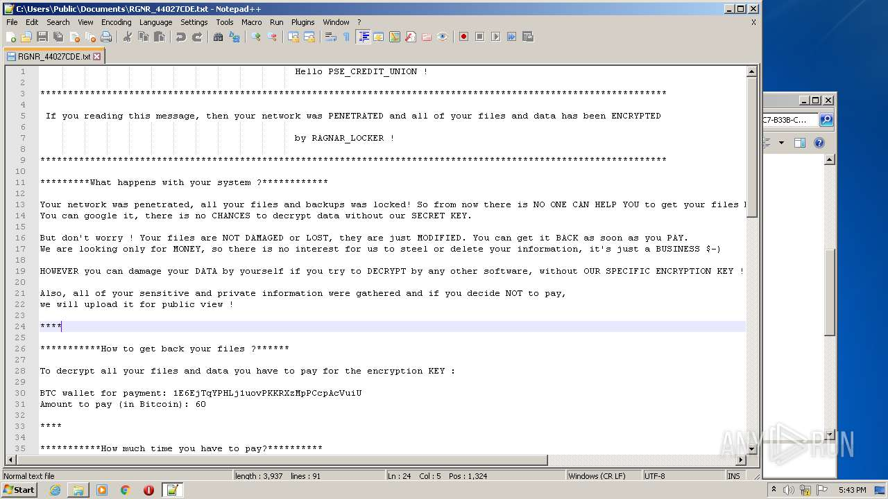
