# Trojan-Ransom.Win32.Sodin.aao-b5e73c65a92abd6d8ea6040739e6b71a207035f1517f3813c56fbac937b8ff06

- https://any.run/report/b5e73c65a92abd6d8ea6040739e6b71a207035f1517f3813c56fbac937b8ff06/bb4adf2d-833a-4d8d-bb6c-78b7fb7bc937

```
- _id: "b5e73c65a92abd6d8ea6040739e6b71a207035f1517f3813c56fbac937b8ff06"
  creation_date: 1577916997  # 2020-01-01 23:16:37 +0100 CET
  crowdsourced_yara_results: 
  - author: "Florian Roth"
    description: "Detects REvil ransomware"
    rule_name: "MAL_RANSOM_REvil_Oct20_1"
    ruleset_id: "00014065d5"
    ruleset_name: "crime_ransom_revil"
    source: "https://github.com/Neo23x0/signature-base"
  - description: "Identifies SODINOKIBI/REvil ransomware"
    rule_name: "Windows_Ransomware_Sodinokibi_83f05fbe"
    ruleset_id: "0157b42ee5"
    ruleset_name: "Windows_Ransomware_Sodinokibi"
    source: "https://github.com/elastic/protections-artifacts"
  - description: "Identifies SODINOKIBI/REvil ransomware"
    rule_name: "Windows_Ransomware_Sodinokibi_a282ba44"
    ruleset_id: "0157b42ee5"
    ruleset_name: "Windows_Ransomware_Sodinokibi"
    source: "https://github.com/elastic/protections-artifacts"
  - author: "Felix Bilstein - yara-signator at cocacoding dot com"
    description: "Detects win.revil."
    rule_name: "win_revil_auto"
    ruleset_id: "008278ba59"
    ruleset_name: "win.revil_auto"
    source: "https://malpedia.caad.fkie.fraunhofer.de/"
  first_submission_date: 1657261157  # 2022-07-08 08:19:17 +0200 CEST
  last_analysis_date: 1663147824  # 2022-09-14 11:30:24 +0200 CEST
  last_analysis_results: 
    Kaspersky: 
      result: "Trojan-Ransom.Win32.Sodin.aao"
  magic: "PE32 executable for MS Windows (GUI) Intel 80386 32-bit"
  size: 168448
  trid: 
  - file_type: "Win32 Dynamic Link Library (generic)"
    probability: 29.6
  - file_type: "Win16 NE executable (generic)"
    probability: 22.7
  - file_type: "Win32 Executable (generic)"
    probability: 20.3
  - file_type: "OS/2 Executable (generic)"
    probability: 9.1
  - file_type: "Generic Win/DOS Executable"
    probability: 9.0
```


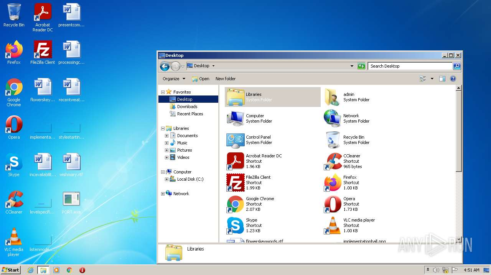
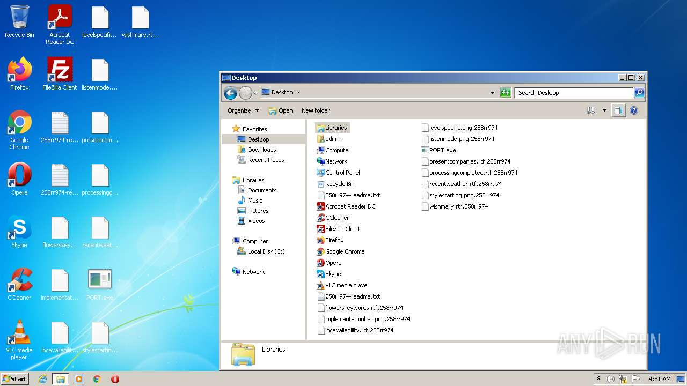
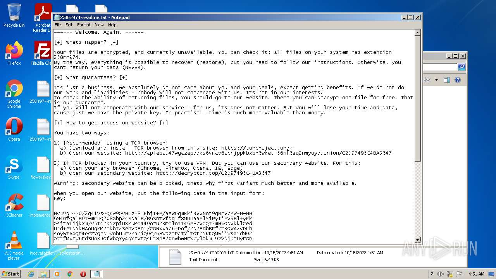
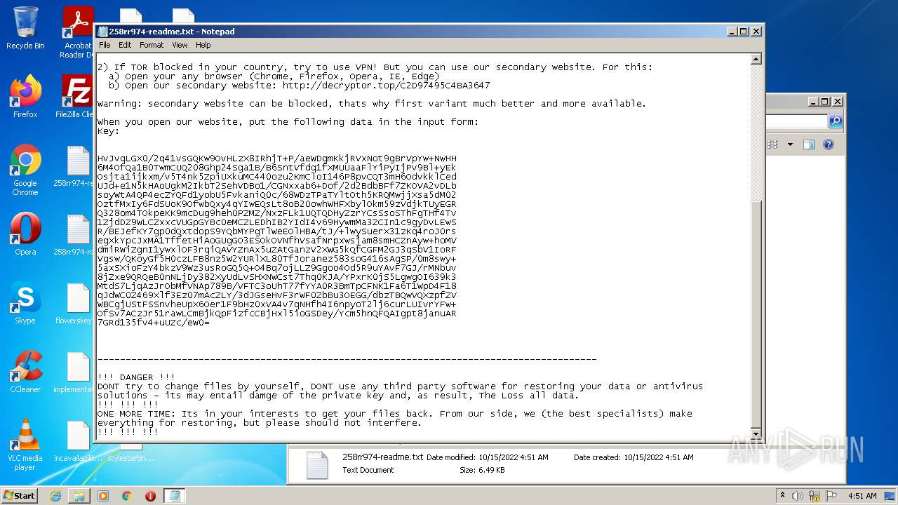
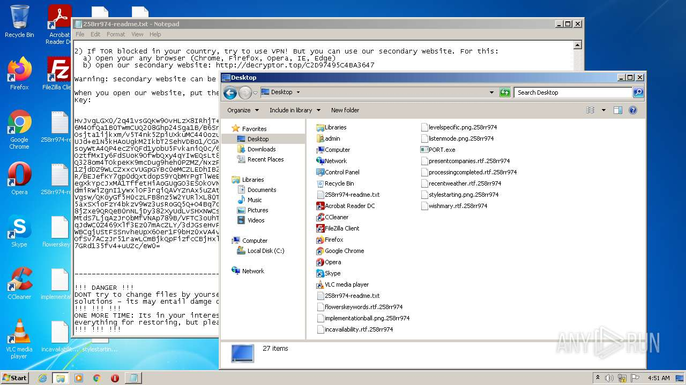
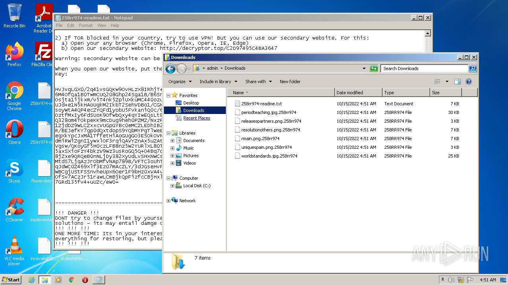
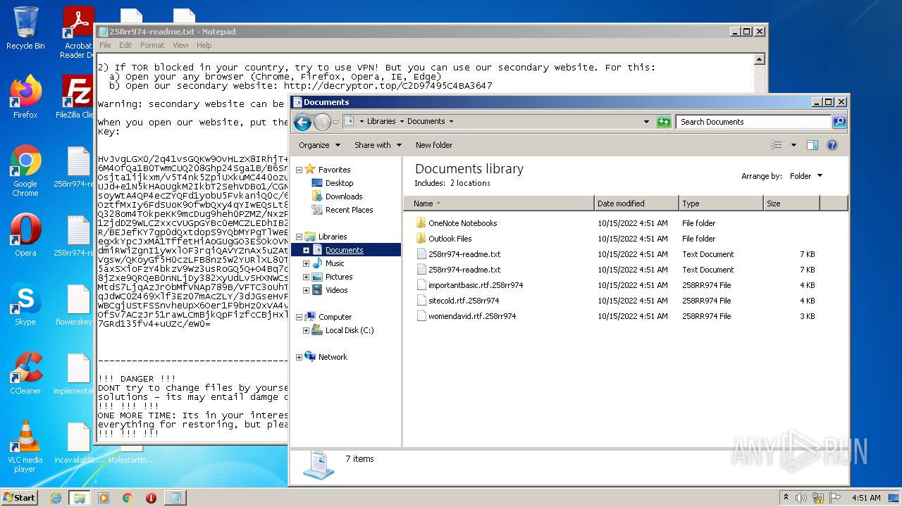
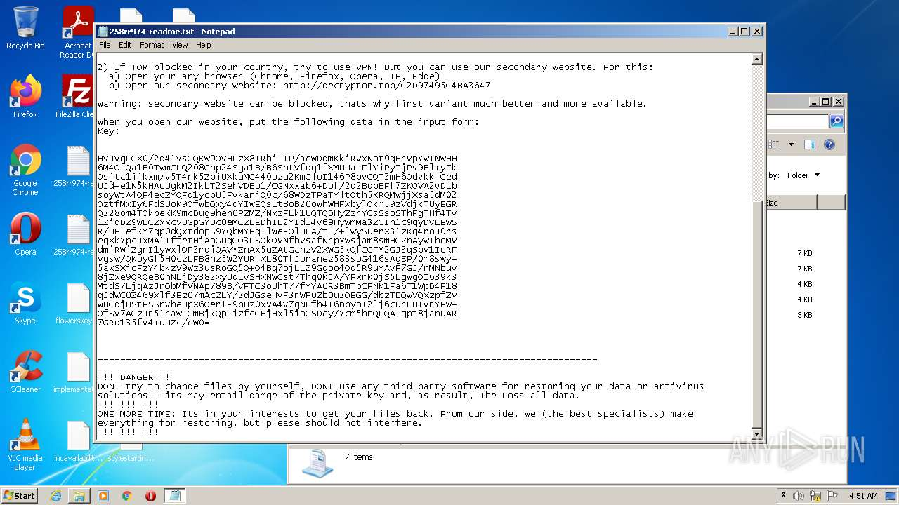
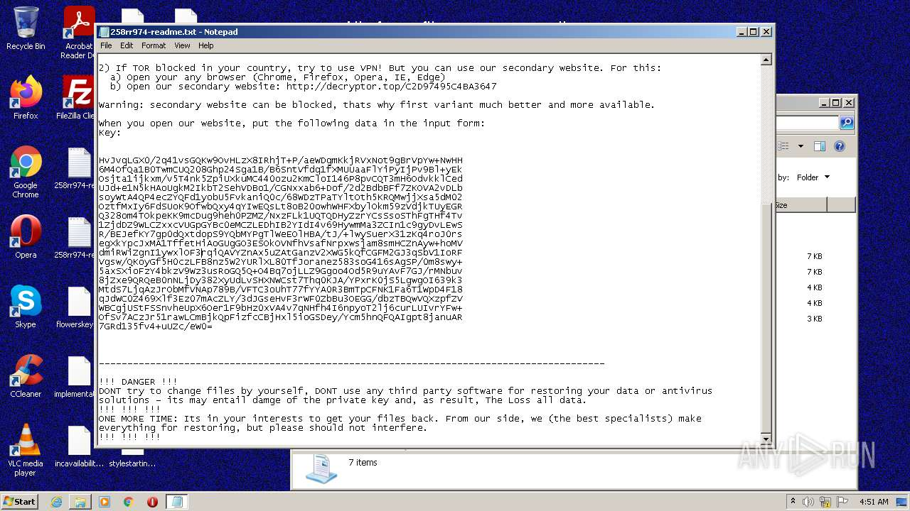
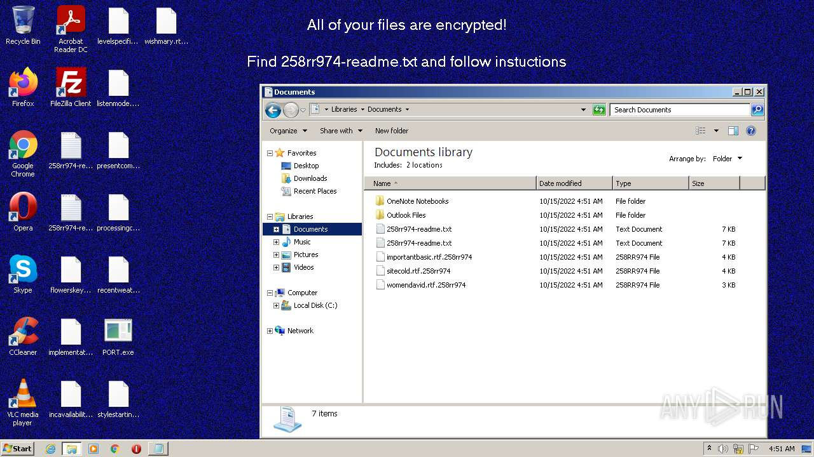
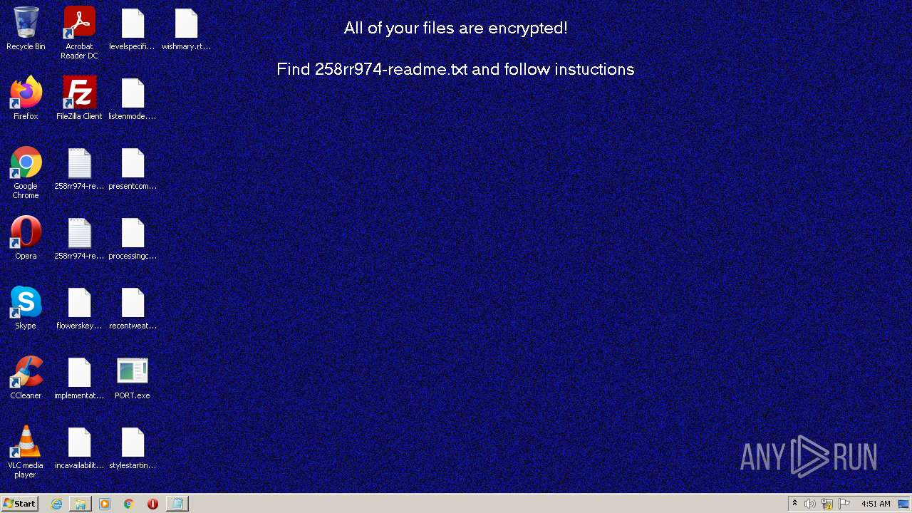
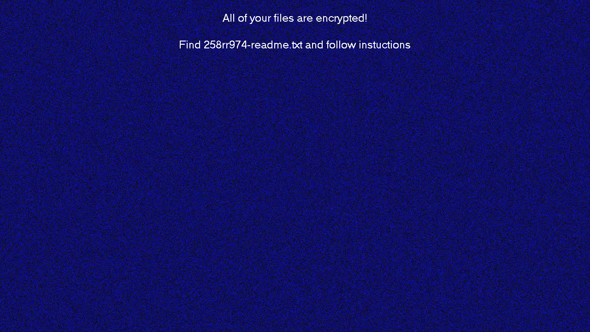
