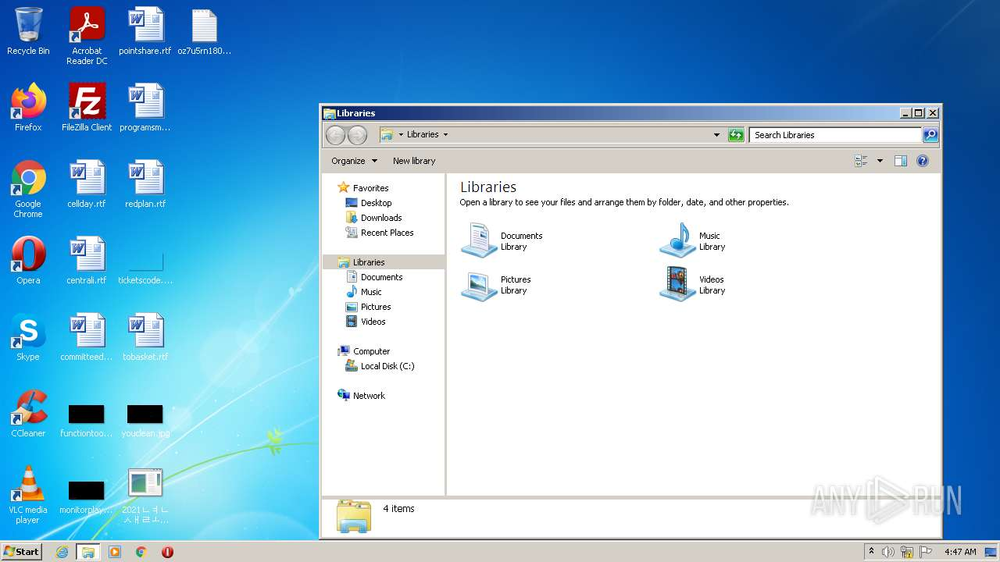
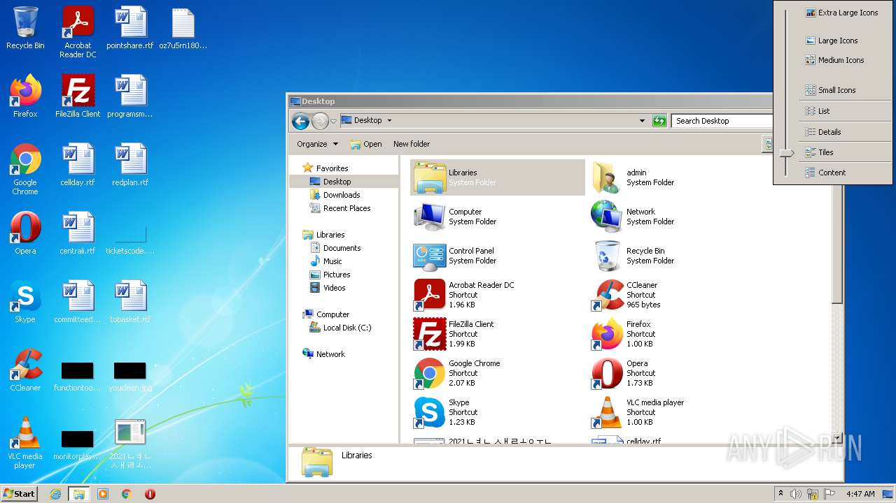
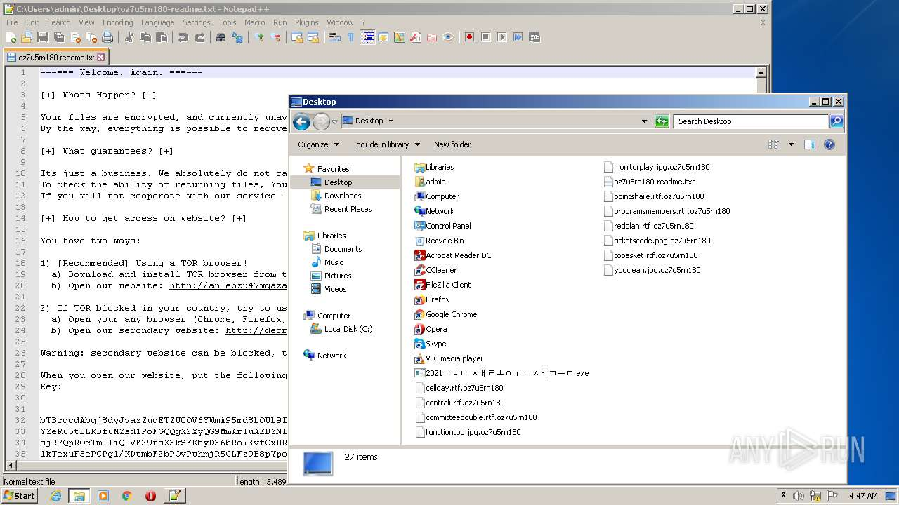
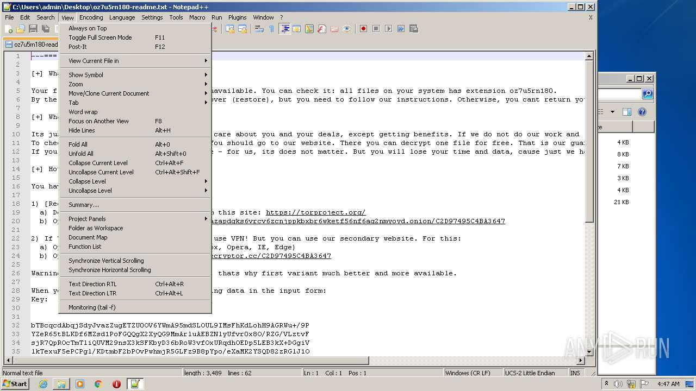
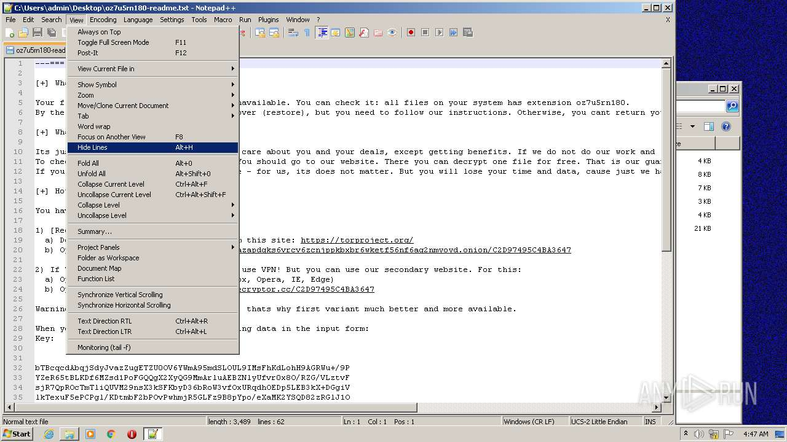
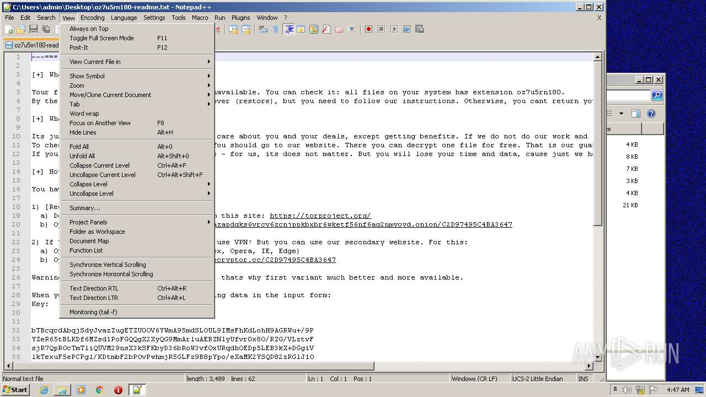
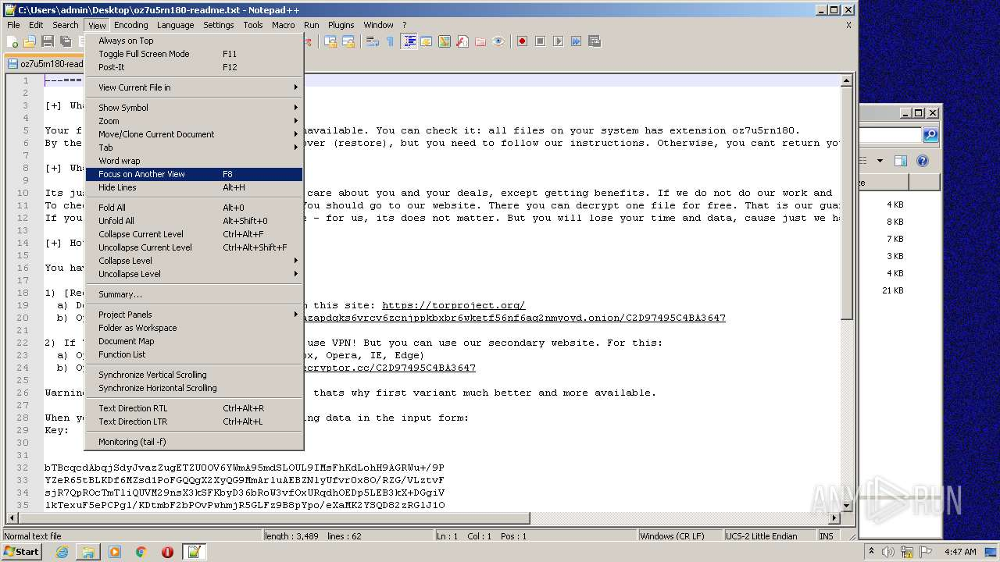
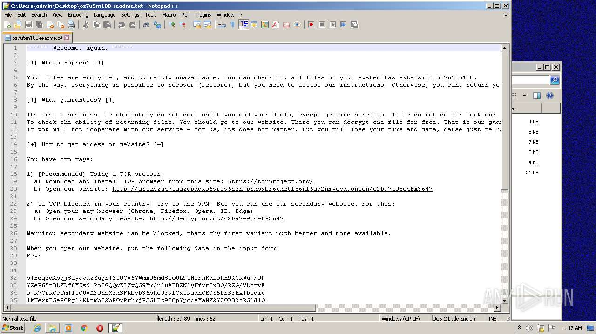
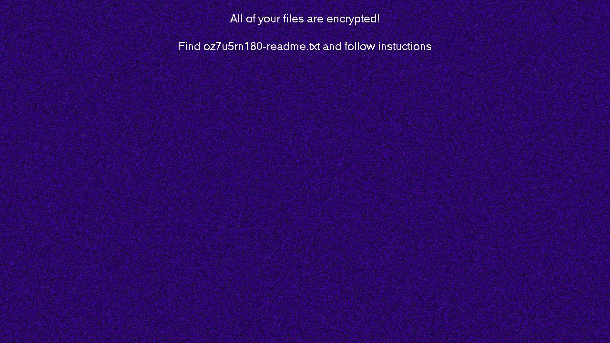

# Trojan-Ransom.Win32.Sodin.abw-d91f951bdcf35012ac6b47c28cf32ec143e4269243d8c229f6cb326fd343df95

```
- _id: "d91f951bdcf35012ac6b47c28cf32ec143e4269243d8c229f6cb326fd343df95"
  creation_date: 1605314017  # 2020-11-14 01:33:37 +0100 CET
  crowdsourced_yara_results: 
  - author: "Florian Roth"
    description: "Detects REvil ransomware"
    rule_name: "MAL_RANSOM_REvil_Oct20_1"
    ruleset_id: "00014065d5"
    ruleset_name: "crime_ransom_revil"
    source: "https://github.com/Neo23x0/signature-base"
  - author: "Felix Bilstein - yara-signator at cocacoding dot com"
    description: "Detects win.revil."
    rule_name: "win_revil_auto"
    ruleset_id: "008278ba59"
    ruleset_name: "win.revil_auto"
    source: "https://malpedia.caad.fkie.fraunhofer.de/"
  first_submission_date: 1605967601  # 2020-11-21 15:06:41 +0100 CET
  last_analysis_date: 1644371213  # 2022-02-09 02:46:53 +0100 CET
  last_analysis_results: 
    Kaspersky: 
      result: "Trojan-Ransom.Win32.Sodin.abw"
  magic: "PE32 executable for MS Windows (GUI) Intel 80386 32-bit"
  size: 120832
  trid: 
  - file_type: "Win32 Dynamic Link Library (generic)"
    probability: 29.6
  - file_type: "Win16 NE executable (generic)"
    probability: 22.7
  - file_type: "Win32 Executable (generic)"
    probability: 20.3
  - file_type: "OS/2 Executable (generic)"
    probability: 9.1
  - file_type: "Generic Win/DOS Executable"
    probability: 9.0
```


















