# Trojan-Ransom.Win32.Sodin.bi-b78469fb8eff53d82081bdcb0dbb3436f239b8ca6ef7fd800ce5ba7e098c256f

- https://any.run/report/b78469fb8eff53d82081bdcb0dbb3436f239b8ca6ef7fd800ce5ba7e098c256f/53e70ce8-0932-45a7-9064-25b691b9b74f

```
- _id: "b78469fb8eff53d82081bdcb0dbb3436f239b8ca6ef7fd800ce5ba7e098c256f"
  creation_date: 1581451410  # 2020-02-11 21:03:30 +0100 CET
  crowdsourced_yara_results: 
  - author: "Florian Roth"
    description: "Detects REvil ransomware"
    rule_name: "MAL_RANSOM_REvil_Oct20_1"
    ruleset_id: "00014065d5"
    ruleset_name: "crime_ransom_revil"
    source: "https://github.com/Neo23x0/signature-base"
  - description: "Identifies SODINOKIBI/REvil ransomware"
    rule_name: "Windows_Ransomware_Sodinokibi_83f05fbe"
    ruleset_id: "0157b42ee5"
    ruleset_name: "Windows_Ransomware_Sodinokibi"
    source: "https://github.com/elastic/protections-artifacts"
  - description: "Identifies SODINOKIBI/REvil ransomware"
    rule_name: "Windows_Ransomware_Sodinokibi_a282ba44"
    ruleset_id: "0157b42ee5"
    ruleset_name: "Windows_Ransomware_Sodinokibi"
    source: "https://github.com/elastic/protections-artifacts"
  - author: "Felix Bilstein - yara-signator at cocacoding dot com"
    description: "Detects win.revil."
    rule_name: "win_revil_auto"
    ruleset_id: "008278ba59"
    ruleset_name: "win.revil_auto"
    source: "https://malpedia.caad.fkie.fraunhofer.de/"
  first_submission_date: 1584334316  # 2020-03-16 05:51:56 +0100 CET
  last_analysis_date: 1662884366  # 2022-09-11 10:19:26 +0200 CEST
  last_analysis_results: 
    Kaspersky: 
      result: "Trojan-Ransom.Win32.Sodin.bi"
  magic: "PE32 executable for MS Windows (console) Intel 80386 32-bit"
  size: 186368
  trid: 
  - file_type: "Win32 Dynamic Link Library (generic)"
    probability: 29.6
  - file_type: "Win16 NE executable (generic)"
    probability: 22.7
  - file_type: "Win32 Executable (generic)"
    probability: 20.3
  - file_type: "OS/2 Executable (generic)"
    probability: 9.1
  - file_type: "Generic Win/DOS Executable"
    probability: 9.0
```

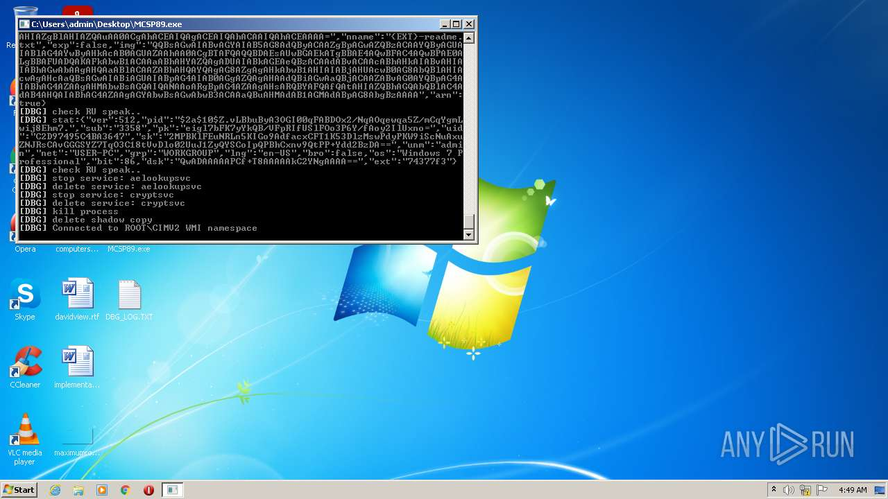
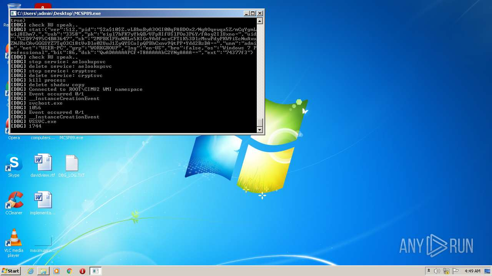
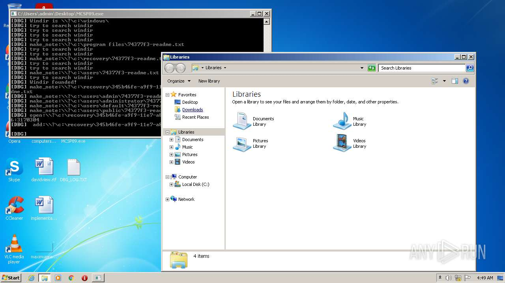
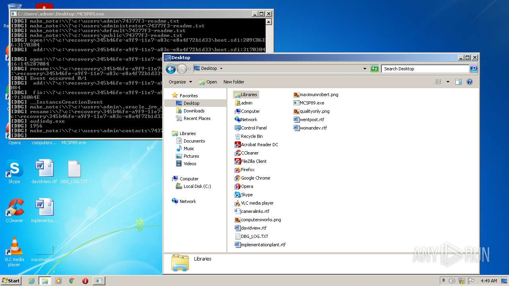

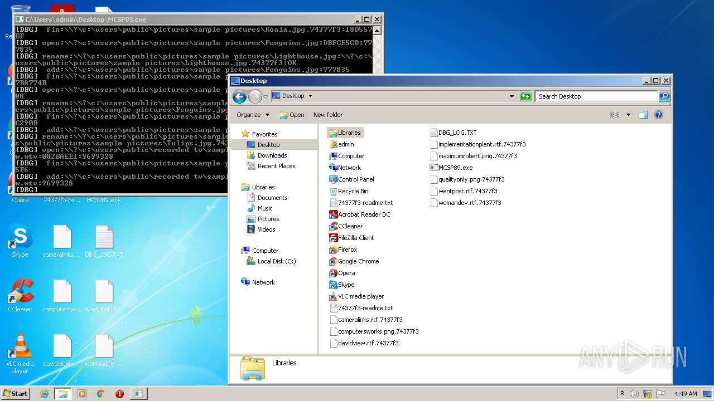
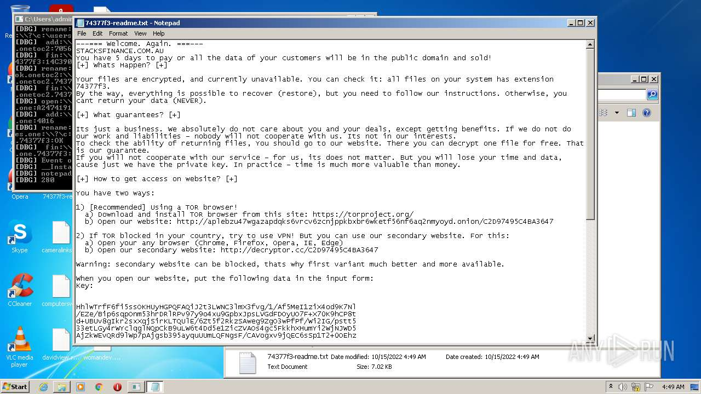
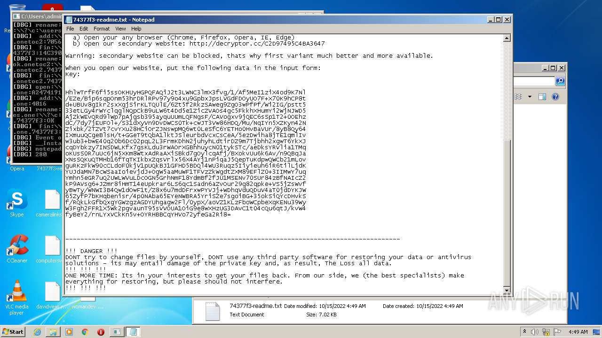
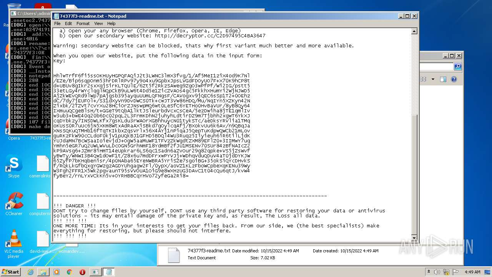
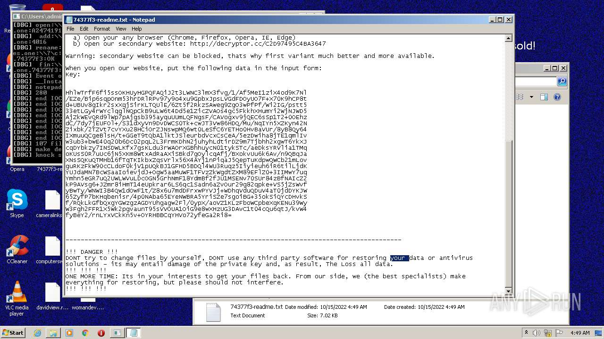
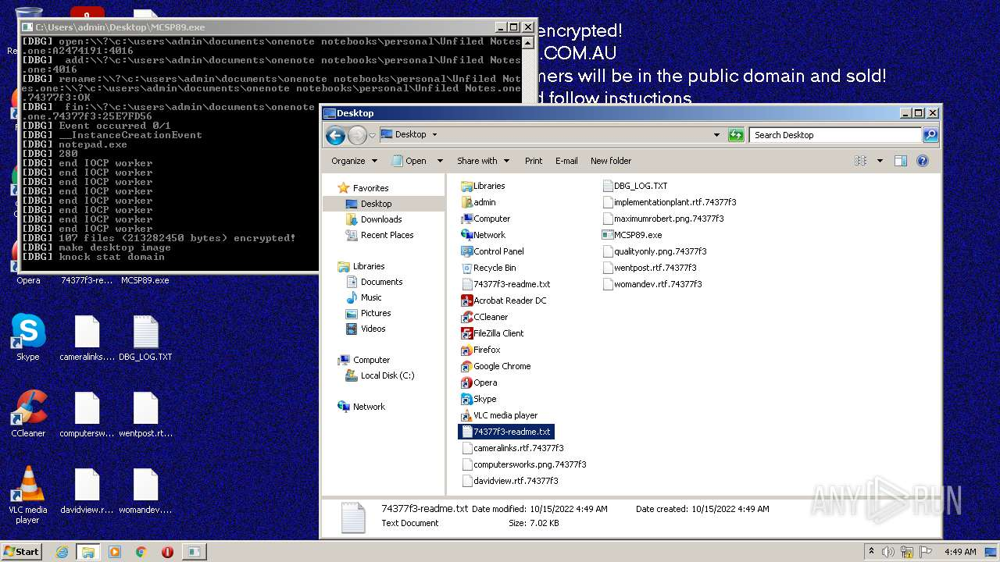
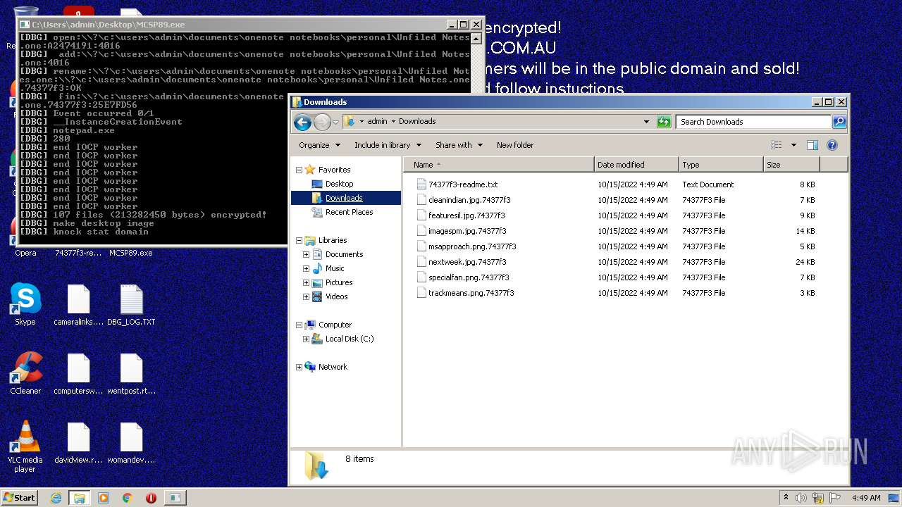
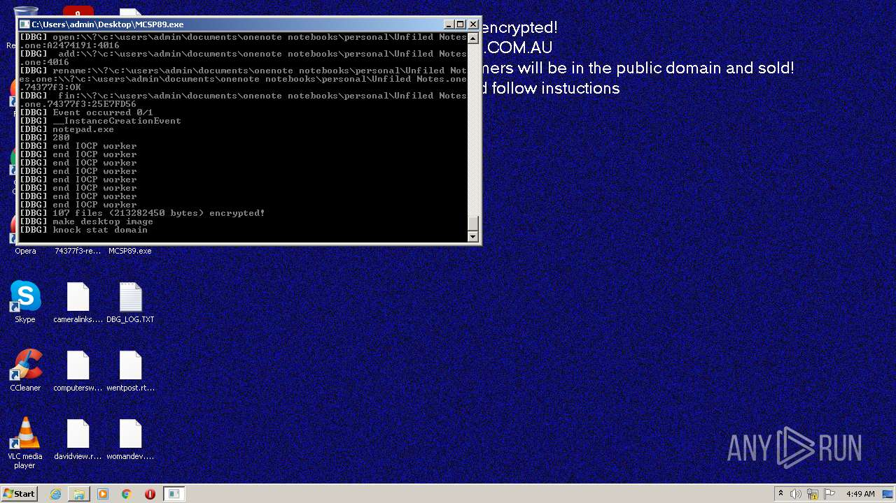
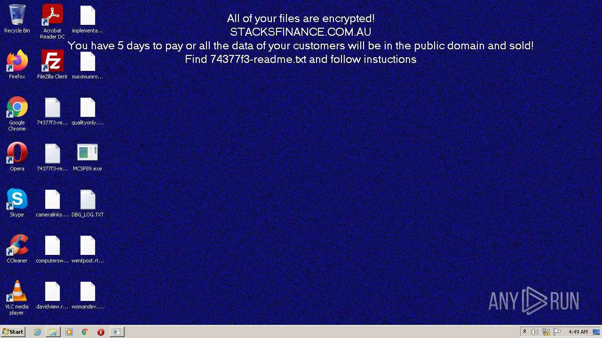
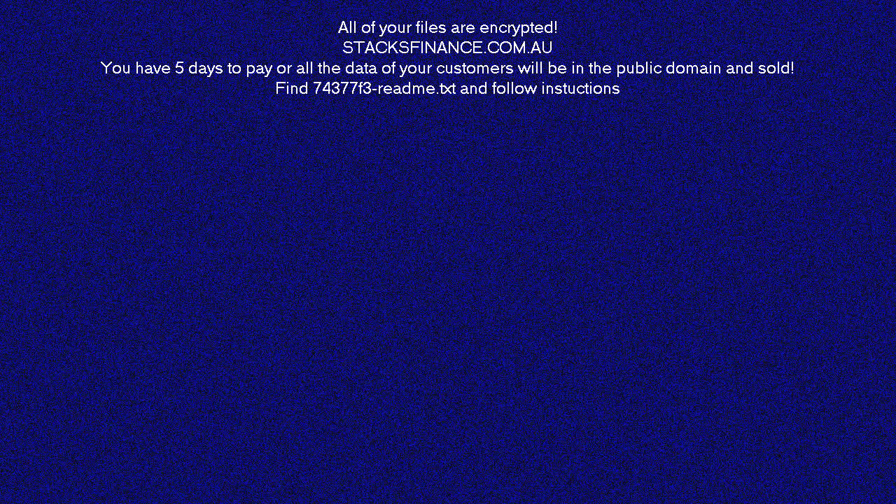
