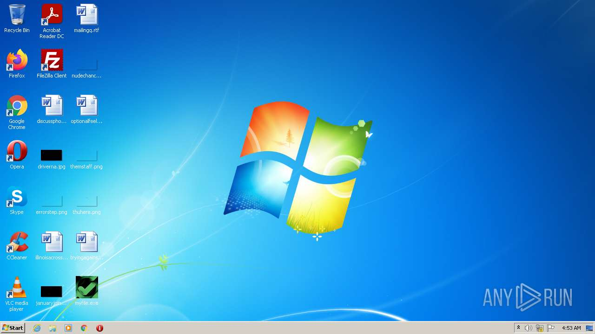
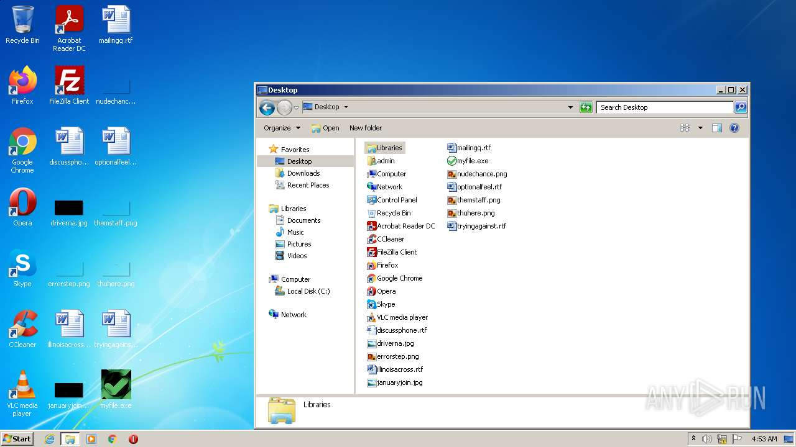
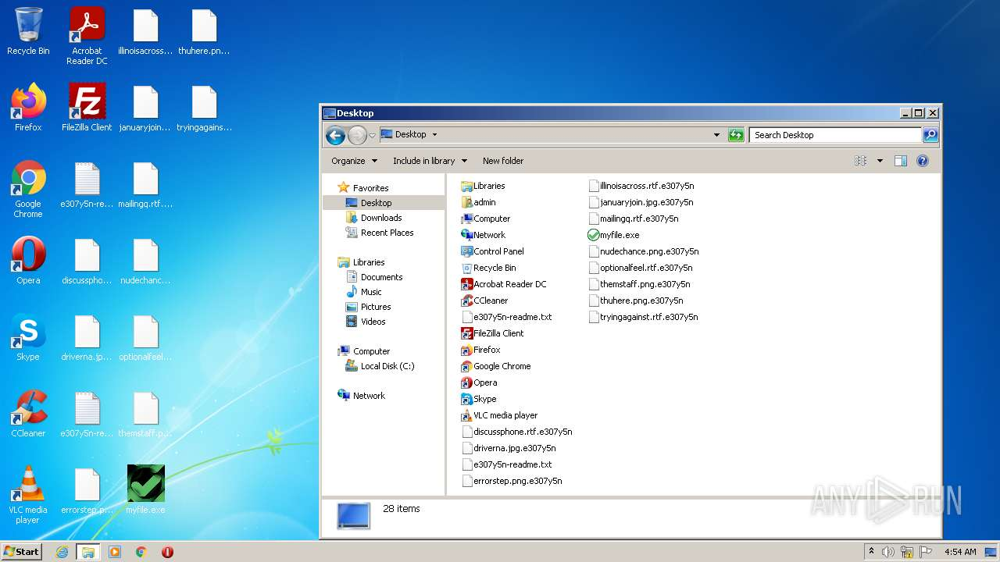
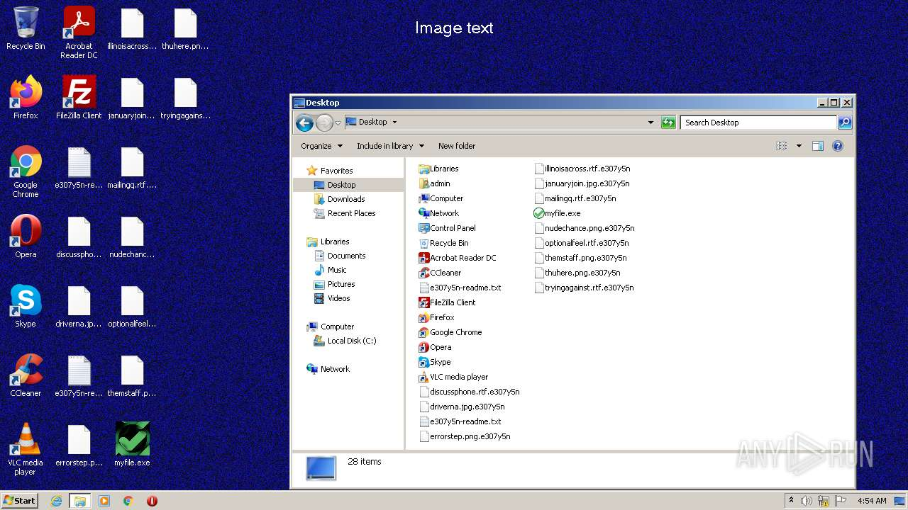
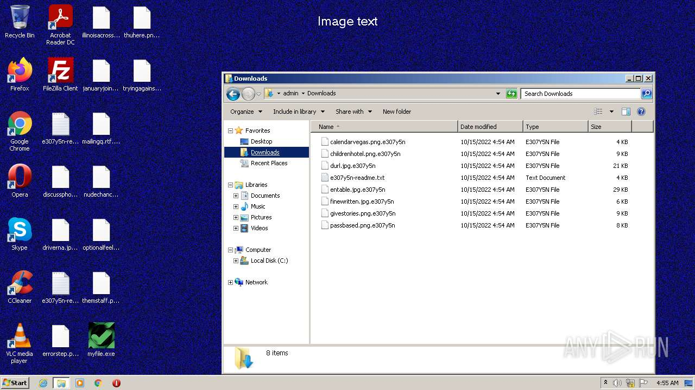
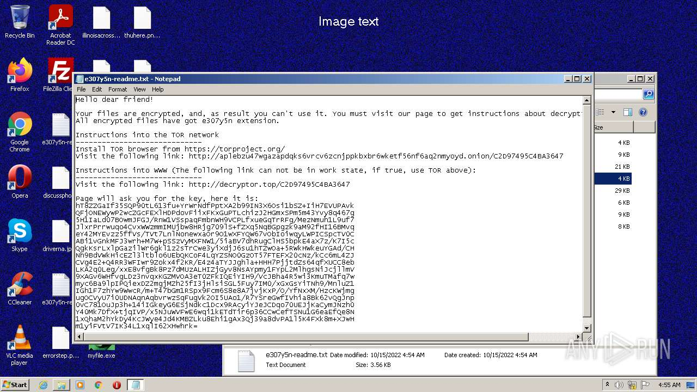
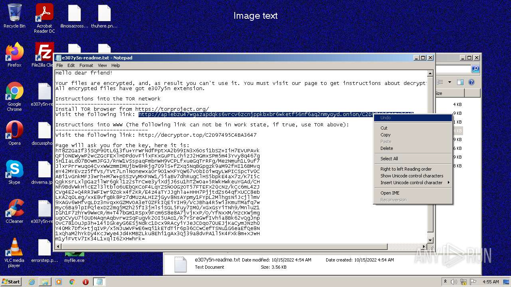
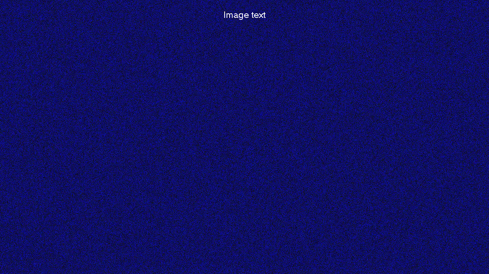

# Trojan-Ransom.Win32.Sodin.d-74bc2f9a81ad2cc609b7730dbabb146506f58244e5e655cbb42044913384a6ac

- https://any.run/report/74bc2f9a81ad2cc609b7730dbabb146506f58244e5e655cbb42044913384a6ac/a83b677c-4eaa-47f6-a1bd-77ae48fd4dda

```
- _id: "74bc2f9a81ad2cc609b7730dbabb146506f58244e5e655cbb42044913384a6ac"
  creation_date: 1556314701  # 2019-04-26 23:38:21 +0200 CEST
  first_submission_date: 1556321367  # 2019-04-27 01:29:27 +0200 CEST
  last_analysis_date: 1656579630  # 2022-06-30 11:00:30 +0200 CEST
  last_analysis_results: 
    Kaspersky: 
      result: "Trojan-Ransom.Win32.Sodin.d"
  magic: "PE32 executable for MS Windows (GUI) Intel 80386 32-bit"
  size: 683520
  trid: 
  - file_type: "Win32 Executable MS Visual C++ (generic)"
    probability: 48.8
  - file_type: "Win64 Executable (generic)"
    probability: 16.4
  - file_type: "Win32 Dynamic Link Library (generic)"
    probability: 10.2
  - file_type: "Win16 NE executable (generic)"
    probability: 7.8
  - file_type: "Win32 Executable (generic)"
    probability: 7.0
```









