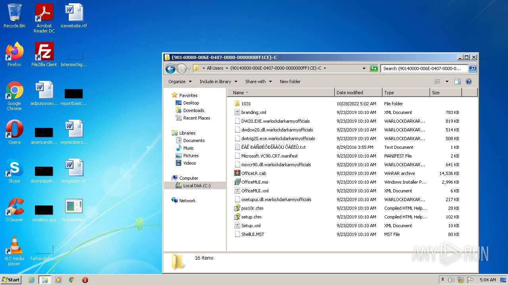
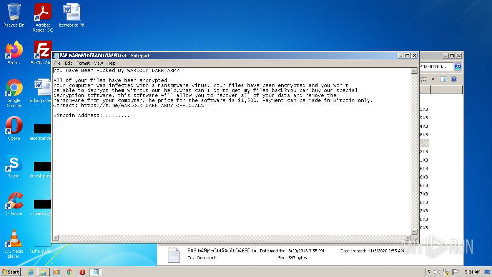
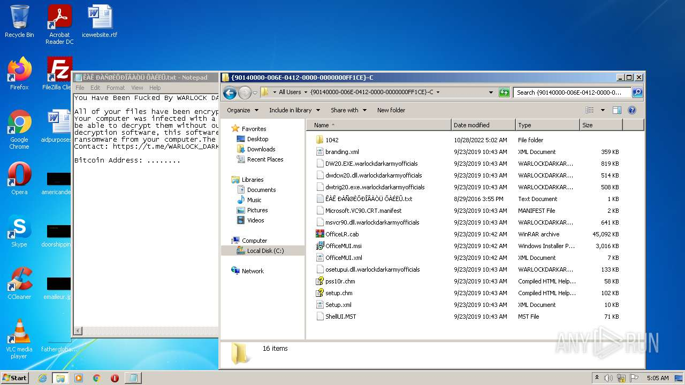

# Trojan-Ransom.Win32.Xorist.lk-7e00a694a2898d824c997c1862c005a6f1642473f8ee1b7e090a94e803765ba3

- https://any.run/report/7e00a694a2898d824c997c1862c005a6f1642473f8ee1b7e090a94e803765ba3/d841b824-af71-4455-ae84-36f565dcd970

```
- _id: "7e00a694a2898d824c997c1862c005a6f1642473f8ee1b7e090a94e803765ba3"
  creation_date: 1327862943  # 2012-01-29 19:49:03 +0100 CET
  crowdsourced_yara_results: 
  - author: "Florian Roth"
    description: "Detects ransomware indicator"
    rule_name: "SUSP_RANSOMWARE_Indicator_Jul20"
    ruleset_id: "000a7d3924"
    ruleset_name: "crime_ransom_generic"
    source: "https://github.com/Neo23x0/signature-base"
  - author: "ditekSHen"
    description: "Detects Xorist ransomware"
    rule_name: "MALWARE_Win_Xorist"
    ruleset_id: "00cc803bdc"
    ruleset_name: "malware"
    source: "https://github.com/ditekshen/detection"
  - author: "ReversingLabs"
    description: "Yara rule that detects Xorist ransomware."
    rule_name: "Win32_Ransomware_Xorist"
    ruleset_id: "005a730761"
    ruleset_name: "Win32.Ransomware.Xorist"
    source: "https://github.com/reversinglabs/reversinglabs-yara-rules"
  first_submission_date: 1666917146  # 2022-10-28 02:32:26 +0200 CEST
  last_analysis_date: 1666930093  # 2022-10-28 06:08:13 +0200 CEST
  last_analysis_results: 
    Kaspersky: 
      result: "Trojan-Ransom.Win32.Xorist.lk"
  magic: "PE32 executable for MS Windows (GUI) Intel 80386 32-bit"
  size: 12800
  trid: 
  - file_type: "Win32 Executable MS Visual C++ (generic)"
    probability: 47.2
  - file_type: "Win64 Executable (generic)"
    probability: 15.9
  - file_type: "Win32 Dynamic Link Library (generic)"
    probability: 9.9
  - file_type: "Win16 NE executable (generic)"
    probability: 7.6
  - file_type: "Win32 Executable (generic)"
    probability: 6.8
```





