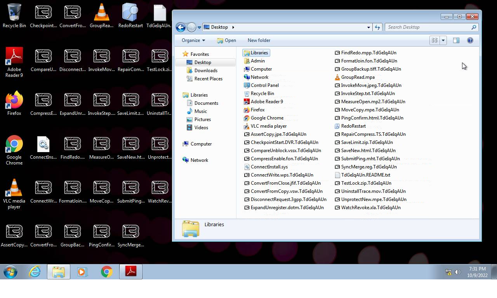
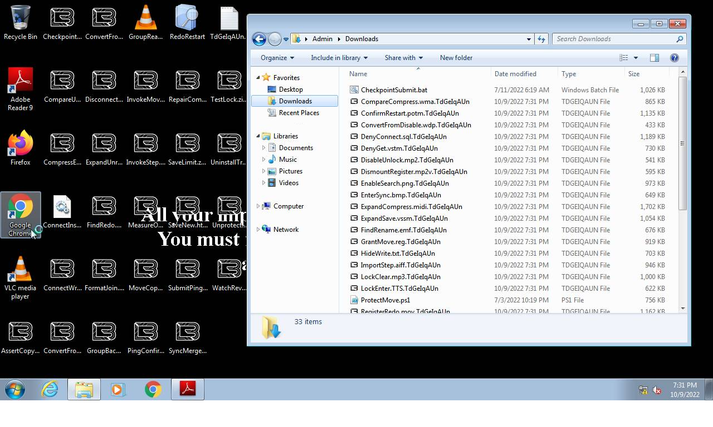
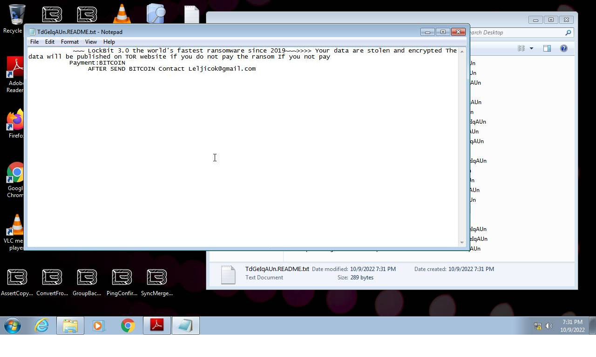
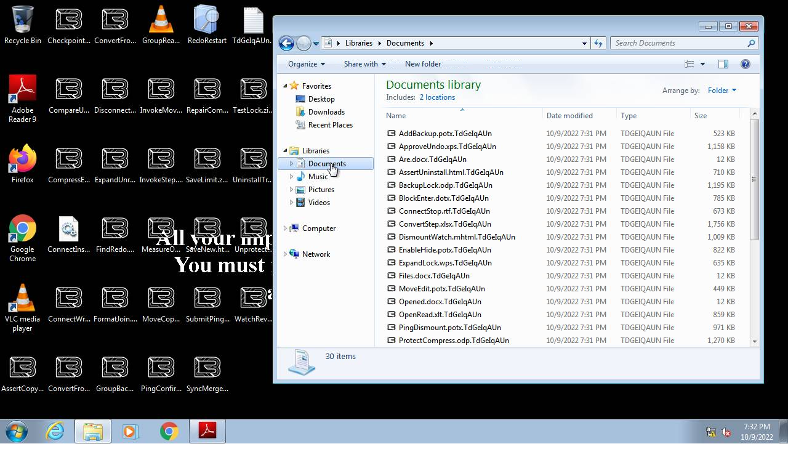

# Trojan.MSIL.Agent.ffjt-72064fb1e9fbf3c31e0981b87b93fcb78d3b2aacb9d9e23dcdb0374f28344865

- https://tria.ge/221009-v3nctshebl/behavioral1

```
- _id: "72064fb1e9fbf3c31e0981b87b93fcb78d3b2aacb9d9e23dcdb0374f28344865"
  creation_date: 1664370331  # 2022-09-28 15:05:31 +0200 CEST
  crowdsourced_yara_results: 
  - author: "Florian Roth"
    description: "Detects Neshta malware"
    rule_name: "MAL_Neshta_Generic"
    ruleset_id: "000d22dbf9"
    ruleset_name: "mal_netsha"
    source: "https://github.com/Neo23x0/signature-base"
  - author: "Johannes Bader @viql"
    description: "detects Neshta"
    rule_name: "win_neshta_1"
    ruleset_id: "0140fddf38"
    ruleset_name: "neshta"
    source: "https://github.com/baderj/yara"
  - author: "ditekSHen"
    description: "Detects Neshta"
    rule_name: "MALWARE_Win_Neshta"
    ruleset_id: "00cc803bdc"
    ruleset_name: "malware"
    source: "https://github.com/ditekshen/detection"
  first_submission_date: 1665336839  # 2022-10-09 19:33:59 +0200 CEST
  last_analysis_date: 1665336839  # 2022-10-09 19:33:59 +0200 CEST
  last_analysis_results: 
    Kaspersky: 
      result: "Trojan.MSIL.Agent.ffjt"
  magic: "PE32 executable for MS Windows (GUI) Intel 80386 32-bit Mono/.Net assembly"
  packers: 
    PEiD: ".NET executable"
  size: 929792
  trid: 
  - file_type: "Generic CIL Executable (.NET, Mono, etc.)"
    probability: 49.0
  - file_type: "Win32 Executable MS Visual C++ (generic)"
    probability: 20.9
  - file_type: "Win64 Executable (generic)"
    probability: 7.0
  - file_type: "DOS Borland compiled Executable (generic)"
    probability: 6.7
  - file_type: "Win32 Dynamic Link Library (generic)"
    probability: 4.4
```





