# Trojan.Win32.DelShad.bus-0c28b92943fa987c263995719770251b499ca7500b49d7d8baecde03c4a86052

```
- _id: "0c28b92943fa987c263995719770251b499ca7500b49d7d8baecde03c4a86052"
  creation_date: 1576454282  # 2019-12-16 00:58:02 +0100 CET
  first_submission_date: 1576478363  # 2019-12-16 07:39:23 +0100 CET
  last_analysis_date: 1664249252  # 2022-09-27 05:27:32 +0200 CEST
  last_analysis_results: 
    Kaspersky: 
      result: "Trojan.Win32.DelShad.bus"
  magic: "PE32 executable for MS Windows (GUI) Intel 80386 32-bit"
  packers: 
    F-PROT: "UPX"
    PEiD: "UPX 2.90 [LZMA] -> Markus Oberhumer, Laszlo Molnar & John Reiser"
  size: 394240
  trid: 
  - file_type: "UPX compressed Win32 Executable"
    probability: 35.7
  - file_type: "Win32 EXE Yoda's Crypter"
    probability: 35.0
  - file_type: "Win32 Dynamic Link Library (generic)"
    probability: 8.6
  - file_type: "Win16 NE executable (generic)"
    probability: 6.6
  - file_type: "Win32 Executable (generic)"
    probability: 5.9
```


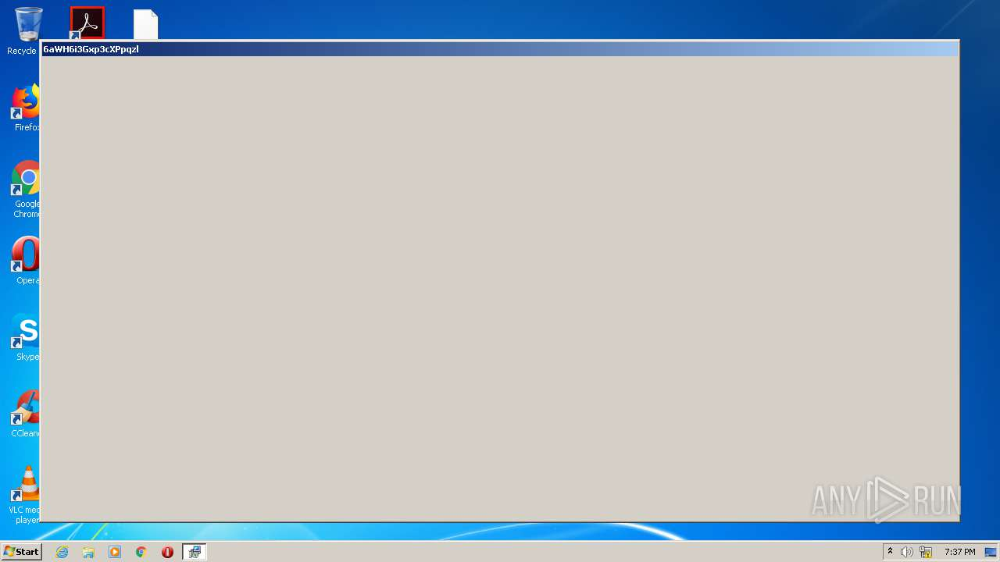

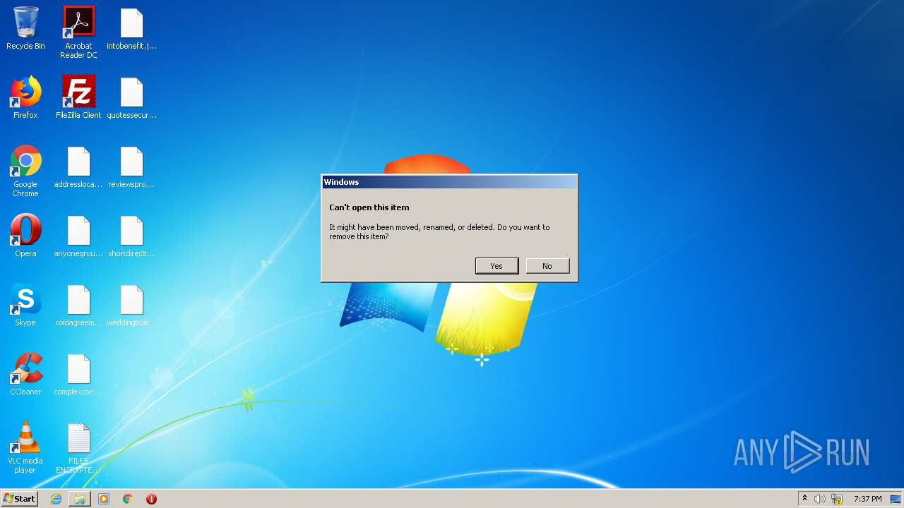
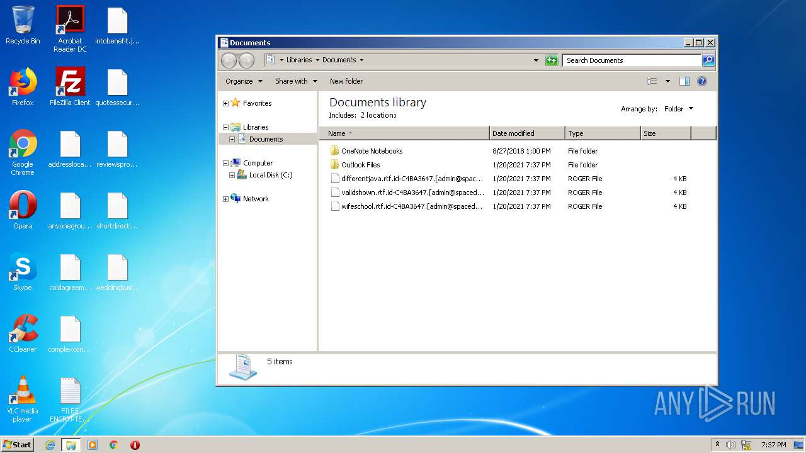

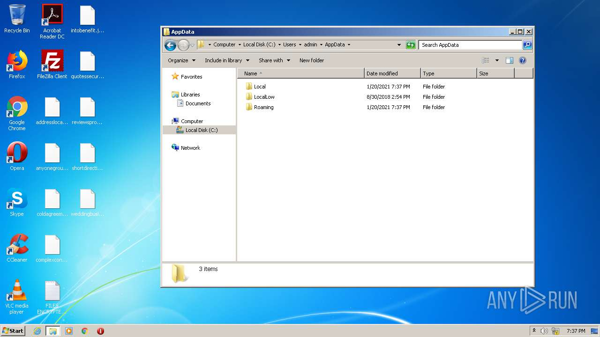

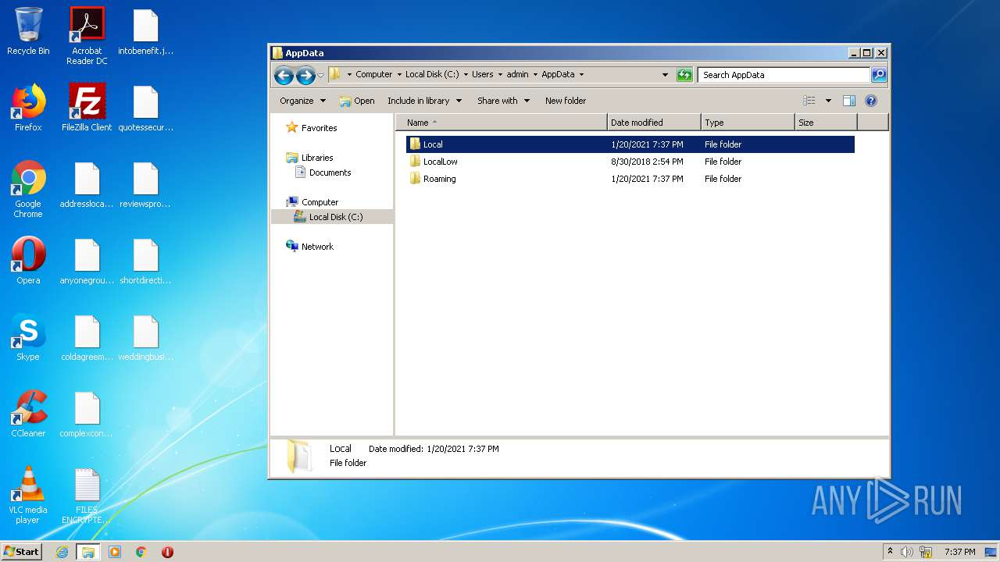

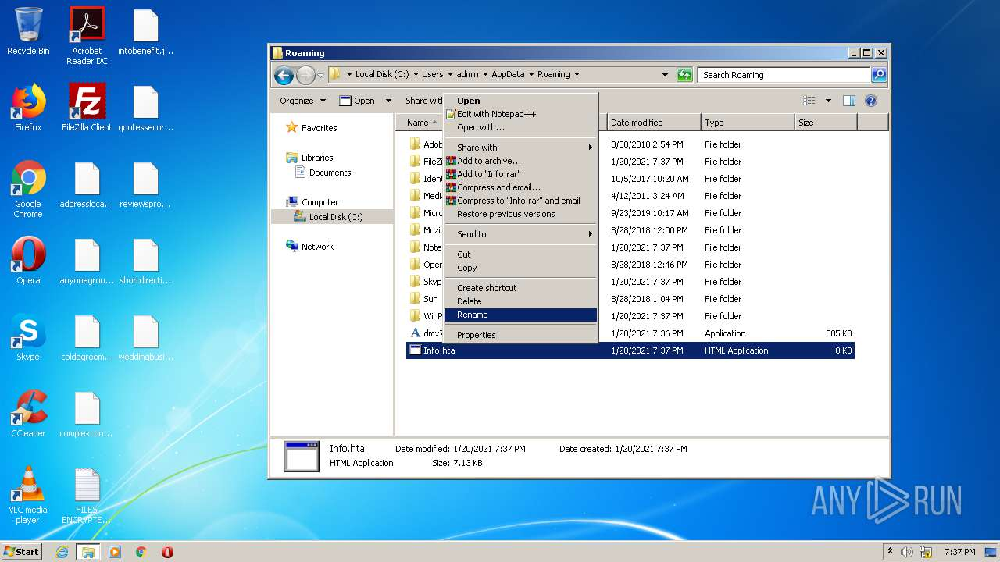
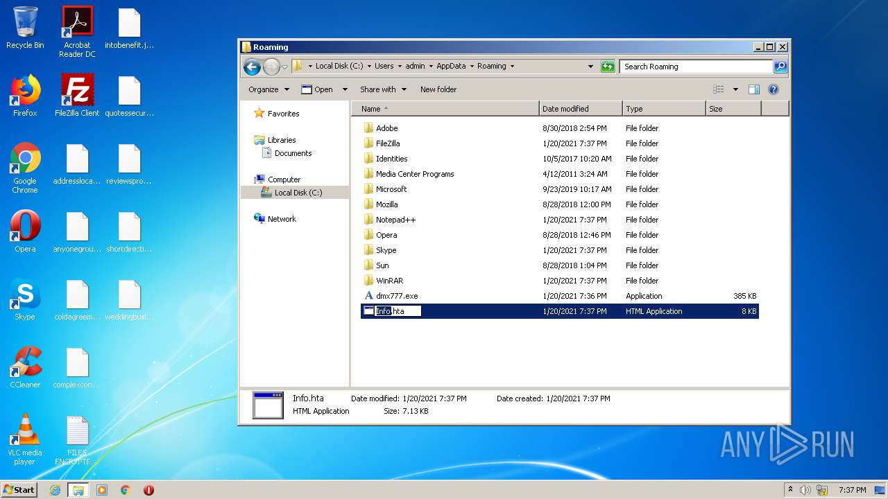
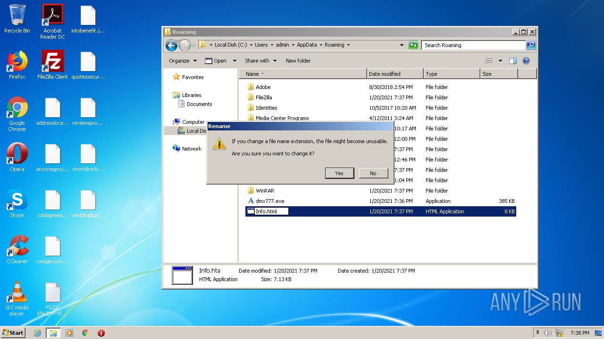

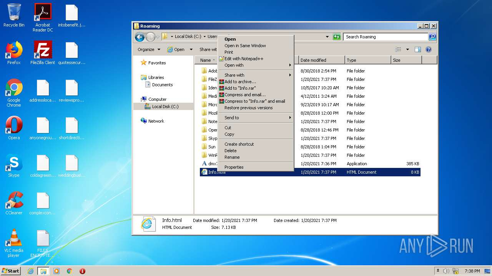
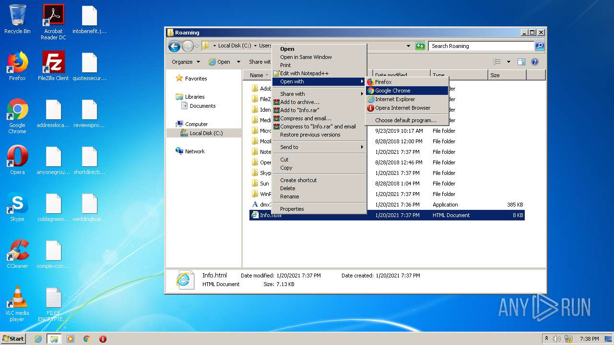
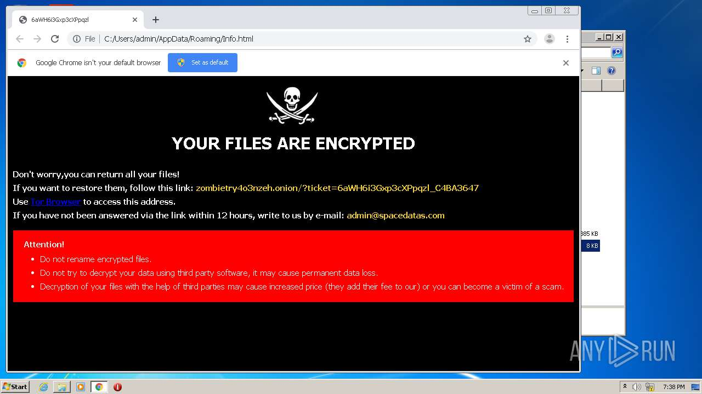
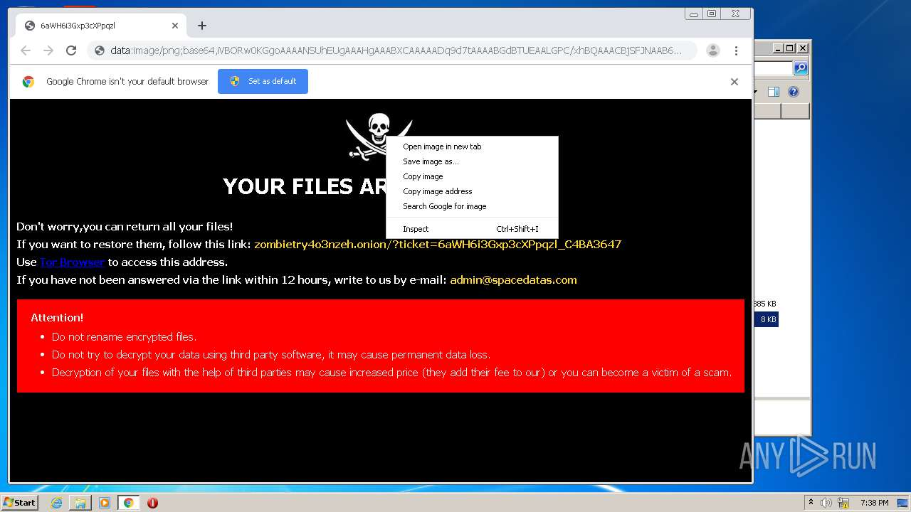

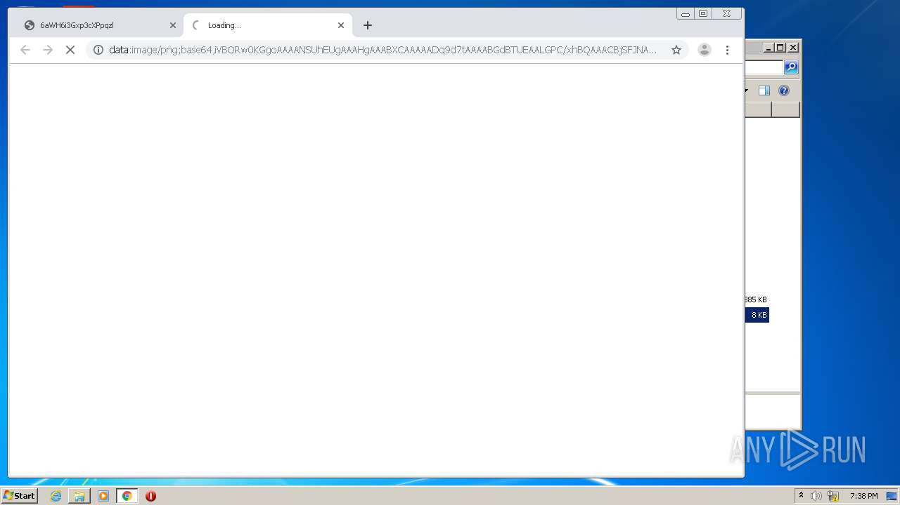
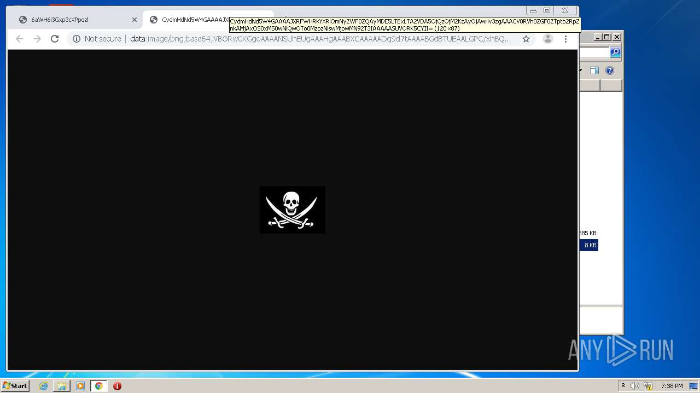
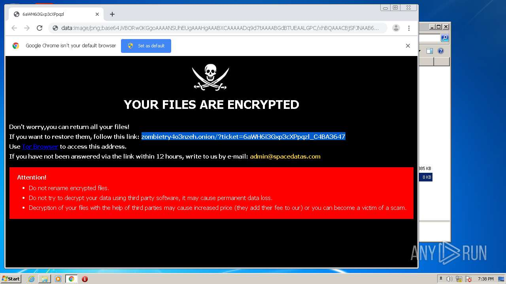
