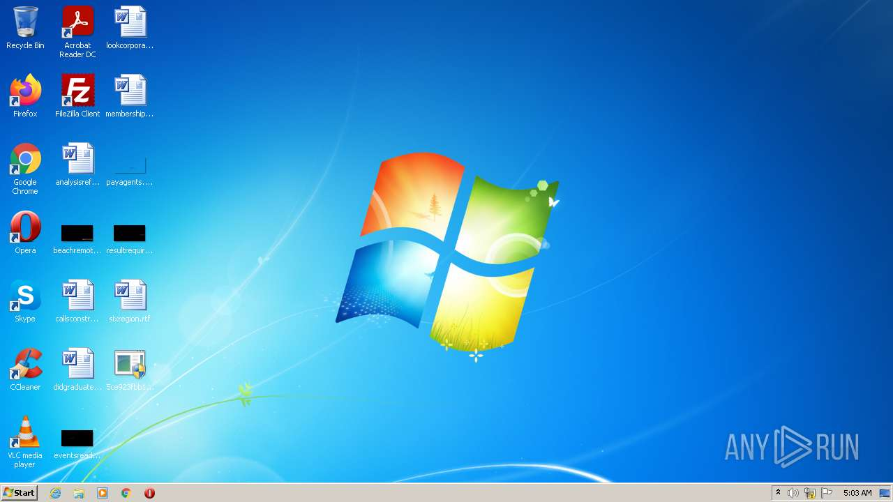
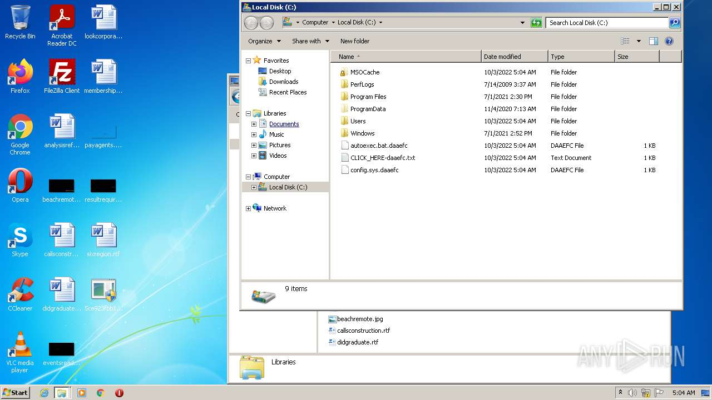
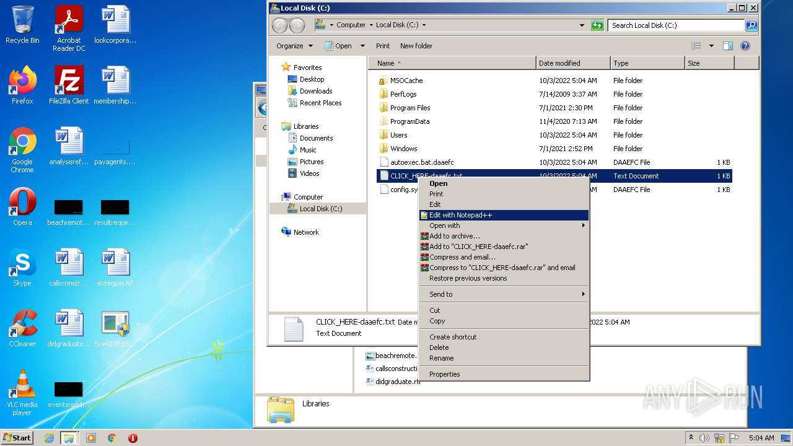
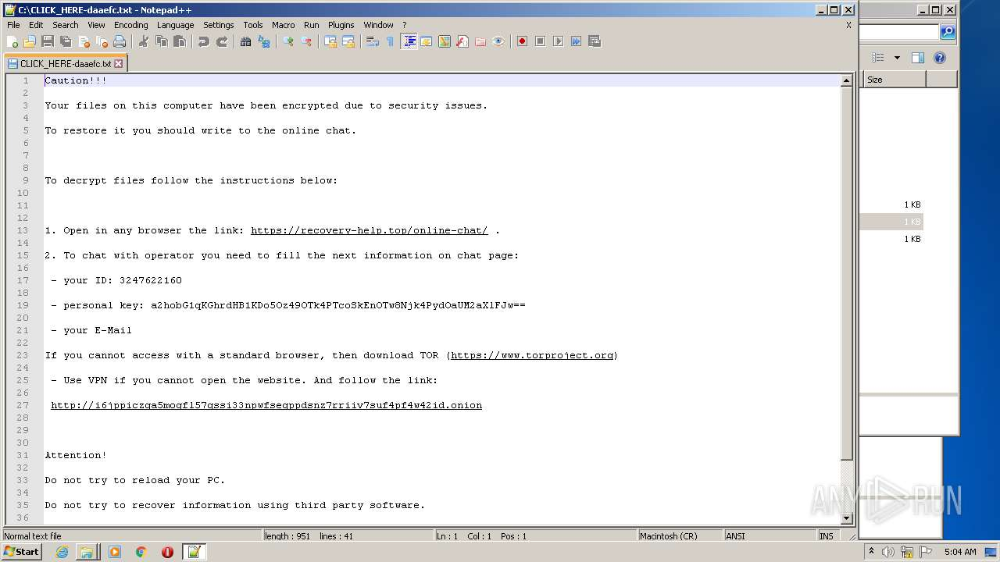
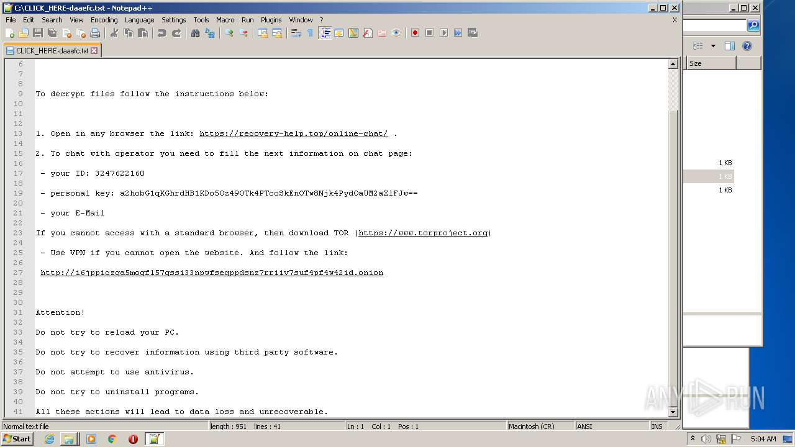
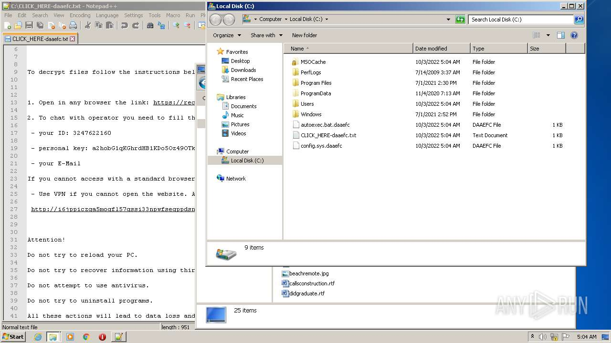
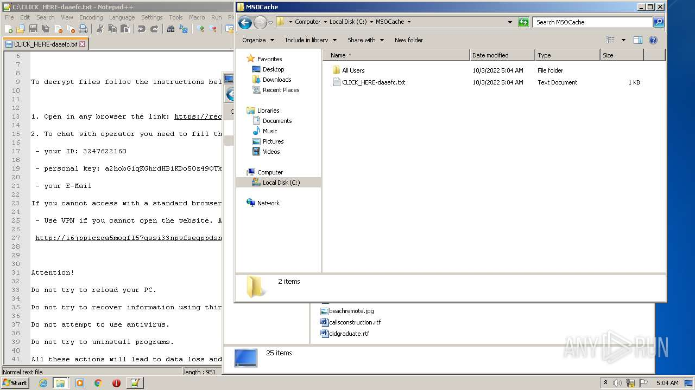
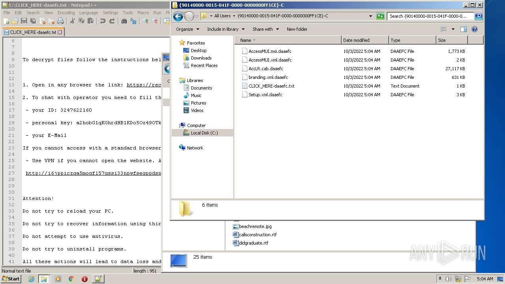

# Trojan.Win32.DelShad.cgi-5ce923fbb11fa354c6a5d182c99d63437153a7204480876dd18371486c2072be

- https://any.run/report/5ce923fbb11fa354c6a5d182c99d63437153a7204480876dd18371486c2072be/c1c84a5c-c800-44f0-9169-3a8a50ee52c6

```
- _id: "5ce923fbb11fa354c6a5d182c99d63437153a7204480876dd18371486c2072be"
  creation_date: 1579178069  # 2020-01-16 13:34:29 +0100 CET
  first_submission_date: 1579584930  # 2020-01-21 06:35:30 +0100 CET
  last_analysis_date: 1600020806  # 2020-09-13 20:13:26 +0200 CEST
  last_analysis_results: 
    Kaspersky: 
      result: "Trojan.Win32.DelShad.cgi"
  magic: "PE32 executable for MS Windows (console) Intel 80386 32-bit"
  packers: 
    F-PROT: "UPX"
    PEiD: "UPX 2.90 [LZMA] -> Markus Oberhumer, Laszlo Molnar & John Reiser"
  size: 163328
  trid: 
  - file_type: "UPX compressed Win32 Executable"
    probability: 38.2
  - file_type: "Win32 EXE Yoda's Crypter"
    probability: 37.5
  - file_type: "Win32 Dynamic Link Library (generic)"
    probability: 9.2
  - file_type: "Win32 Executable (generic)"
    probability: 6.3
  - file_type: "OS/2 Executable (generic)"
    probability: 2.8
```









