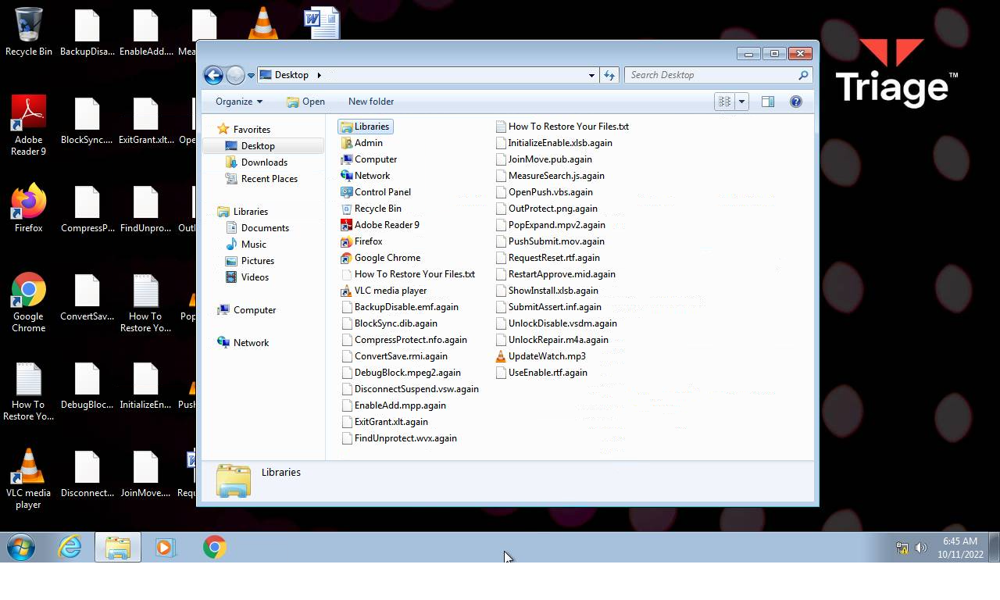

# Trojan.Win32.DelShad.ivs-f4c2169dab08ca0aa12fe0e35a0424b6de1396b719a3eb34c3f7ce205a99dd46

- https://tria.ge/221011-hhpc6safa5/behavioral1

```
- _id: "f4c2169dab08ca0aa12fe0e35a0424b6de1396b719a3eb34c3f7ce205a99dd46"
  creation_date: 1655030520  # 2022-06-12 12:42:00 +0200 CEST
  crowdsourced_yara_results: 
  - author: "Florian Roth"
    description: "Detects destructive malware"
    rule_name: "Destructive_Ransomware_Gen1"
    ruleset_id: "0002573660"
    ruleset_name: "apt_olympic_destroyer"
    source: "https://github.com/Neo23x0/signature-base"
  - author: "ditekSHen"
    description: "detects command variations typically used by ransomware"
    rule_name: "INDICATOR_SUSPICIOUS_GENRansomware"
    ruleset_id: "00c3b8eb5d"
    ruleset_name: "indicator_suspicious"
    source: "https://github.com/ditekshen/detection"
  - author: "ditekSHen"
    description: "Detects executables containing many references to VEEAM. Observed in ransomware"
    rule_name: "INDICATOR_SUSPICOUS_EXE_References_VEEAM"
    ruleset_id: "00c3b8eb5d"
    ruleset_name: "indicator_suspicious"
    source: "https://github.com/ditekshen/detection"
  first_submission_date: 1665460556  # 2022-10-11 05:55:56 +0200 CEST
  last_analysis_date: 1665460556  # 2022-10-11 05:55:56 +0200 CEST
  last_analysis_results: 
    Kaspersky: 
      result: "Trojan.Win32.DelShad.ivs"
  magic: "PE32+ executable for MS Windows (console) Mono/.Net assembly"
  size: 87040
  trid: 
  - file_type: "Win64 Executable (generic)"
    probability: 48.7
  - file_type: "Win16 NE executable (generic)"
    probability: 23.3
  - file_type: "OS/2 Executable (generic)"
    probability: 9.3
  - file_type: "Generic Win/DOS Executable"
    probability: 9.2
  - file_type: "DOS Executable Generic"
    probability: 9.2
```





