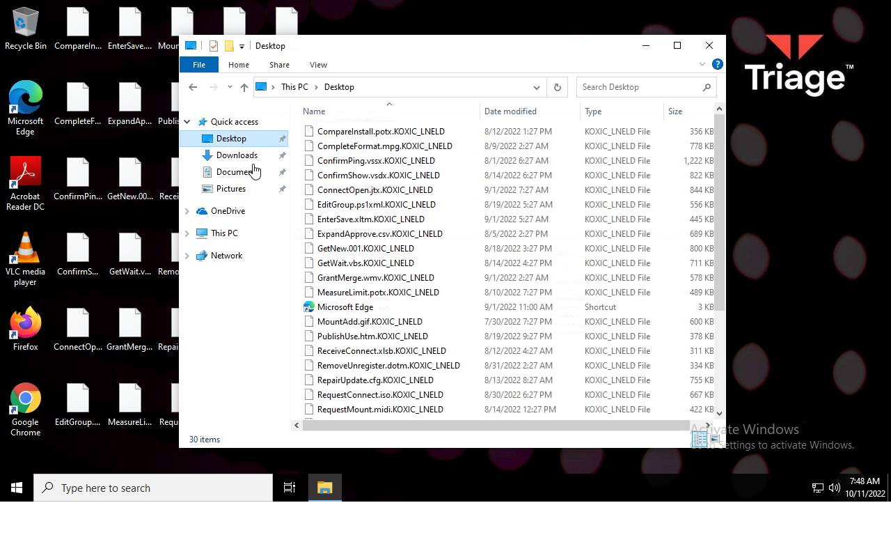
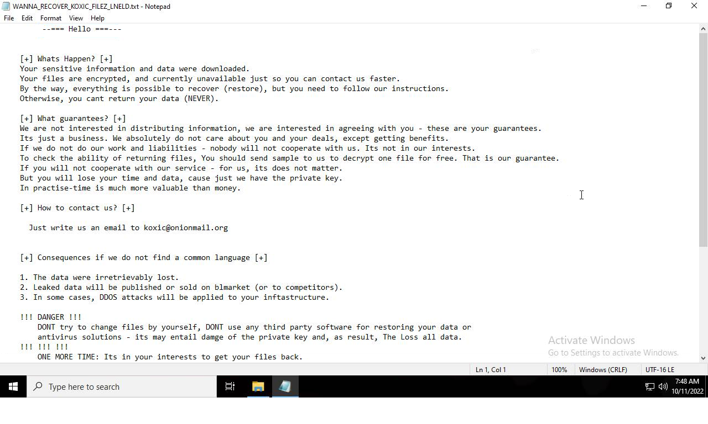
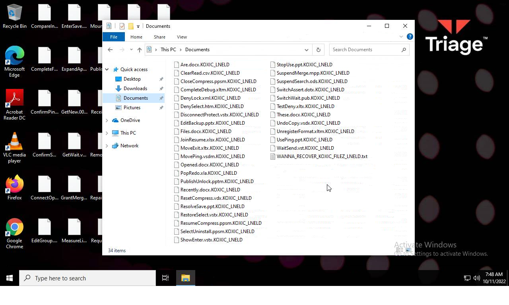
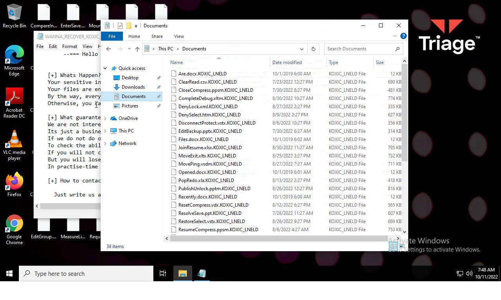
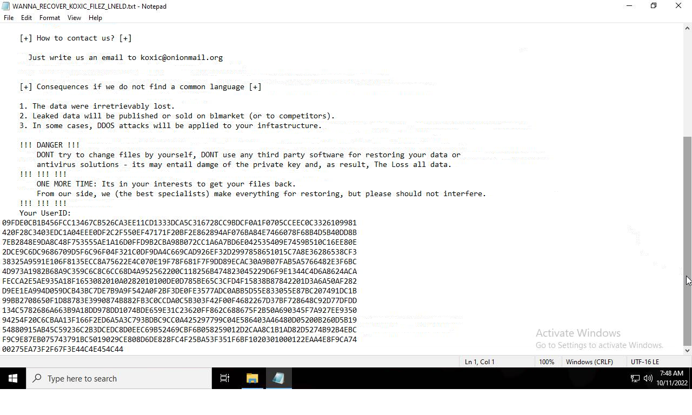

# Trojan.Win32.DelShad.jnk-d2203b6d272d44b7abc66e290c3b79767428168b077a16ded1db0babbe34f333

- https://tria.ge/221011-jmlcracher/behavioral1

```
- _id: "d2203b6d272d44b7abc66e290c3b79767428168b077a16ded1db0babbe34f333"
  creation_date: 1651165769  # 2022-04-28 19:09:29 +0200 CEST
  crowdsourced_yara_results: 
  - author: "ditekSHen"
    description: "Detects executables embedding registry key / value combination indicative of disabling Windows Defedner features"
    match_in_subfile: true
    rule_name: "INDICATOR_SUSPICIOUS_EXE_RegKeyComb_DisableWinDefender"
    ruleset_id: "00c3b8eb5d"
    ruleset_name: "indicator_suspicious"
    source: "https://github.com/ditekshen/detection"
  - author: "ditekSHen"
    description: "Detects Koxic ransomware"
    match_in_subfile: true
    rule_name: "MALWARE_Win_Koxic"
    ruleset_id: "00cc803bdc"
    ruleset_name: "malware"
    source: "https://github.com/ditekshen/detection"
  - author: "ReversingLabs"
    description: "Yara rule that detects Koxic ransomware."
    match_in_subfile: true
    rule_name: "Win32_Ransomware_Koxic"
    ruleset_id: "005c12cf33"
    ruleset_name: "Win32.Ransomware.Koxic"
    source: "https://github.com/reversinglabs/reversinglabs-yara-rules"
  first_submission_date: 1665434230  # 2022-10-10 22:37:10 +0200 CEST
  last_analysis_date: 1665434230  # 2022-10-10 22:37:10 +0200 CEST
    last_analysis_results: 
    Kaspersky: 
      result: "Trojan.Win32.DelShad.jnk"
  magic: "PE32 executable for MS Windows (GUI) Intel 80386 32-bit"
  packers: 
    PEiD: "UPX 2.90 [LZMA] -> Markus Oberhumer, Laszlo Molnar & John Reiser"
  size: 161792
  trid: 
  - file_type: "Win16 NE executable (generic)"
    probability: 32.3
  - file_type: "Win32 Executable (generic)"
    probability: 28.9
  - file_type: "OS/2 Executable (generic)"
    probability: 13.0
  - file_type: "Generic Win/DOS Executable"
    probability: 12.8
  - file_type: "DOS Executable Generic"
    probability: 12.8
```








