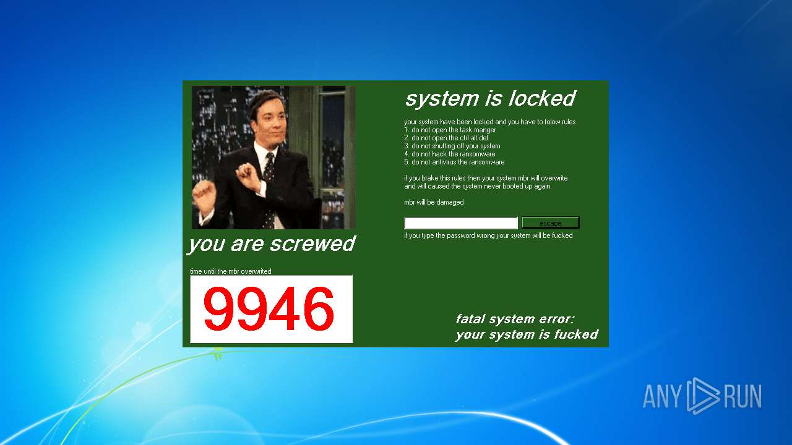
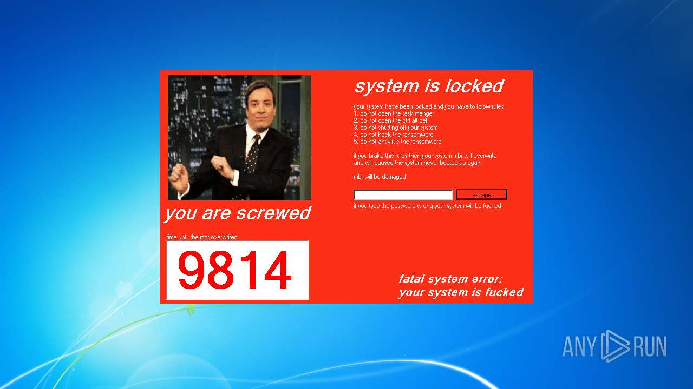

# Trojan.Win32.DiskWriter.ebe-d6c5412c8087241c03188d0aef43f145803b72819bdf145e32145a3c0f7e8e41

- https://any.run/report/d6c5412c8087241c03188d0aef43f145803b72819bdf145e32145a3c0f7e8e41/80ba8f35-85cb-4242-b002-2794377c93f0

```
- _id: "d6c5412c8087241c03188d0aef43f145803b72819bdf145e32145a3c0f7e8e41"
  creation_date: 1646313357  # 2022-03-03 14:15:57 +0100 CET
  crowdsourced_yara_results: 
  - author: "ditekSHen"
    description: "Detects WobbyChipMBR / Covid-21 ransomware"
    match_in_subfile: true
    rule_name: "MALWARE_Win_WobbyChipMBR"
    ruleset_id: "00cc803bdc"
    ruleset_name: "malware"
    source: "https://github.com/ditekshen/detection"
  - author: "InQuest Labs"
    description: "This signature identifies Adobe Extensible Metadata Platform (XMP) identifiers embedded within files. Defined as a standard for mapping graphical asset relationships, XMP allows for tracking of both parent-child relationships and individual revisions. There are three categories of identifiers: original document, document, and instance. Generally, XMP data is stored in XML format, updated on save/copy, and embedded within the graphical asset. These identifiers can be used to track both malicious and benign graphics within common Microsoft and Adobe document lures."
    match_in_subfile: true
    rule_name: "Adobe_XMP_Identifier"
    ruleset_id: "0121ae37cc"
    ruleset_name: "Adobe_XMP_Identifier"
    source: "https://github.com/InQuest/yara-rules-vt"
  first_submission_date: 1663715933  # 2022-09-21 01:18:53 +0200 CEST
  last_analysis_date: 1664195521  # 2022-09-26 14:32:01 +0200 CEST
  last_analysis_results: 
    Kaspersky: 
      result: "Trojan.Win32.DiskWriter.ebe"
  magic: "PE32 executable for MS Windows (GUI) Intel 80386 32-bit"
  size: 1713471
  trid: 
  - file_type: "WinRAR Self Extracting archive (4.x-5.x)"
    probability: 89.0
  - file_type: "Win64 Executable (generic)"
    probability: 3.5
  - file_type: "Win32 Dynamic Link Library (generic)"
    probability: 2.2
  - file_type: "Win16 NE executable (generic)"
    probability: 1.6
  - file_type: "Win32 Executable (generic)"
    probability: 1.5
```






