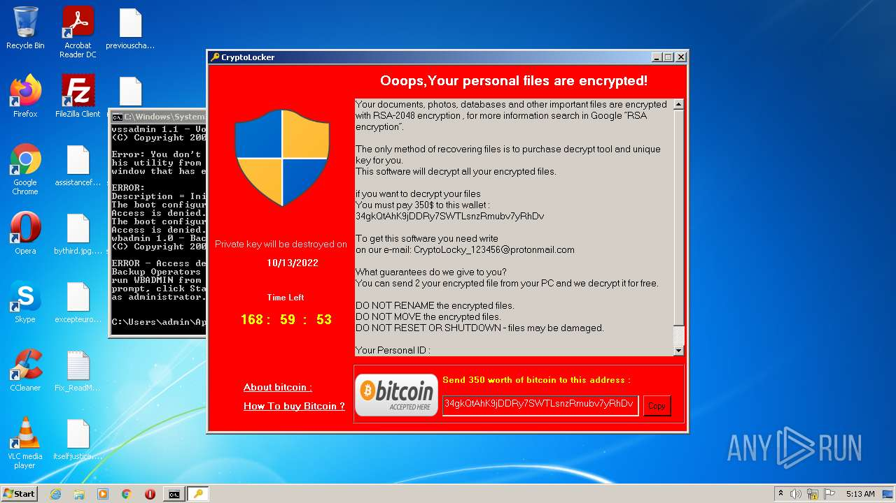
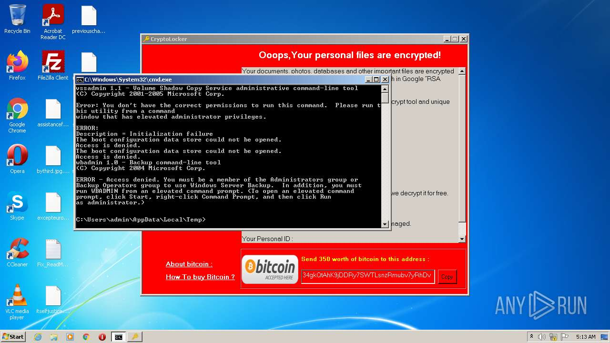
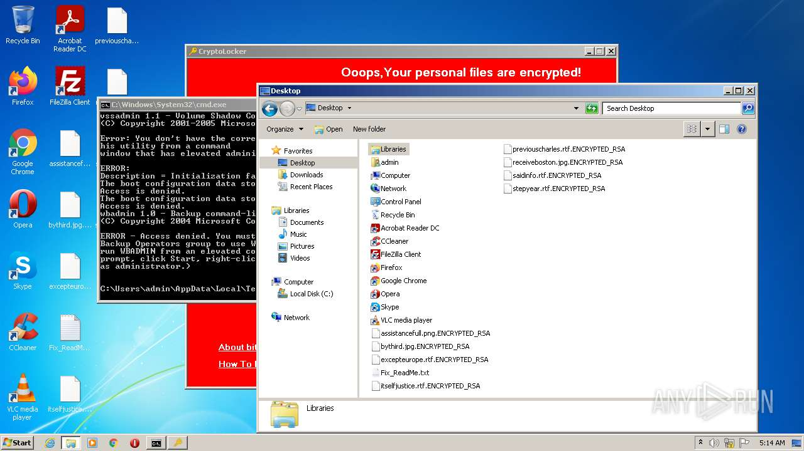
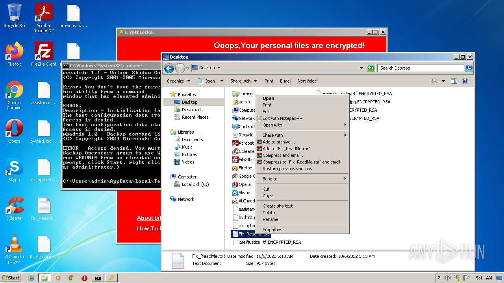
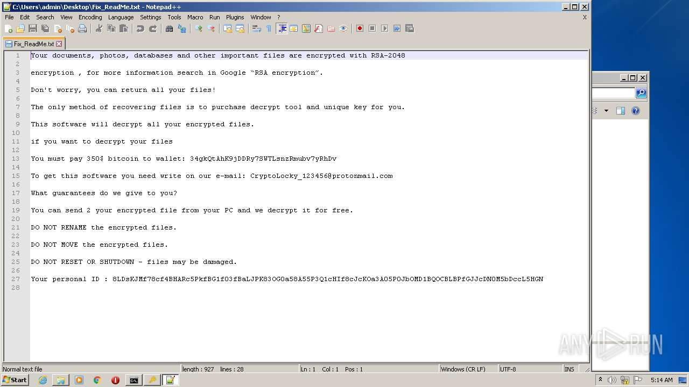
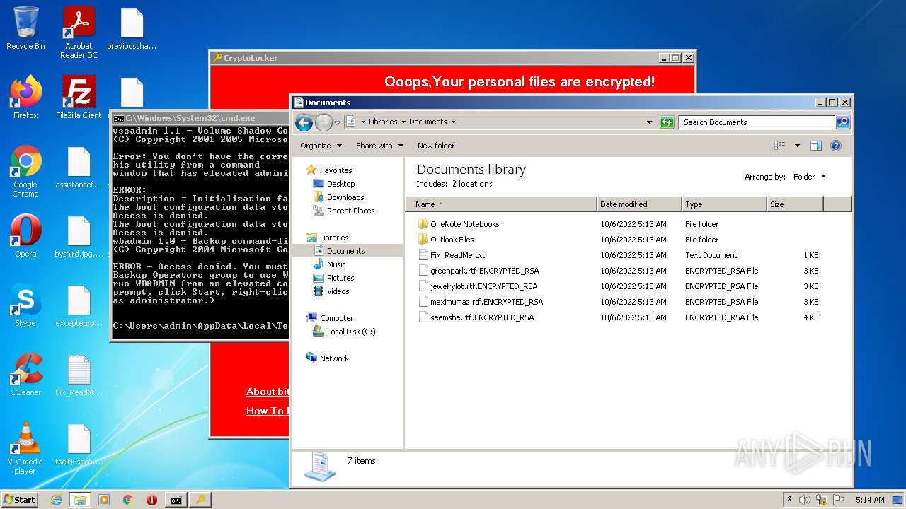
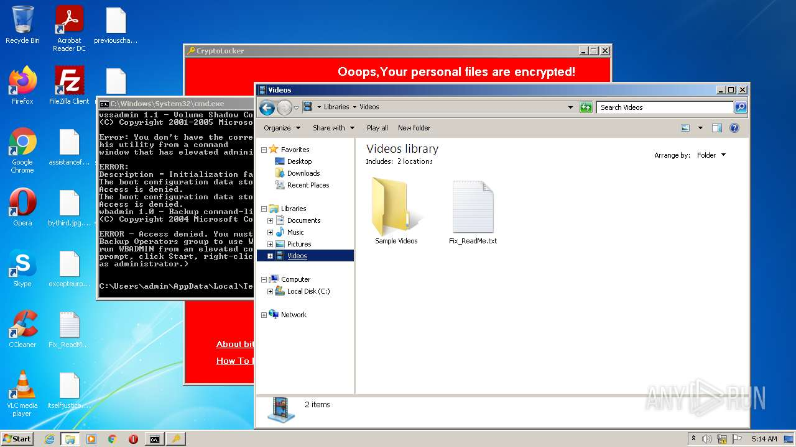
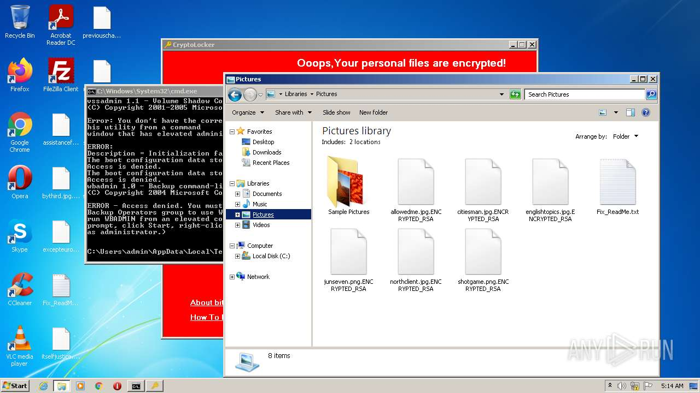

# Trojan.Win32.Fsysna.gafh-d9d01bff3bf98b37793eb9d74e713cc340b7d9ad40d0c6437f422c41fca73364

- https://any.run/report/d9d01bff3bf98b37793eb9d74e713cc340b7d9ad40d0c6437f422c41fca73364/f777451d-a8ac-4591-a614-46368662080a

```
- _id: "d9d01bff3bf98b37793eb9d74e713cc340b7d9ad40d0c6437f422c41fca73364"
  creation_date: 1579344702  # 2020-01-18 11:51:42 +0100 CET
  first_submission_date: 1580320067  # 2020-01-29 18:47:47 +0100 CET
  last_analysis_date: 1637941034  # 2021-11-26 16:37:14 +0100 CET
  last_analysis_results: 
    Kaspersky: 
      result: "Trojan.Win32.Fsysna.gafh"
  magic: "PE32 executable for MS Windows (GUI) Intel 80386 32-bit Mono/.Net assembly"
  size: 854016
  trid: 
  - file_type: "Win32 Executable MS Visual C++ (generic)"
    probability: 34.5
  - file_type: "Microsoft Visual C++ compiled executable (generic)"
    probability: 18.2
  - file_type: "Win64 Executable (generic)"
    probability: 11.6
  - file_type: "DOS Borland compiled Executable (generic)"
    probability: 11.0
  - file_type: "Win32 Dynamic Link Library (generic)"
    probability: 7.2
```









