# Trojan.Win32.Inject.fxop-477c13d4ca09fdb7fea6487641c6a904d4dee1adecd74ac42e0b00a3842503f9

- https://any.run/report/477c13d4ca09fdb7fea6487641c6a904d4dee1adecd74ac42e0b00a3842503f9/70428bfd-c2f4-4084-a366-ef8e62ce59e9

```
- _id: "477c13d4ca09fdb7fea6487641c6a904d4dee1adecd74ac42e0b00a3842503f9"
  creation_date: 1187311100  # 2007-08-17 02:38:20 +0200 CEST
  crowdsourced_yara_results: 
  - author: "Florian Roth (with the help of binar.ly)"
    description: "Detects WannaCry Ransomware"
    rule_name: "WannaCry_Ransomware"
    ruleset_id: "000fd39f0d"
    ruleset_name: "crime_wannacry"
    source: "https://github.com/Neo23x0/signature-base"
  - author: "ditekSHen"
    description: "Detects executables packed with nBinder"
    rule_name: "INDICATOR_EXE_Packed_nBinder"
    ruleset_id: "00c291ca7f"
    ruleset_name: "indicator_packed"
    source: "https://github.com/ditekshen/detection"
  first_submission_date: 1653288843  # 2022-05-23 08:54:03 +0200 CEST
  last_analysis_date: 1667412121  # 2022-11-02 19:02:01 +0100 CET
  last_analysis_results: 
    Kaspersky: 
      result: "Trojan.Win32.Inject.fxop"
  magic: "PE32 executable for MS Windows (GUI) Intel 80386 32-bit"
  size: 6108096
  trid: 
  - file_type: "Win32 Executable MS Visual C++ (generic)"
    probability: 34.5
  - file_type: "Microsoft Visual C++ compiled executable (generic)"
    probability: 18.2
  - file_type: "Win64 Executable (generic)"
    probability: 11.6
  - file_type: "DOS Borland compiled Executable (generic)"
    probability: 11.0
  - file_type: "Win32 Dynamic Link Library (generic)"
    probability: 7.2
```

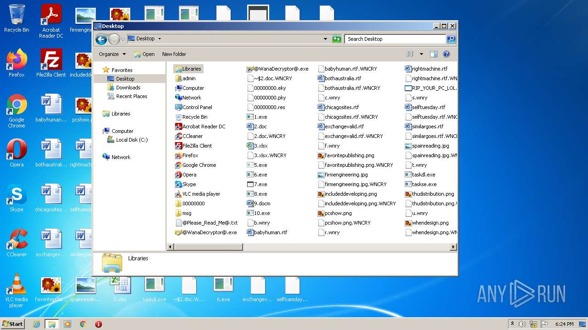
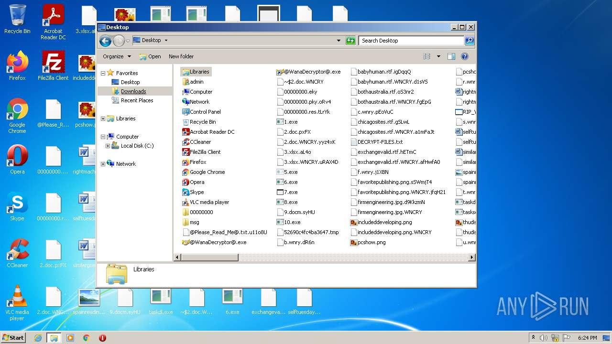
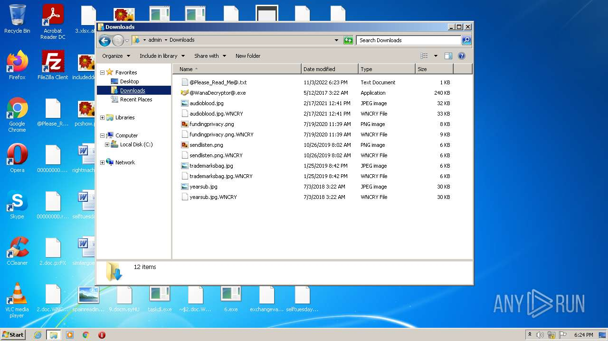
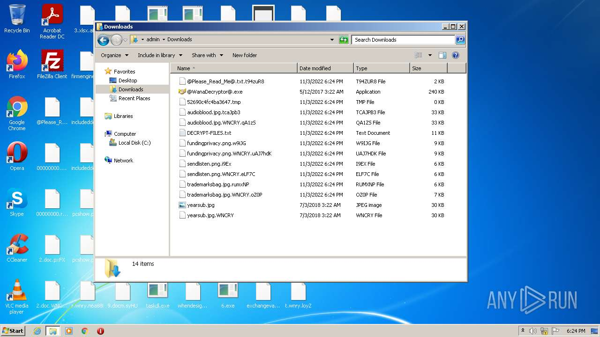
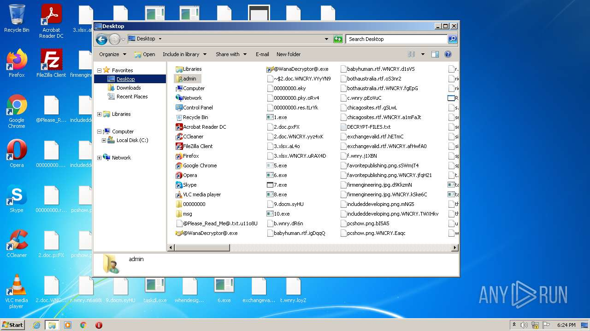
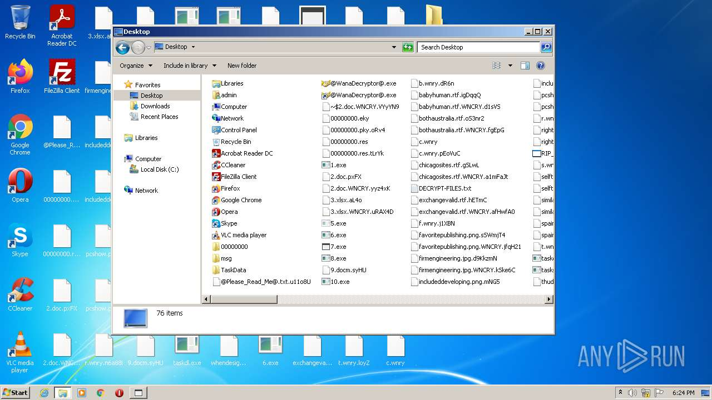
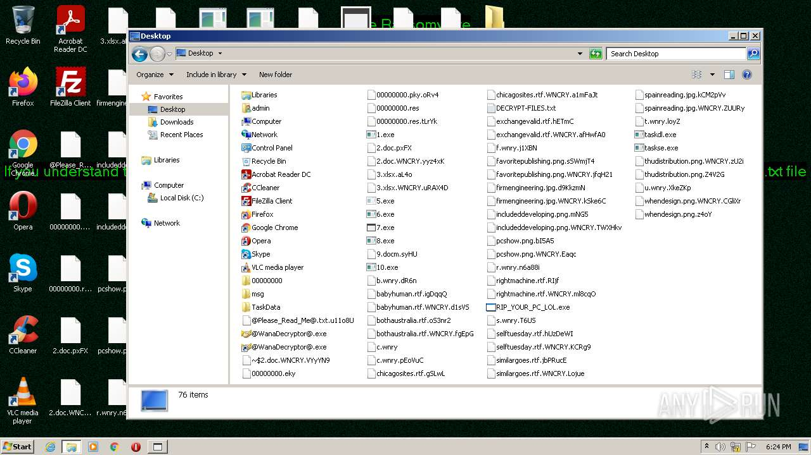

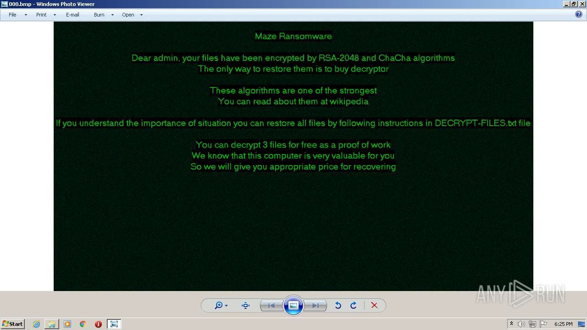
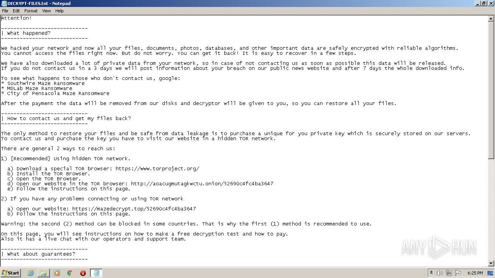
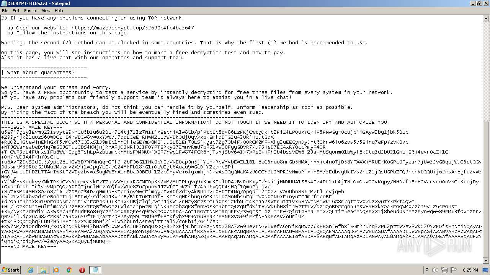
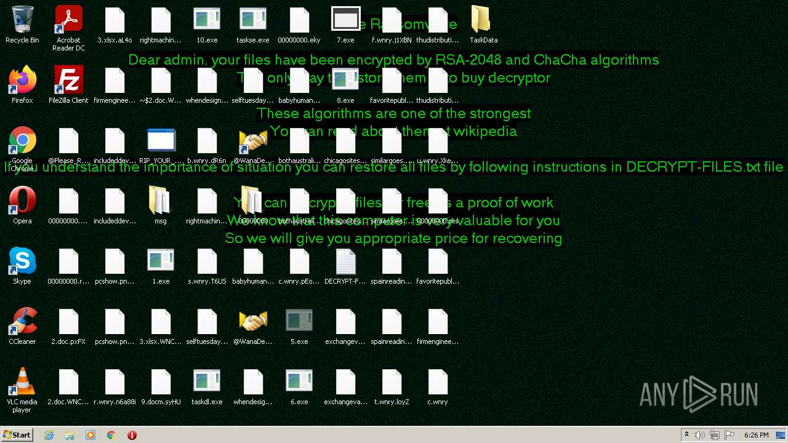
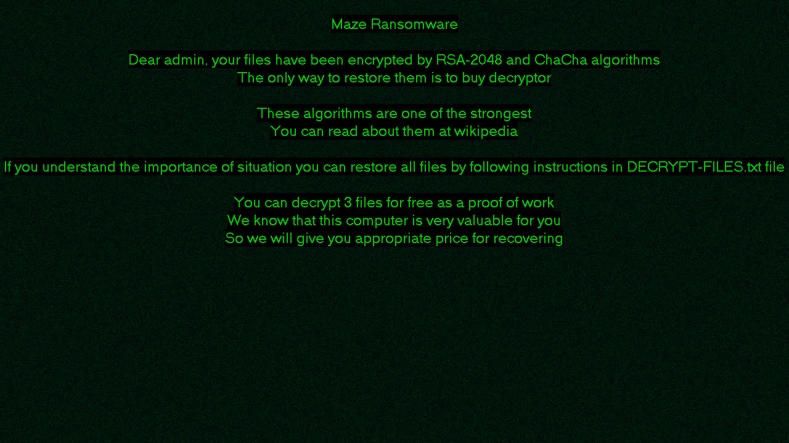
