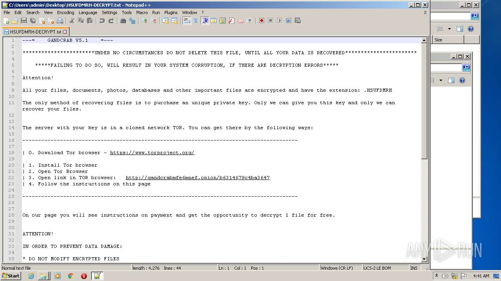

# Trojan.Win32.Yakes.ykjq-39eb2ab1cc9ce7d1d0e89cad1ac68e18a0177a176f1e9e60349d7ccae5af8415

- https://any.run/report/39eb2ab1cc9ce7d1d0e89cad1ac68e18a0177a176f1e9e60349d7ccae5af8415/d0d03400-8bb0-4bf0-8384-3c620ab6165a

```
- _id: "39eb2ab1cc9ce7d1d0e89cad1ac68e18a0177a176f1e9e60349d7ccae5af8415"
  creation_date: 1549978227  # 2019-02-12 14:30:27 +0100 CET
  first_submission_date: 1549982889  # 2019-02-12 15:48:09 +0100 CET
  last_analysis_date: 1633916415  # 2021-10-11 03:40:15 +0200 CEST
  last_analysis_results: 
    Kaspersky: 
      result: "Trojan.Win32.Yakes.ykjq"
  magic: "PE32 executable for MS Windows (GUI) Intel 80386 32-bit"
  size: 556544
  trid: 
  - file_type: "Windows Control Panel Item (generic)"
    probability: 75.5
  - file_type: "Win32 Executable MS Visual C++ (generic)"
    probability: 11.9
  - file_type: "Win64 Executable (generic)"
    probability: 4.0
  - file_type: "Win32 Dynamic Link Library (generic)"
    probability: 2.5
  - file_type: "Win16 NE executable (generic)"
    probability: 1.9
```





