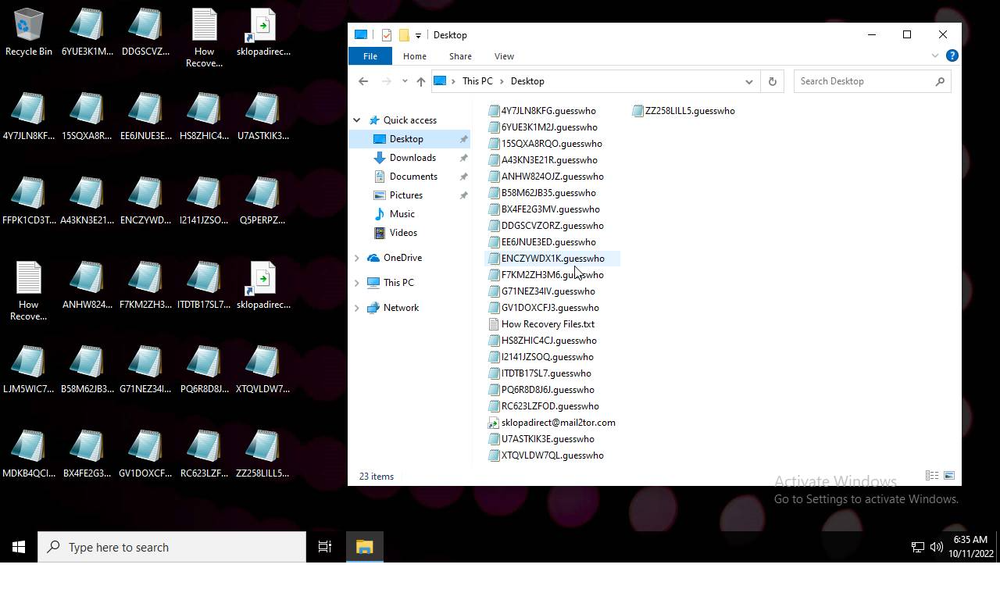
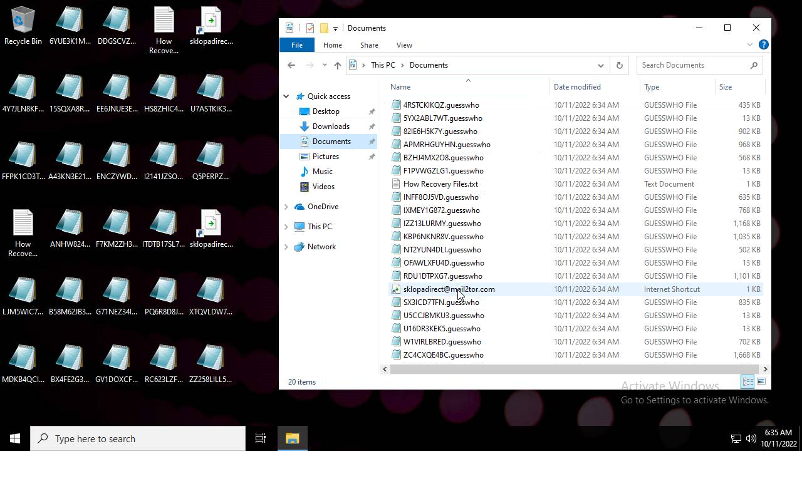
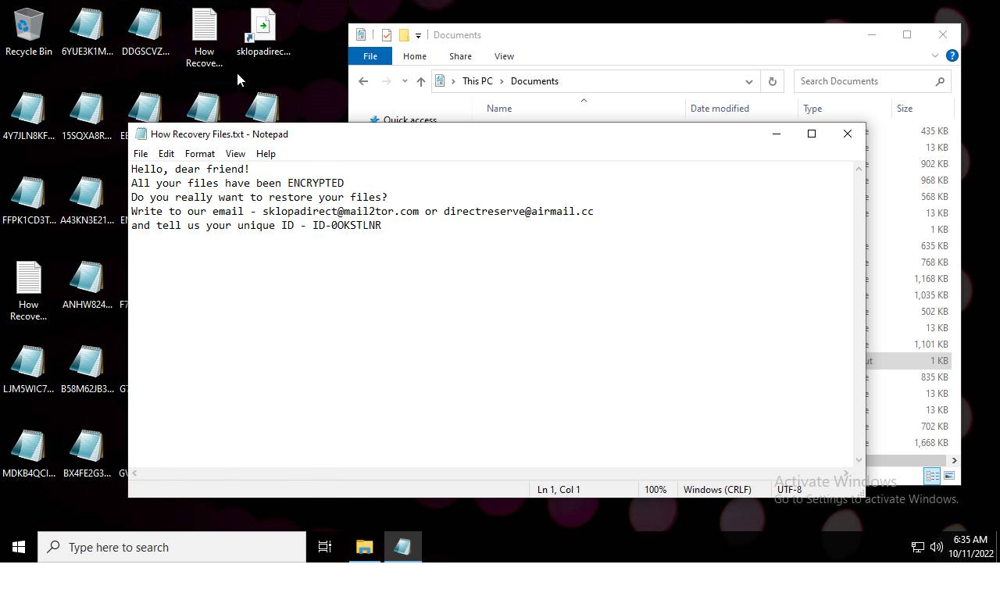
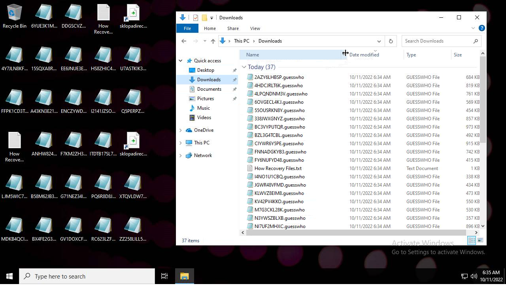
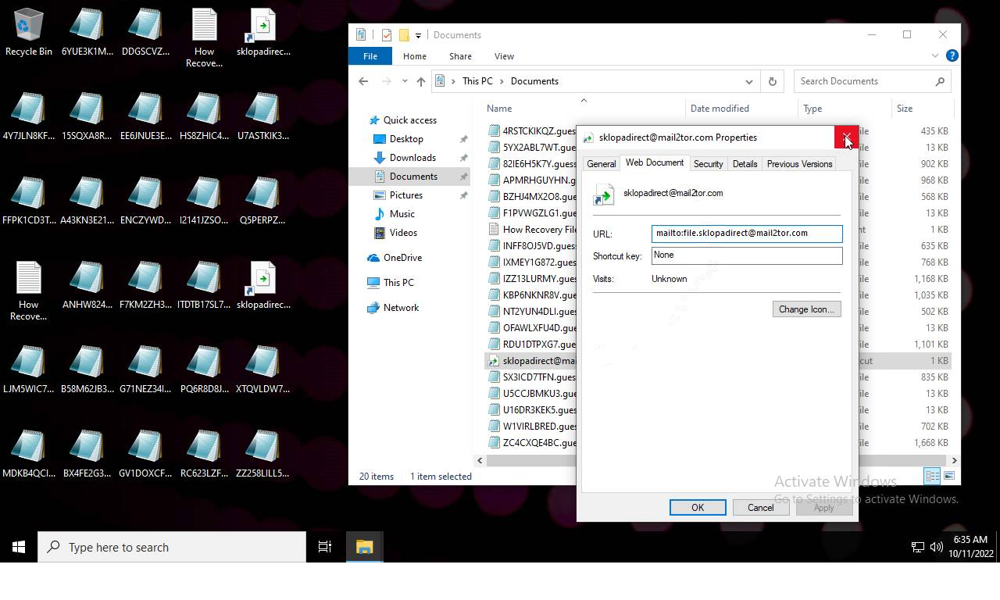

# Trojan.Win32.Yakes.yqic-022c33465774d287d13a7b10f9bedb0f9f530486c7f7aec443f922da6de8af01

- https://tria.ge/221011-hbaw7saeen/behavioral2

```
- _id: "022c33465774d287d13a7b10f9bedb0f9f530486c7f7aec443f922da6de8af01"
  creation_date: 1556043893  # 2019-04-23 20:24:53 +0200 CEST
  first_submission_date: 1665128090  # 2022-10-07 09:34:50 +0200 CEST
  last_analysis_date: 1665128090  # 2022-10-07 09:34:50 +0200 CEST
  last_analysis_results: 
    Kaspersky: 
      result: "Trojan.Win32.Yakes.yqic"
  magic: "PE32 executable for MS Windows (GUI) Intel 80386 32-bit"
  size: 542432
  trid: 
  - file_type: "Windows Control Panel Item (generic)"
    probability: 85.7
  - file_type: "Win64 Executable (generic)"
    probability: 4.5
  - file_type: "Win32 Dynamic Link Library (generic)"
    probability: 2.8
  - file_type: "Win16 NE executable (generic)"
    probability: 2.1
  - file_type: "Win32 Executable (generic)"
    probability: 1.9
```






