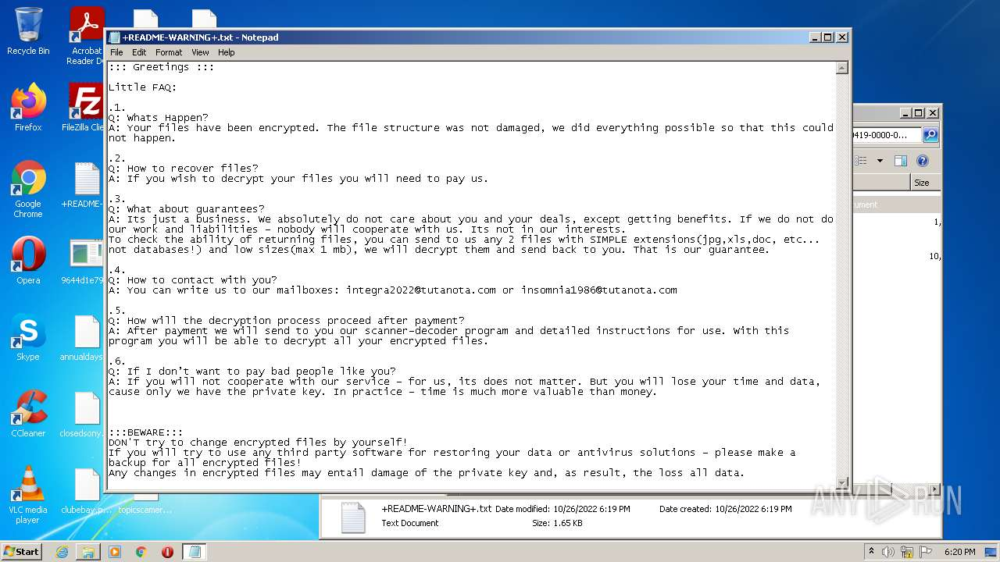
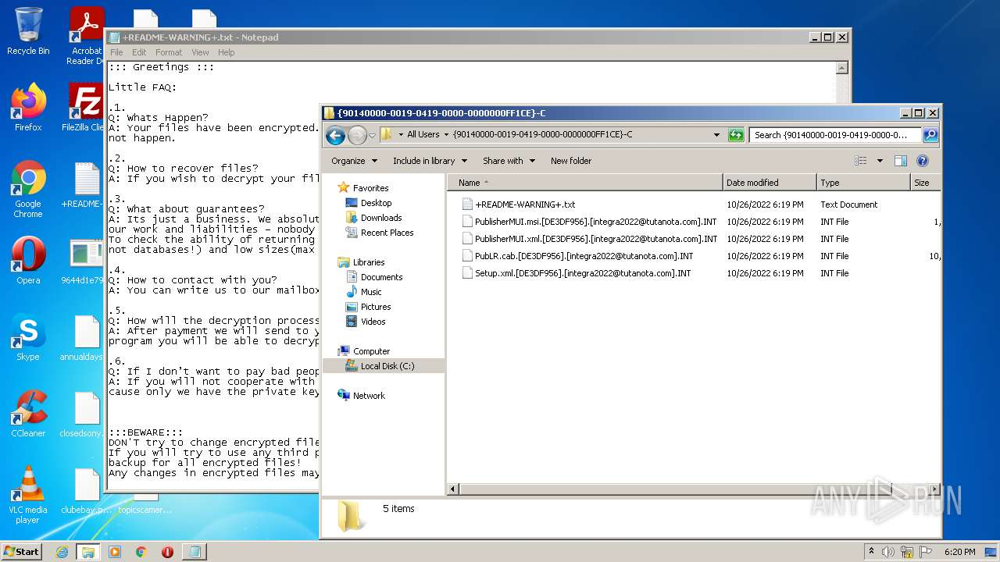
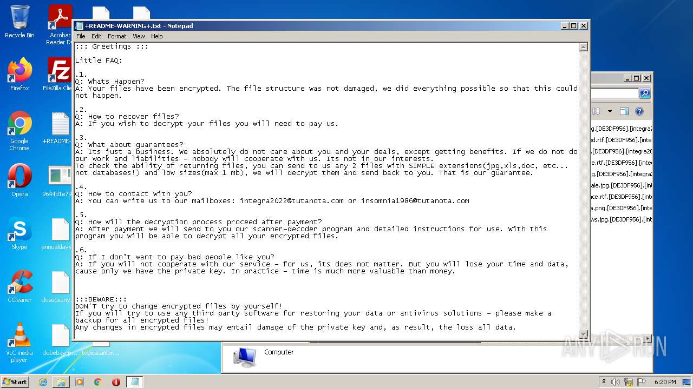
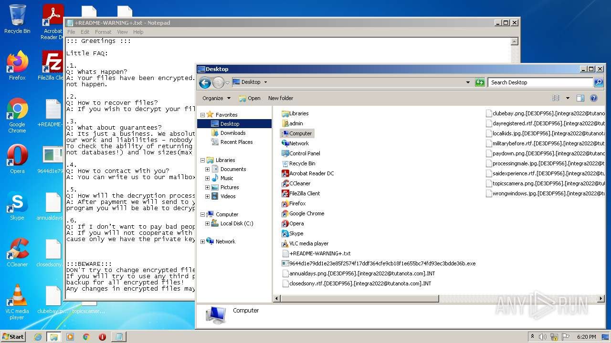
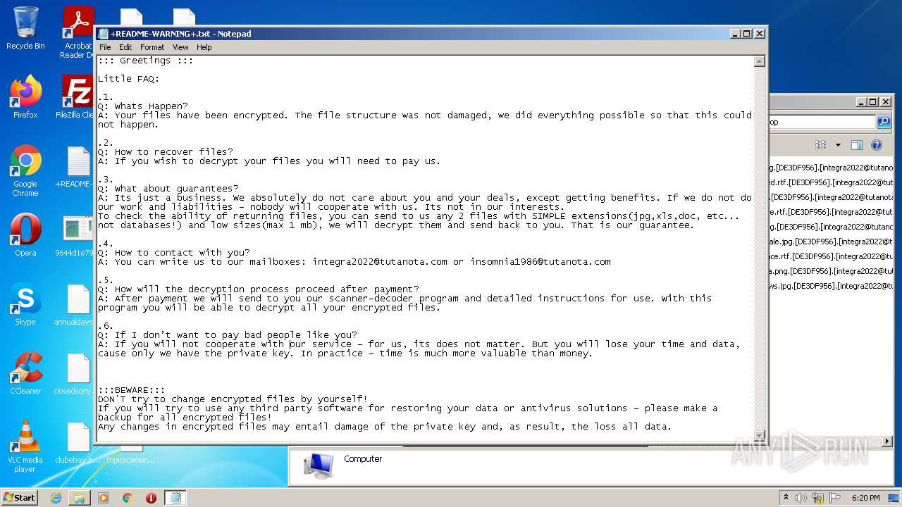
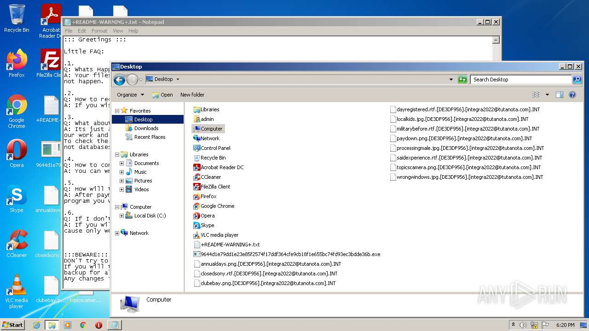

# UDS-Trojan-Ransom.Win32.Generic-9644d1e79dd1e23e85f2574f17ddf364cfe9cb18f1e655bc74fd93ec3bdde36b

- https://any.run/report/9644d1e79dd1e23e85f2574f17ddf364cfe9cb18f1e655bc74fd93ec3bdde36b/46d38b5b-5244-483c-8970-696b65ca9cf8

```
- _id: "9644d1e79dd1e23e85f2574f17ddf364cfe9cb18f1e655bc74fd93ec3bdde36b"
  creation_date: 1657491883  # 2022-07-11 00:24:43 +0200 CEST
  crowdsourced_yara_results: 
  - author: "Marc Rivero | McAfee ATR Team"
    description: "Rule to detect the unpacked Makop ransomware samples"
    rule_name: "RANSOM_makop"
    ruleset_id: "00189e242f"
    ruleset_name: "RANSOM_makop"
    source: "https://github.com/advanced-threat-research/Yara-Rules"
  - author: "Elastic Security"
    rule_name: "Windows_Ransomware_Makop_3ac2c13c"
    ruleset_id: "0151d8d4d3"
    ruleset_name: "Windows_Ransomware_Makop"
    source: "https://github.com/elastic/protections-artifacts"
  first_submission_date: 1666763632  # 2022-10-26 07:53:52 +0200 CEST
  last_analysis_date: 1666763632  # 2022-10-26 07:53:52 +0200 CEST
  last_analysis_results: 
    Kaspersky: 
      result: "UDS:Trojan-Ransom.Win32.Generic"
  magic: "PE32 executable for MS Windows (GUI) Intel 80386 32-bit"
  size: 43008
  trid: 
  - file_type: "Win32 Executable MS Visual C++ (generic)"
    probability: 58.4
  - file_type: "Win32 Dynamic Link Library (generic)"
    probability: 12.3
  - file_type: "Win16 NE executable (generic)"
    probability: 9.4
  - file_type: "Win32 Executable (generic)"
    probability: 8.4
  - file_type: "OS/2 Executable (generic)"
    probability: 3.8
```








