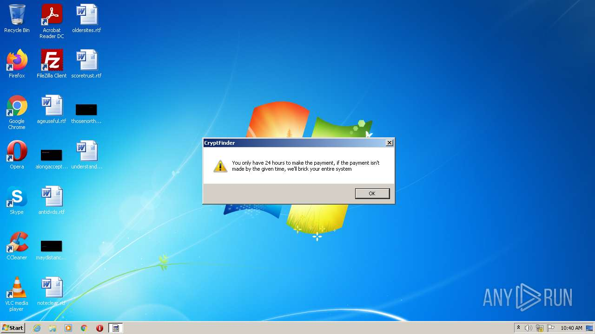
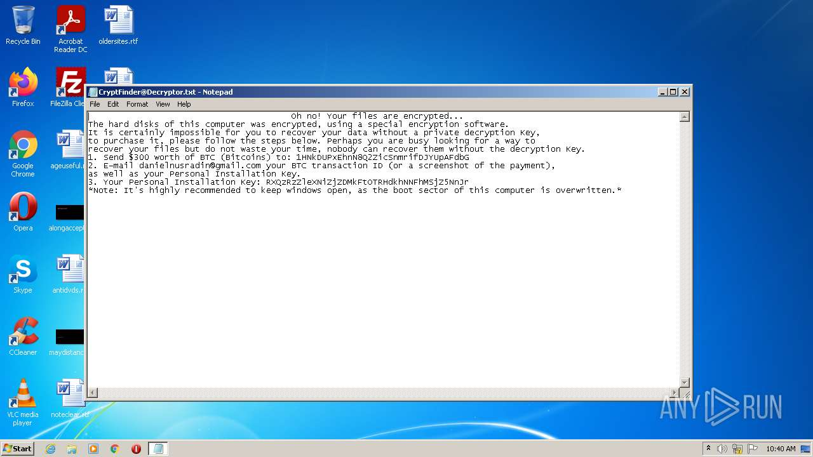
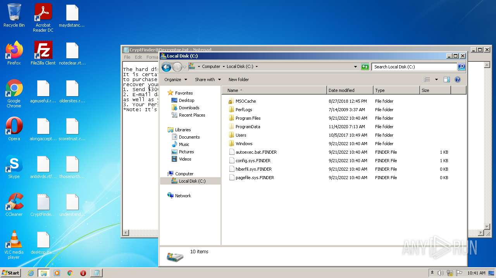
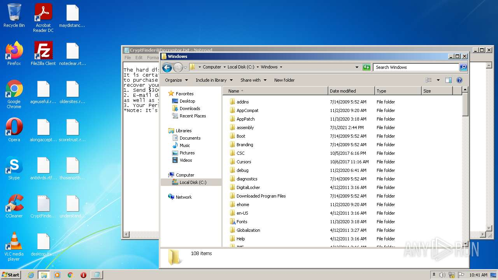
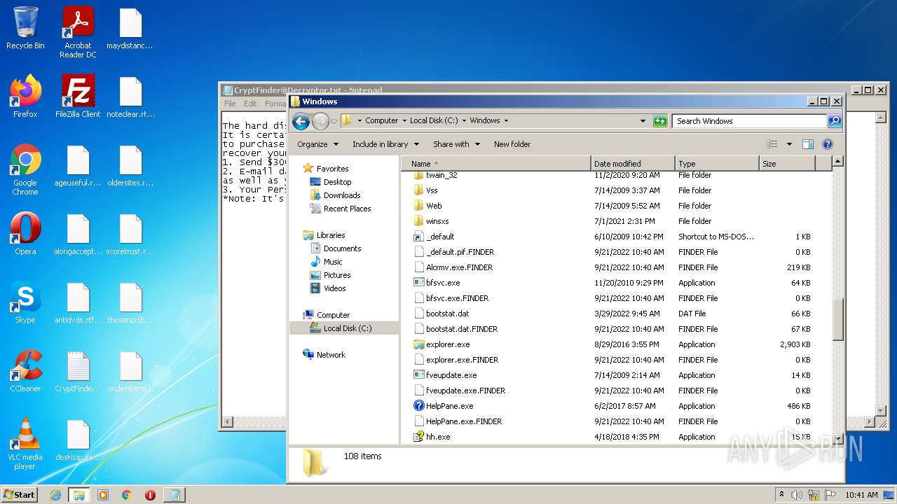
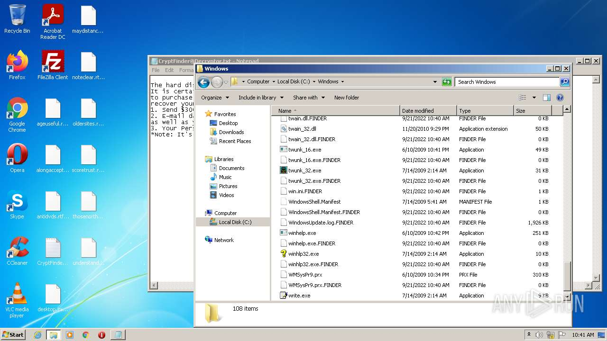
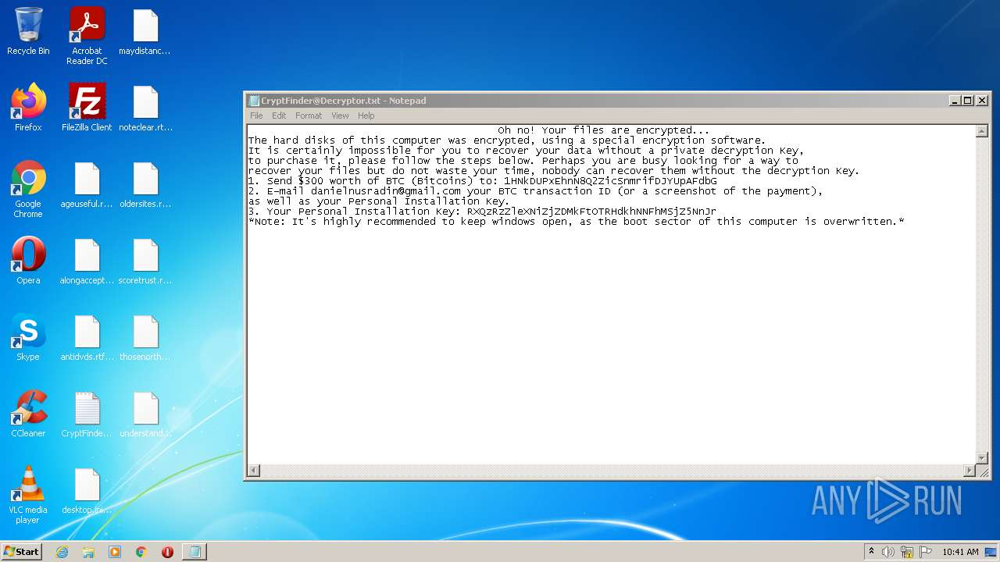

# UDS-Trojan.MSIL.DiskWriter.gen-eb85d94573227080d490e312bad29d106f48698a1eea5db452de5b735afa3755

- https://any.run/report/eb85d94573227080d490e312bad29d106f48698a1eea5db452de5b735afa3755/af983dde-dea6-4d13-93f1-7d87d6c8e846

```
- _id: "eb85d94573227080d490e312bad29d106f48698a1eea5db452de5b735afa3755"
  creation_date: 3229633732  # 2072-05-05 02:28:52 +0200 CEST
  first_submission_date: 1663753408  # 2022-09-21 11:43:28 +0200 CEST
  last_analysis_date: 1663940230  # 2022-09-23 15:37:10 +0200 CEST
  last_analysis_results: 
    Kaspersky: 
      result: "UDS:Trojan.MSIL.DiskWriter.gen"
  magic: "PE32 executable for MS Windows (GUI) Intel 80386 Mono/.Net assembly"
  packers: 
    PEiD: ".NET executable"
  size: 35328
  trid: 
  - file_type: "Generic CIL Executable (.NET, Mono, etc.)"
    probability: 69.1
  - file_type: "Win64 Executable (generic)"
    probability: 9.9
  - file_type: "Win32 Dynamic Link Library (generic)"
    probability: 6.2
  - file_type: "Win16 NE executable (generic)"
    probability: 4.7
  - file_type: "Win32 Executable (generic)"
    probability: 4.2
```










