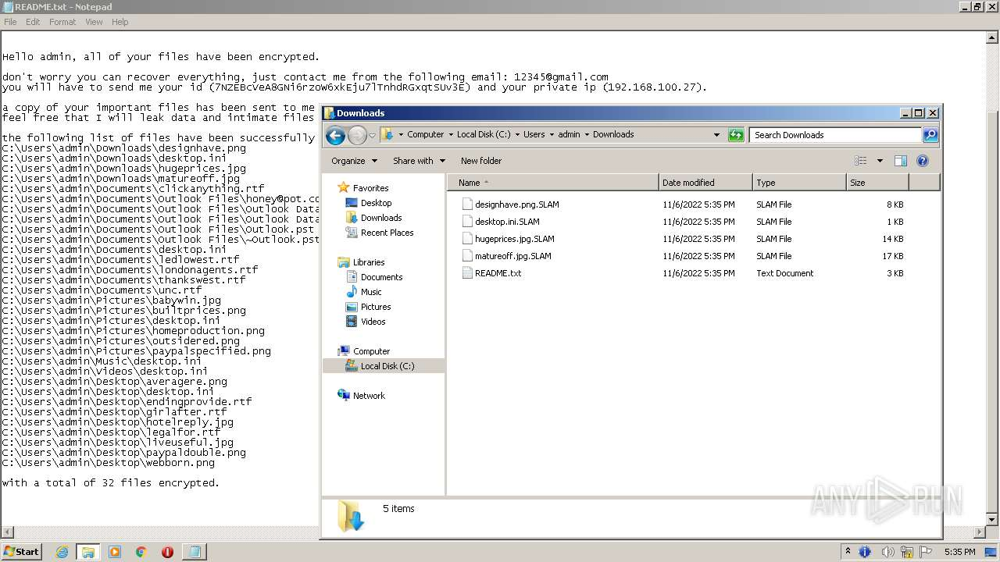
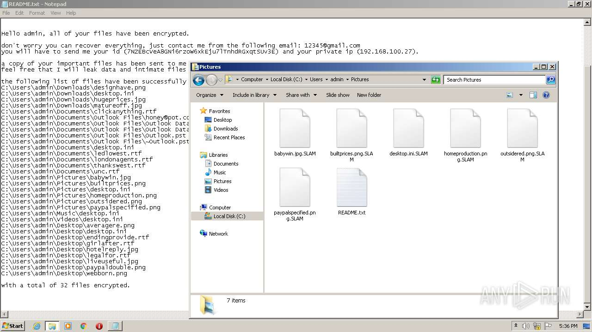

# -59b922e65c5eef564a75b278a41b10b437d408c3bcd9d62956a98b932ff22e16

- https://any.run/report/59b922e65c5eef564a75b278a41b10b437d408c3bcd9d62956a98b932ff22e16/b23f2272-fa3a-4bb2-b3bf-6fa168818e18

```
- _id: "59b922e65c5eef564a75b278a41b10b437d408c3bcd9d62956a98b932ff22e16"
  creation_date: 1667745938  # 2022-11-06 15:45:38 +0100 CET
  crowdsourced_yara_results: 
  - author: "ditekSHen"
    description: "detects command variations typically used by ransomware"
    rule_name: "INDICATOR_SUSPICIOUS_GENRansomware"
    ruleset_id: "00c3b8eb5d"
    ruleset_name: "indicator_suspicious"
    source: "https://github.com/ditekshen/detection"
  - author: "ditekSHen"
    description: "Detects executables containing many references to VEEAM. Observed in ransomware"
    rule_name: "INDICATOR_SUSPICOUS_EXE_References_VEEAM"
    ruleset_id: "00c3b8eb5d"
    ruleset_name: "indicator_suspicious"
    source: "https://github.com/ditekshen/detection"
  - author: "ditekSHen"
    description: "Detects executables embedding registry key / value combination indicative of disabling Windows Defedner features"
    rule_name: "INDICATOR_SUSPICIOUS_EXE_RegKeyComb_DisableWinDefender"
    ruleset_id: "00c3b8eb5d"
    ruleset_name: "indicator_suspicious"
    source: "https://github.com/ditekshen/detection"
  first_submission_date: 1667746957  # 2022-11-06 16:02:37 +0100 CET
  last_analysis_date: 1667746957  # 2022-11-06 16:02:37 +0100 CET
  magic: "PE32 executable for MS Windows (console) Intel 80386 32-bit Mono/.Net assembly"
  packers: 
    PEiD: ".NET executable"
  size: 935424
  trid: 
  - file_type: "Generic CIL Executable (.NET, Mono, etc.)"
    probability: 69.1
  - file_type: "Win64 Executable (generic)"
    probability: 9.9
  - file_type: "Win32 Dynamic Link Library (generic)"
    probability: 6.2
  - file_type: "Win16 NE executable (generic)"
    probability: 4.7
  - file_type: "Win32 Executable (generic)"
    probability: 4.2
```






