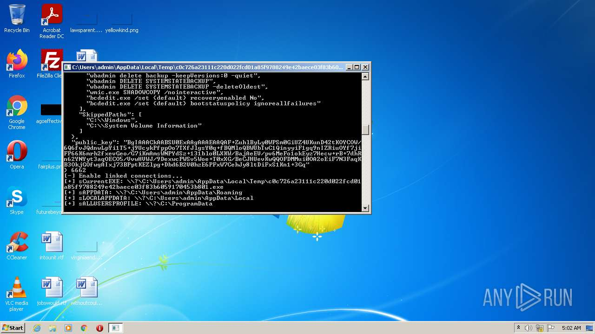
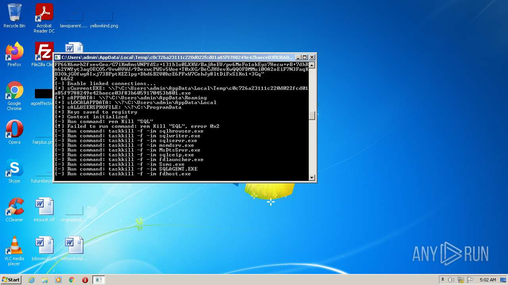
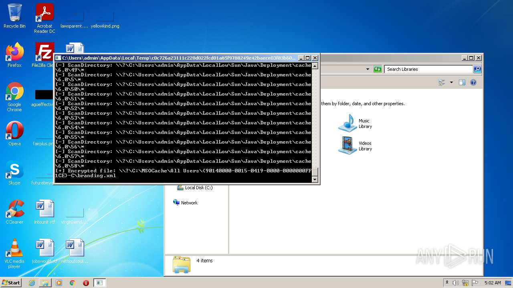
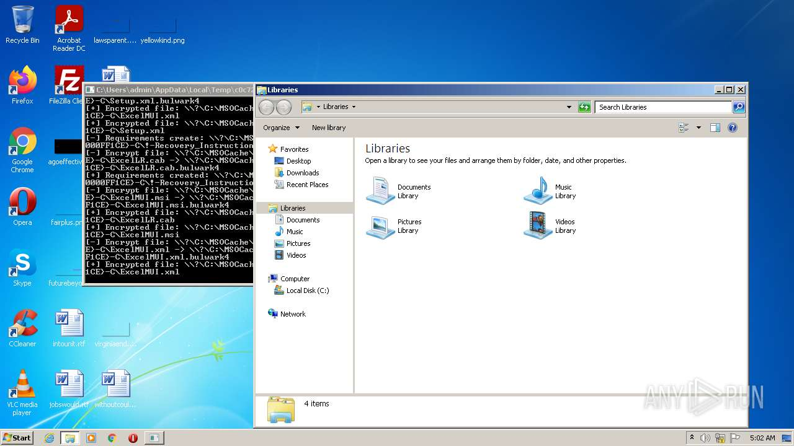
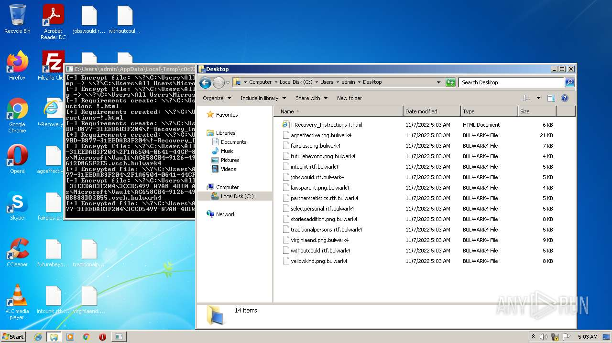
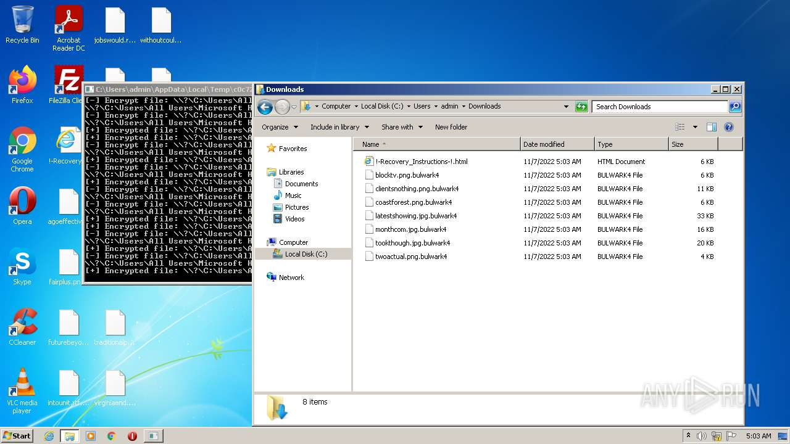

# -c0c726a23111c220d022fcd01a85f9788249e42baece03f83b6059170453b801

- https://any.run/report/c0c726a23111c220d022fcd01a85f9788249e42baece03f83b6059170453b801/0a737bc2-8e46-49a7-a151-cf41d49428fb

```
- _id: "c0c726a23111c220d022fcd01a85f9788249e42baece03f83b6059170453b801"
  creation_date: 1666550730  # 2022-10-23 20:45:30 +0200 CEST
  first_submission_date: 1667535018  # 2022-11-04 05:10:18 +0100 CET
  last_analysis_date: 1667535018  # 2022-11-04 05:10:18 +0100 CET
  magic: "PE32 executable for MS Windows (console) Intel 80386 32-bit"
  size: 308224
  trid: 
  - file_type: "Win64 Executable (generic)"
    probability: 32.2
  - file_type: "Win32 Dynamic Link Library (generic)"
    probability: 20.1
  - file_type: "Win16 NE executable (generic)"
    probability: 15.4
  - file_type: "Win32 Executable (generic)"
    probability: 13.7
  - file_type: "OS/2 Executable (generic)"
    probability: 6.2
```









