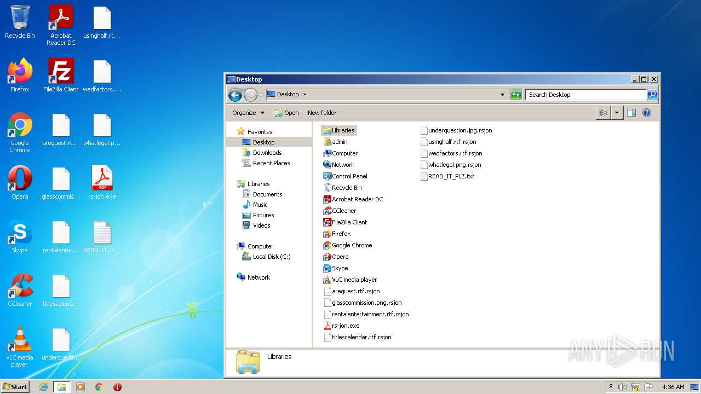
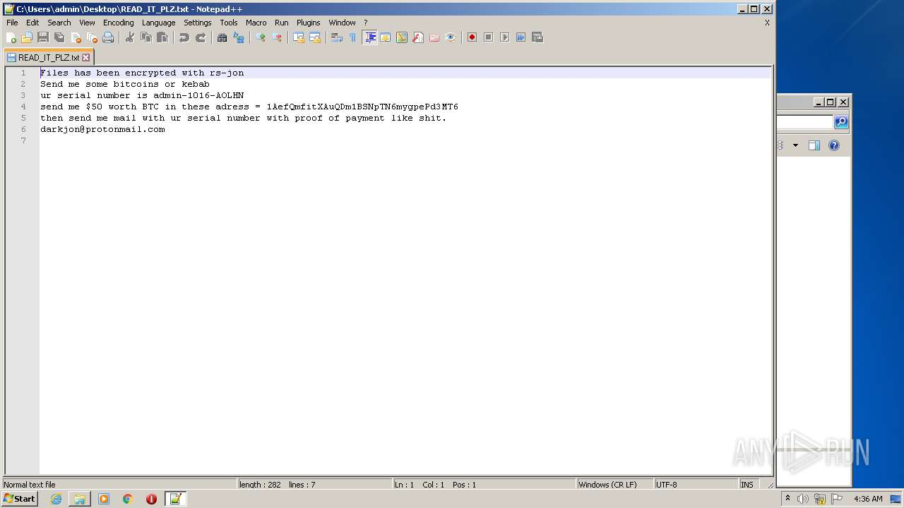
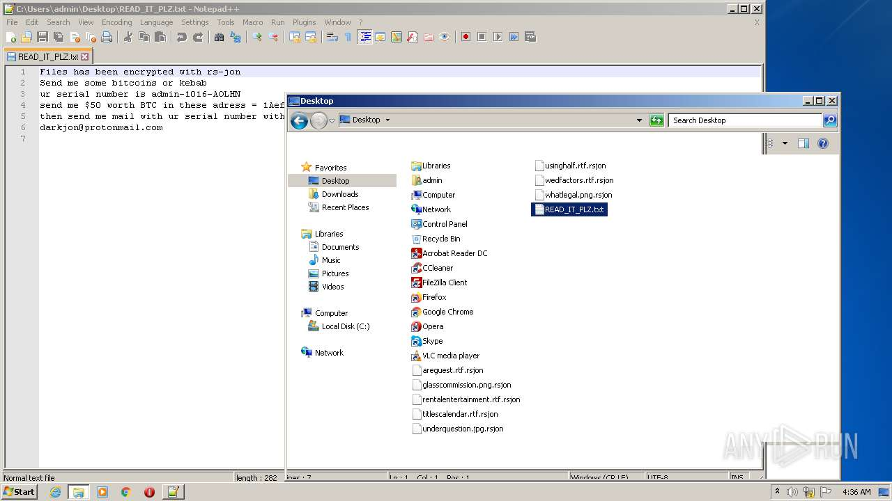
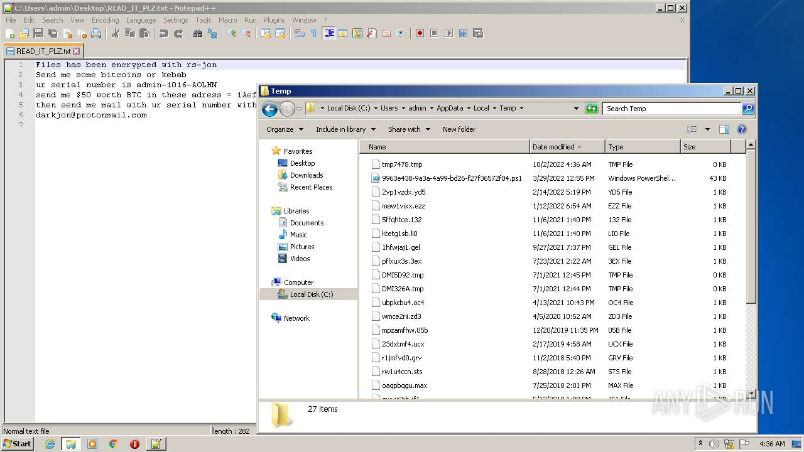
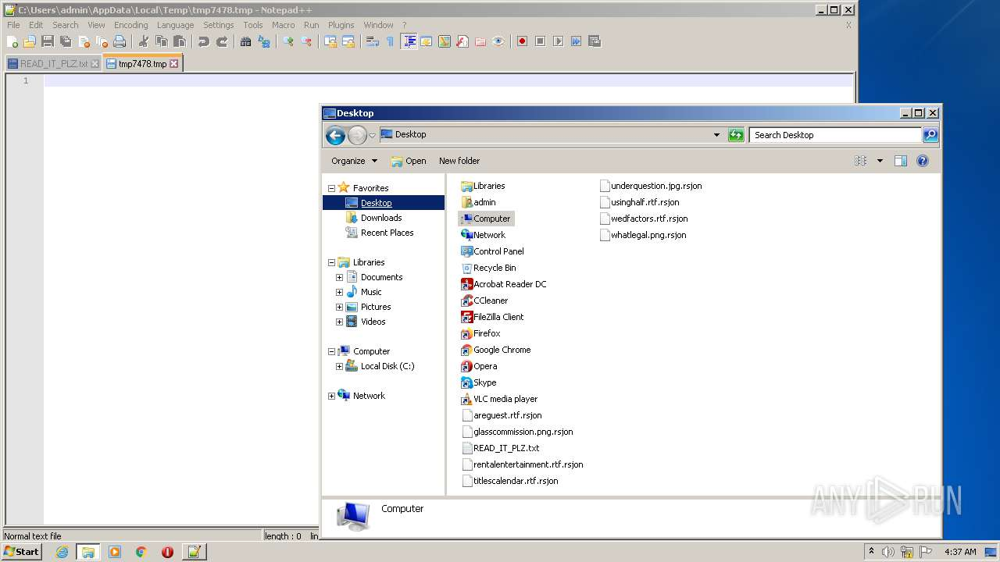
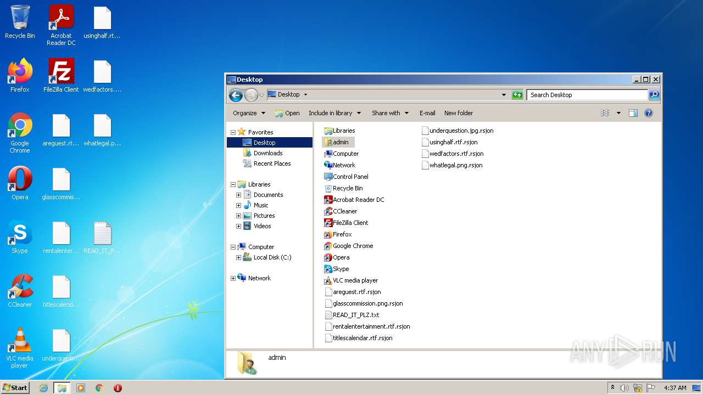

# -f8bde64e8aafeec7e3c86a7dd35fe5d5c3475c33583bca00725162ec2d4298bc

- https://any.run/report/f8bde64e8aafeec7e3c86a7dd35fe5d5c3475c33583bca00725162ec2d4298bc/e9748454-0c5f-45fa-b921-5cedebd4de80

```
- _id: "f8bde64e8aafeec7e3c86a7dd35fe5d5c3475c33583bca00725162ec2d4298bc"
  creation_date: 3272749089  # 2073-09-16 02:58:09 +0200 CEST
  crowdsourced_yara_results: 
  - author: "Florian Roth"
    description: "Detects ransomware distributed in COVID-19 theme"
    rule_name: "MAL_RANSOM_COVID19_Apr20_1"
    ruleset_id: "000f8b51a1"
    ruleset_name: "crime_covid_ransom"
    source: "https://github.com/Neo23x0/signature-base"
  first_submission_date: 1625416312  # 2021-07-04 18:31:52 +0200 CEST
  last_analysis_date: 1625416312  # 2021-07-04 18:31:52 +0200 CEST
  magic: "PE32 executable for MS Windows (GUI) Intel 80386 Mono/.Net assembly"
  size: 217600
  trid: 
  - file_type: "Generic CIL Executable (.NET, Mono, etc.)"
    probability: 72.5
  - file_type: "Win64 Executable (generic)"
    probability: 10.4
  - file_type: "Win32 Dynamic Link Library (generic)"
    probability: 6.5
  - file_type: "Win32 Executable (generic)"
    probability: 4.4
  - file_type: "OS/2 Executable (generic)"
    probability: 2.0
```









