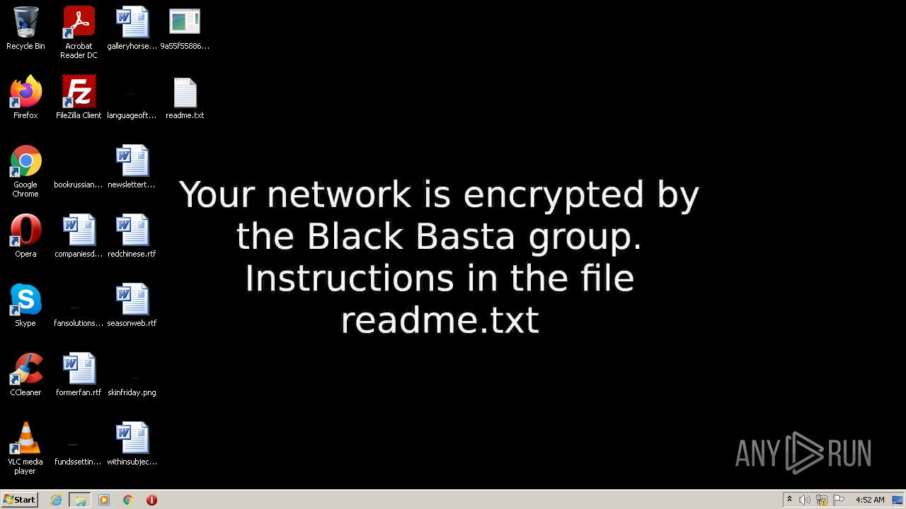
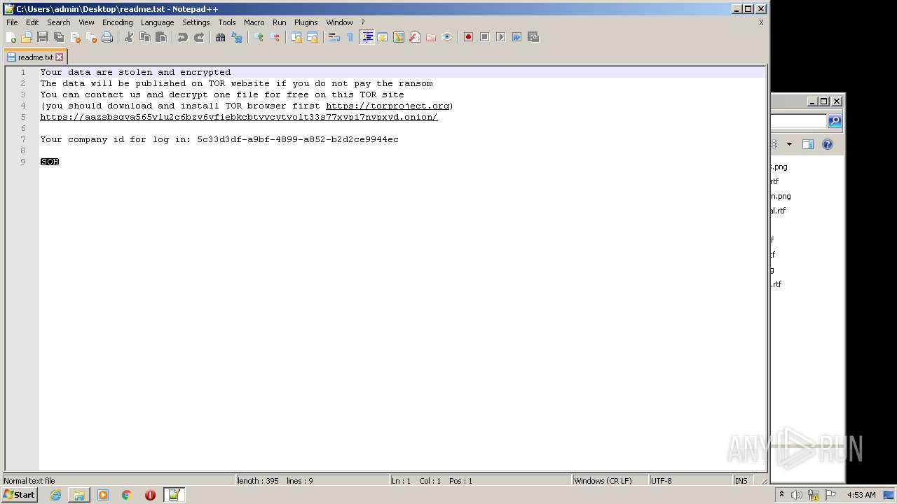
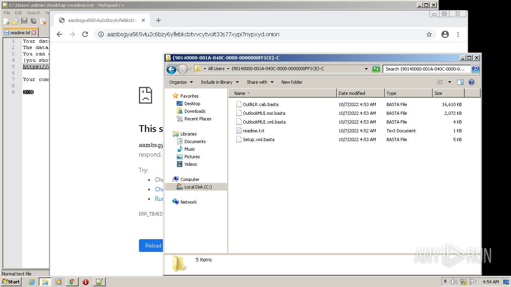

# VHO-Trojan-Ransom.Win32.Agent.gen-9a55f55886285eef7ffabdd55c0232d1458175b1d868c03d3e304ce7d98980bc

- https://any.run/report/9a55f55886285eef7ffabdd55c0232d1458175b1d868c03d3e304ce7d98980bc/f7c44d8f-3736-4f39-b859-ccf030c5d0e0

```
- _id: "9a55f55886285eef7ffabdd55c0232d1458175b1d868c03d3e304ce7d98980bc"
  creation_date: 1664594744  # 2022-10-01 05:25:44 +0200 CEST
  crowdsourced_yara_results: 
  - author: "ditekSHen"
    description: "detects command variations typically used by ransomware"
    rule_name: "INDICATOR_SUSPICIOUS_GENRansomware"
    ruleset_id: "00c3b8eb5d"
    ruleset_name: "indicator_suspicious"
    source: "https://github.com/ditekshen/detection"
  - author: "Elastic Security"
    rule_name: "Windows_Ransomware_BlackBasta_494d3c54"
    ruleset_id: "0157897c12"
    ruleset_name: "Windows_Ransomware_BlackBasta"
    source: "https://github.com/elastic/protections-artifacts"
  first_submission_date: 1665088466  # 2022-10-06 22:34:26 +0200 CEST
  last_analysis_date: 1665088466  # 2022-10-06 22:34:26 +0200 CEST
  last_analysis_results: 
    Kaspersky: 
      result: "VHO:Trojan-Ransom.Win32.Agent.gen"
  magic: "PE32 executable for MS Windows (console) Intel 80386 32-bit"
  size: 555520
  trid: 
  - file_type: "Win64 Executable (generic)"
    probability: 32.2
  - file_type: "Win32 Dynamic Link Library (generic)"
    probability: 20.1
  - file_type: "Win16 NE executable (generic)"
    probability: 15.4
  - file_type: "Win32 Executable (generic)"
    probability: 13.7
  - file_type: "OS/2 Executable (generic)"
    probability: 6.2
```





