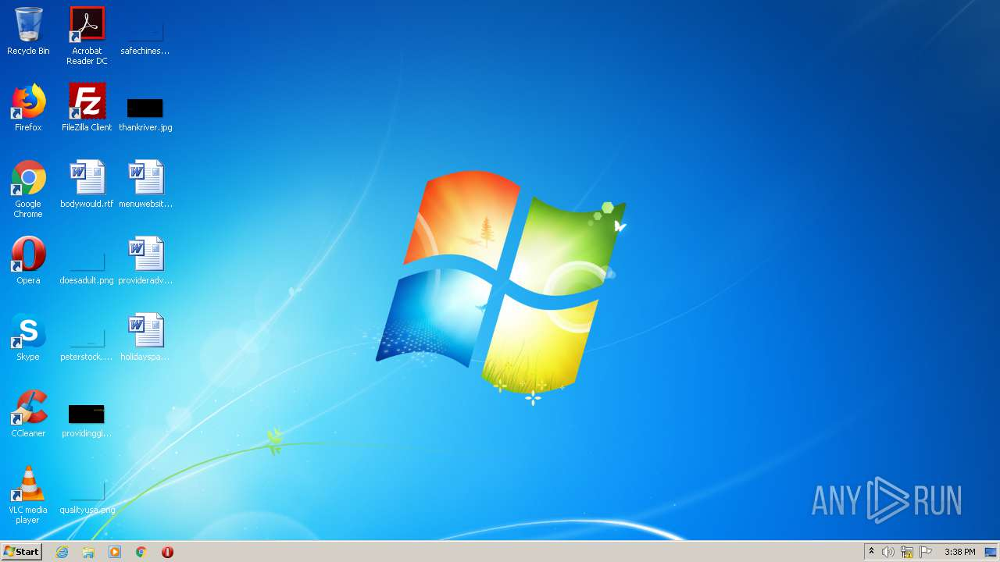
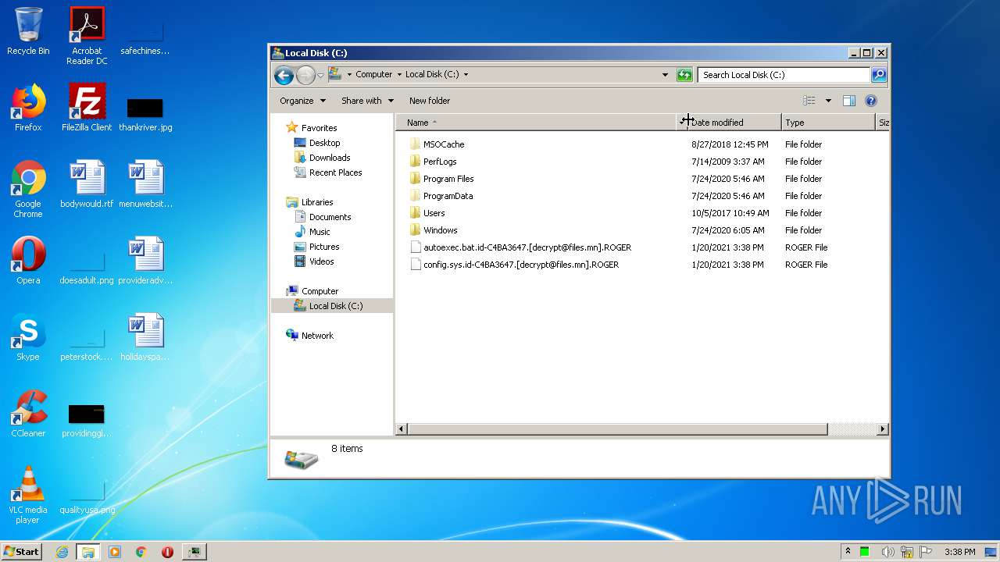

# Virus.Win32.Neshta.a-15a6de31fabc53d691acf7fe40e630be55da45b09cb79816d50785d50b913a72

```
- _id: "15a6de31fabc53d691acf7fe40e630be55da45b09cb79816d50785d50b913a72"
  creation_date: 708992537  # 1992-06-20 00:22:17 +0200 CEST
  first_submission_date: 1580190931  # 2020-01-28 06:55:31 +0100 CET
  last_analysis_date: 1582060128  # 2020-02-18 22:08:48 +0100 CET
  last_analysis_results: 
    Kaspersky: 
      result: "Virus.Win32.Neshta.a"
  magic: "PE32 executable for MS Windows (GUI) Intel 80386 32-bit"
  size: 136192
  trid: 
  - file_type: "Win32 Executable Borland Delphi 6"
    probability: 93.1
  - file_type: "Win32 Dynamic Link Library (generic)"
    probability: 2.3
  - file_type: "Win32 Executable (generic)"
    probability: 1.5
  - file_type: "Win16/32 Executable Delphi generic"
    probability: 0.7
  - file_type: "OS/2 Executable (generic)"
    probability: 0.7
```



